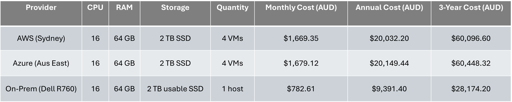
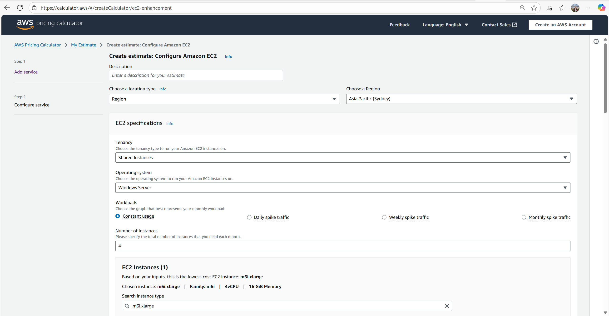
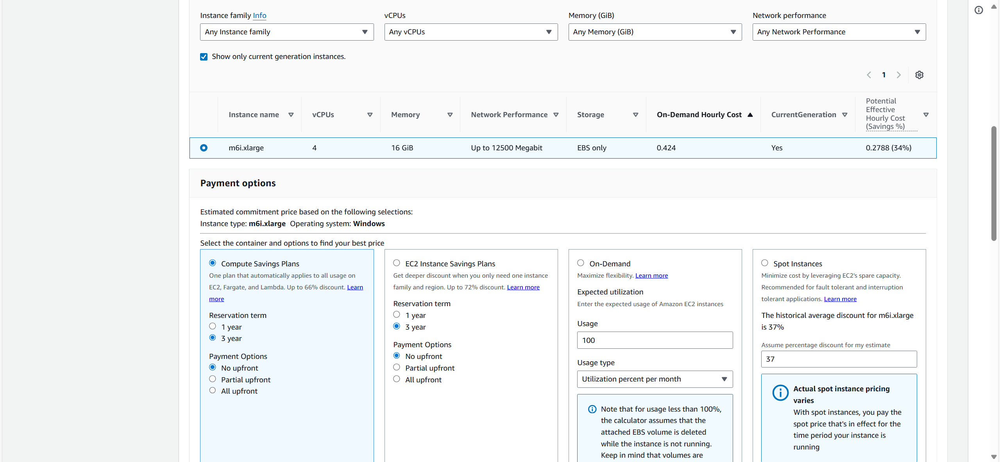
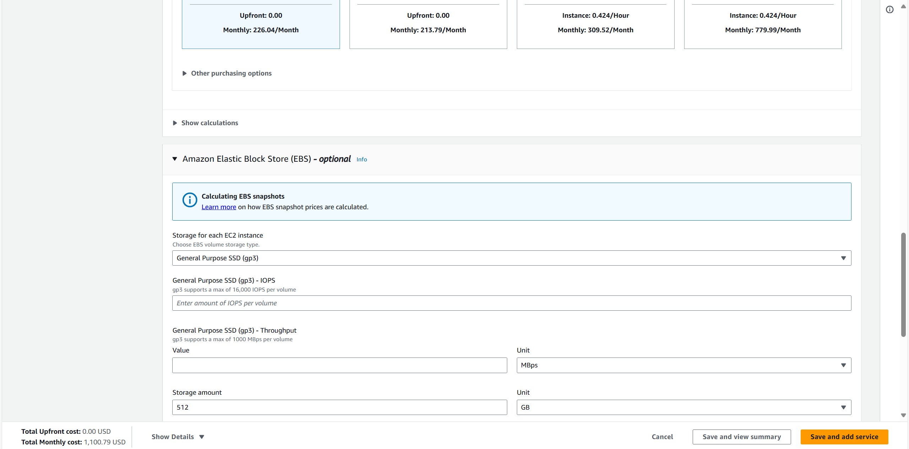
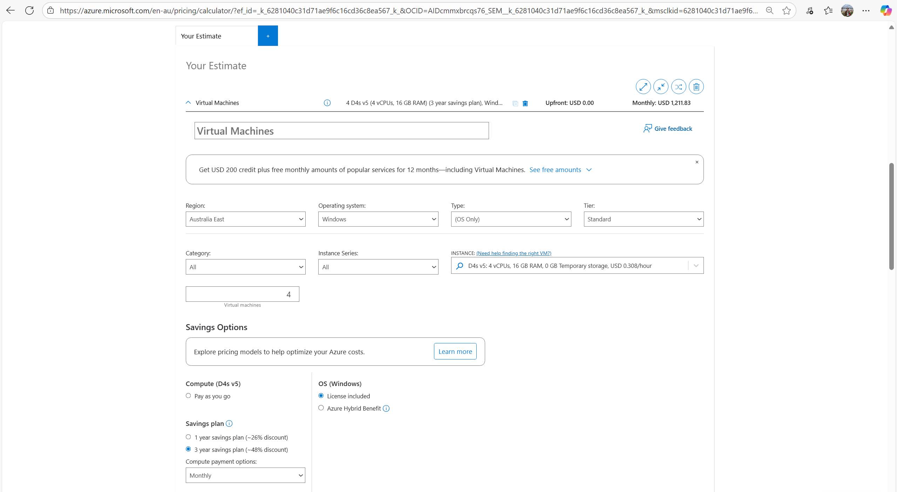
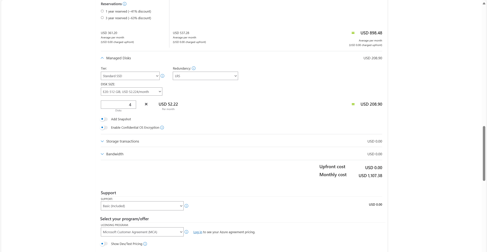
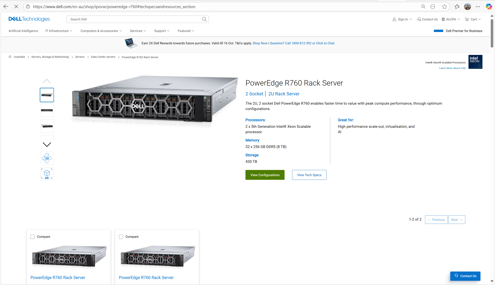
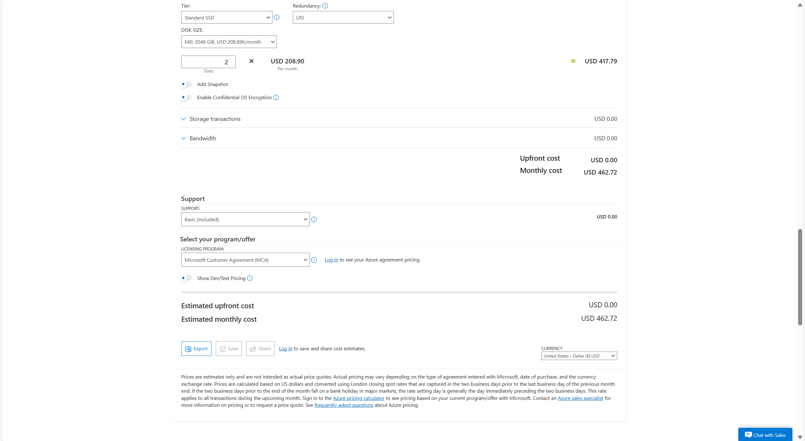
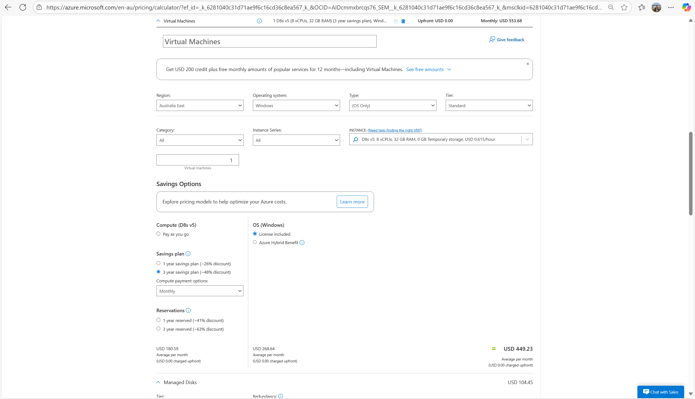
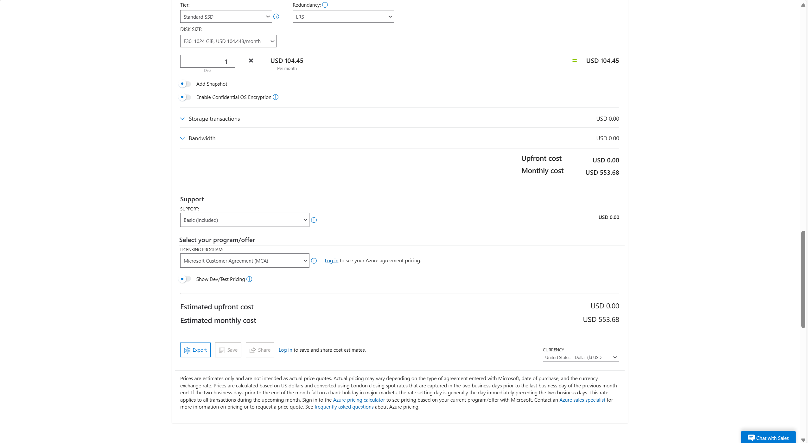

# Cloud Services      
This section gives pricing for a cloud setup for the company.

[Cloud VM Provider Comparison](#cloud-vm-provider-comparison) | [Total Cost](#total-cost-of-cloud-vms) | [Plan](./plan.md) | [Network Design](./network.md) | [Security](./security.md) | [Ethics](./ethics.md) | [Reflection](./reflection.md) | [Return to index](./README.md)

## Proposed Cloud Service
 
The recommended infrastructure for Trueelec is to adopt a hybrid cloud model. Retaining all client data exclusively at headquarters exposes the organisation to considerable risks, such as fire, system outages, ransomware, or internet failures. In contrast, a hybrid approach offers a balanced solution by combining the resilience and scalability of cloud services with the performance and security advantages of on-premises infrastructure, thereby ensuring greater continuity, flexibility, and protection of critical assets.
 
### Proposed Cloud Infrastructure Model for Truelec  
   
1. **Cloud:** 
    - Booking App (VMs)
    - HR
    - Accounting
    - CRM
    - Office Productivity Systems
1. **Hybrid:** 
    - File/Data Servers
    - Backup and Disaster Recovery 
1. **On-Prem:**
    - CCTV
    - RFID 
    - IoT

## Detailed Cloud Infrastructure Components for Truelec

1. **Booking App**
    - **Current Location:** HQ + Branch Servers (6 total, 5 year old  Dell PowerEdge)
    - **Service Type Recommendation:** Replace with Cloud VMs (AWS EC2 / Azure VMs)
    - **Explanation:** Migrate all booking app servers to cloud VMs for scalability, reliability, and centralized management.

1. **File / Application / Database Servers**
    - **Current Location:** Hosted at HQ server room (Server VLAN 61.10.80.0/24) network
    - **Service Type Recommendation:** Hybrid Approach. VMware Cluster and Azure Blob with SQL Database
    - **Explanation:** Truelec will use a VMware cluster at HQ for fast local access to critical applications, while client records and databases are replicated to the cloud for scalability, disaster recovery, and protection against outages or physical risks.

1. **HR System**
    - **Current Location:** Hosted at HQ
    - **Service Type Recommendation:** Migrate to SaaS - Workday
    - **Explanation:** The HR system should move to Workday SaaS, which offers easier compliance, branch-wide access, automatic updates, and lower administrative effort.

1. **Accounting System**
    - **Current Location:** Hosted at HQ
    - **Service Type Recommendation:** Migrate to SaaS - Xero
    - **Explanation:** The accounting system should move to Xero SaaS, which is one of the most widely used accounting platforms in Australia. It simplifies financial management, connects with local banks, and allows secure access from all offices.

1. **CRM System**
    - **Current Location:** Hosted at HQ
    - **Service Type Recommendation:** Migrate to SaaS - Salesforce
    - **Explanation:** The CRM system should move to Salesforce SaaS, which is one of the most widely used CRM platforms globally. It improves customer data access across branches, increases resilience, and provides powerful cloud-based reporting and analytics.

1. **Security Systems (CCTV, RFID, IoT Sensors)**
    - **Current Location:** HQ + Branches (dedicated VLANs)
    - **Service Type Recommendation:** Retain On-Prem (Upgrade Hardware)
    - **Explanation:** The security systems (CCTV, RFID, and IoT sensors) should remain on-premises with upgraded hardware, since video recording and sensor data need fast, local processing without relying on internet bandwidth. However, connecting these systems to the cloud for dashboards and alerts will allow centralised monitoring and analytics across all branches.

1. **Backup / Disaster Recovery**
    - **Current Location:** Local backups in HQ server room (Assumed tape/disk)
    - **Service Type Recommendation:** Hybrid Backup Strategy - Azure Backup Vault
    - **Explanation:** The Backup and Disaster Recovery system should use a hybrid strategy because relying only on local backups leaves Truelec vulnerable to fire, theft, or hardware failure at HQ. By keeping local backups, staff can restore files quickly when needed, while cloud replication (e.g., Azure Backup Vault) adds resilience, long-term retention, and protection against site-level disasters.
    
1. **Office Productivity Systems**
    - **Current Location:** Possibly on-premise Exchange (Assumed)
    - **Service Type Recommendation:** Migrate to SaaS - Microsoft 365
    - **Explanation:** The Office Productivity Systems should migrate to Microsoft 365 SaaS, which provides cloud-based email, Office apps, and collaboration tools. This reduces IT administration, improves teamwork across branches, integrates security features, and ensures high availability.

## Comparison Table of Cloud VM Providers and On-Premise Server

In this part of the proposal, we are evaluating whether to adopt a cloud service or an on-premise server for the booking service application. The comparison covers Amazon Web Services (AWS), Microsoft Azure, and a Dell PowerEdge R760 on-premise server, assessed on the basis of configuration, specifications, requirements, and cost.

For consistency, we modelled the application workload using four cloud instances versus one physical server. This provides a balanced comparison, as we plan to propose separate dedicated resources, either cloud servers or on-premise virtual machines, for the database and backup/disaster recovery functions, depending on the outcome of this analysis.

The table above compares the cost of hosting four medium VMs (4 vCPU, 16 GB RAM, 512 GB SSD each) across AWS, Azure, and an on-premises Dell R760 server over three years. Both cloud providers price almost identically (estimated $20k/year), while the on-premises option has a much lower 3-year total (~$23k) once hardware, licensing, support, power, cooling, and administration are factored in.

**Break down of additional cost for On-premise servers**

| Category                     | 3-Year Cost (AUD) |
| ---------------------------- | ----------------- |
| Hardware (R760 base)         | $10,804           |
| Windows Server Licensing     | $2,500            |
| Support & Warranty           | $1,200            |
| Power + Cooling              | $8,670            |
| Admin Labour (light IT mgmt) | $5,000            |
| **Total 3-Year Cost**        | **$28,174**       |

**Explanation:**

1. **Hardware (R760 base):** Dell Australia’s listed price for the base configuration of a PowerEdge R760. This is the upfront capital expenditure for the physical server.
1. **Windows Server Licensing:**  Windows Server Standard Edition (16-core license) plus CALs, required to legally run Windows workloads. Cloud includes this in the hourly rate, but on-prem must buy it upfront.
1. **Support & Warranty:** Dell ProSupport for 3 years (approximate mid-tier support package cost), ensuring hardware replacement and vendor support.
1. **Power + Cooling:** Based on average draw of 0.55 kW: 0.55 kW × 8,760 h = 4,818 kWh/year. At $0.30/kWh ≈ $1,445/year for power. Cooling is typically 1:1 with IT load, adding another $1,445/year. Total ≈ $2,890/year × 3 years = $8,670.
1. **Admin Labour (light IT mgmt):** Conservative allowance for system administration (patching, monitoring, backups) over 3 years, assuming ~1–2 hours per week by an IT technician or outsourced provider.

## Comparison Details Cloud VM Providers and On-Premise Server 

1. **AWS (Asia Pacific – Sydney)**
    - **CSV File:** [AWS VM Estimate (Web Server)](images/cloud_files/AWS-Estimate-VM-SYD-Group-31.csv)
    - **Monthly Cost:** $1,100.79 USD = $1,669.35 AUD
    - **Yearly Cost:** $20,032.20 AUD
    - **Three-year Cost** $60,096.60 AUD
    - **Instances:** 4 × m6i.xlarge (4 vCPU, 16 GB RAM)
    - **Operating System:** Windows Server
    - **Storage:** 512 GB gp3 SSD per VM
    - **Plan:** Compute Savings Plan, 3 years, no upfront
    - **Monitoring:** Disabled
    - **Data Transfer:** 0 inbound, 0 outbound
    - **Screenshot:** 
    
    

1. **Microsoft Azure (Australia East)**
    - **CSV File:** [Azure VM Estimate (Web Server)](images/cloud_files/Azure-Estimate-VM-SYD-Group-31.csv)
    - **Monthly Cost:** USD 1,107.38 = $1,679.12 AUD
    - **Yearly Cost:** $20,149.44 AUD
    - **Three-year Cost** $60,448.32 AUD
    - **Instances:** 4 × D4s v5 (4 vCPU, 16 GB RAM)
    - **Operating System:** Windows Server (license included)
    - **Storage:** 512 GB Standard SSD per VM
    - **Plan:** 3-year reserved, monthly billing, no upfront
    - **Monitoring:** N/A
    - **Data Transfer:** N/A (not explicitly listed in export)
    - **Screenshot:** 
    

1. **On-Premise Server (Sydney HQ)**
    - **Note:** This was considered and configured to match 6 VMs total load.
    - **Link:** [Dell PowerEdge R760 Rack Server – Dell Australia](https://www.dell.com/en-au/shop/ipovw/poweredge-r760#techspecsandresources_section)
    - **Specification Link:** [Dell PowerEdge R760 Rack Server Specification](https://www.delltechnologies.com/asset/en-au/products/servers/technical-support/poweredge-r760-spec-sheet.pdf?hve=ISG-Storage-PD+view-spec-sheet+poweredge-r760)
    - **Total Cost:** AUD $10,804.54 over 3 years (≈ $3,601.51 AUD per year, excluding power/maintenance/licensing)
    - **Server Specification:**
        - **CPU:** 1 × Intel Xeon Silver (8 cores / 16 threads ≈ 16 vCPUs)
        - **RAM:** 64 GB ECC DDR5 (4 × 16 GB DIMMs)
        - **Storage:** 4 × 512 GB Enterprise SSDs (RAID 10) ≈ usable ~1 TB, or RAID 5 ≈ usable ~1.5 TB
        - **Networking:** Dual 1 GbE ports (expandable if needed)
        - **Power:** Dual redundant PSUs
        - **Form factor:** 2U rack server
    - **Screenshot:** 
    - **Explanation:** This on-premise Dell PowerEdge R760 is configured to closely match the AWS/Azure workload of four medium VMs, each with 4 vCPUs, 16 GB RAM, and 512 GB SSD storage. With a total of 16 vCPUs and 64 GB RAM, the server mirrors the aggregate cloud resources. A hypervisor (VMware ESXi, Hyper-V, or Proxmox) can virtualise these four instances. The storage uses four 512 GB SSDs arranged in RAID for performance and resilience. While less expandable than a high-end build, this configuration is intentionally limited to match the cloud spec without excessive overprovisioning. The upfront capital cost is a single investment, as opposed to cloud’s ongoing subscription (~$20k AUD per year).
    
    - **Note:** We chose this approach instead of buying four smaller servers to mirror each virtual machine because managing multiple physical machines would introduce higher costs, require more space, and increase the complexity of administration. Consolidating the workload into one enterprise-grade server is more efficient and aligns better with how organisations typically deploy virtualised environments.

## Evaluation of Cloud VM Solutions (AWS and Azure) in Comparison with On-Premise Infrastructure

1. **Amazon Web Services**
    - **Explanation:** AWS offers strong infrastructure, wide global reach, and flexible scaling. In this comparison, AWS is slightly cheaper than Azure by only $9.77 AUD per month. However, Windows Server licensing requires extra steps, and AWS does not align as closely with Truelec’s existing Microsoft ecosystem. While AWS is powerful and mature, the administrative overhead and integration gaps make it less attractive for this specific scenario.

1. **Microsoft Azure**
    - **Explanation:** Microsoft Azure costs almost the same as AWS, but includes Windows Server licensing and offers seamless integration with Microsoft 365, Azure Active Directory, and other Microsoft services that are being proposed for adoption at Truelec. Choosing Azure would allow the company to implement a single, consistent ecosystem for cloud services, productivity tools, and identity management. This alignment would reduce future integration issues, simplify administration, and provide a clear path for growth. Azure therefore represents the smoothest operational fit and the best long-term alignment with Truelec’s proposed IT strategy, even though it is more expensive than a pure on-premise setup.

1. **On-Premise Server**
    - **Explanation:** Running the booking service on a Dell PowerEdge R760 is significantly cheaper over the long term. After including hardware, licensing, support, power, cooling, and administration, the 3-year total is approximately AUD $28,174, compared to ~AUD $60,000 required for equivalent cloud services (4 instances). This model gives Truelec full ownership and control of its infrastructure and eliminates ongoing subscription costs. However, it does come with trade-offs: there is no built-in redundancy, so a hardware failure could cause downtime unless a second server is purchased for high availability. In addition, scaling up requires new hardware investments and dedicated IT management.

## Justification of Chosen Cloud VM Specifications

1. **Monthly Cost:** $1,669.35 AUD / $1,679.12 AUD
    - **Explanation:** The estimated monthly cost of around AUD $2,500 is considered acceptable for Truelec because it delivers enterprise-grade infrastructure without requiring a large upfront capital investment. Instead of purchasing new physical servers, which would involve significant upfront spending plus ongoing maintenance, the cloud model spreads costs evenly as predictable operating expenses. At this price, Truelec gains built-in scalability, resilience, and redundancy that would otherwise require major investment in on-premise infrastructure. The figure also falls within a competitive market range, with only a $9.89 USD difference between AWS and Azure, showing that Truelec is paying a fair and sustainable price for long-term business continuity and flexibility.

1. **Region:** Australia East (Sydney) / Asia Pacific – Sydney
    - **Explanation:** Hosting in the Sydney region ensures that application performance remains fast and responsive for both headquarters and branch offices in Wollongong, Newcastle, and Parramatta. Using the closest data centre minimises latency and provides a better user experience, which is critical for a booking system that requires real-time updates. In addition, keeping all data within Australia helps Truelec meet privacy and compliance requirements without the complexity of international data transfer laws. The Sydney region also provides future scalability, allowing the company to expand services as needed while staying aligned with local regulations and business operations.

1. **Instances:** 4 × D4s v5 (4 vCPU, 16 GB RAM) / 4 × m6i.xlarge (4 vCPU, 16 GB RAM)
    - **Explanation:** The project requires six servers: three at the Sydney headquarters and one at each branch in Parramatta, Newcastle, and Wollongong. Choosing these instance types ensures each location has the right balance of processing power and memory to run the booking system reliably. This setup avoids the risk of underperformance while keeping costs reasonable and consistent across all sites.

1. **CPU & Memory:** 4 vCPU, 16 GB RAM per VM
    - **Explanation:** This configuration was selected as a balanced resource allocation for application servers:
        - 4 vCPUs provide enough processing power for concurrent booking transactions.
        - 16 GB RAM supports the operating system, database processes, and caching without excessive cost.

        It avoids both under-provisioning (risking performance issues) and over-provisioning (unnecessary cost).

1. **Operating System:** Windows Server (license included)

    - **Explanation:** The booking application is expected to run on a Microsoft stack using IIS/.NET and SQL. By choosing Azure, Windows Server licensing is already bundled into the VM cost. This keeps the price predictable and avoids the need for Truelec to purchase or manage separate licences. It simplifies setup, reduces administrative overhead, and ensures that the environment is ready to support Microsoft-based workloads from day one.

1. **Storage:** 512 GB Standard SSD per VM

    - **Explanation:** Each VM has 512 GB of SSD storage to cover application files, logs, caching, and temporary data, with extra capacity if local database storage is needed. Standard SSD was chosen instead of Premium SSD to keep costs down while still providing reliable performance for the booking system.

1. **Plan:** 3-year reserved, monthly billing, no upfront

    - **Explanation:** A 3-year reserved plan gives Truelec predictable long-term costs and a significant discount compared to pay-as-you-go pricing. Paying monthly avoids a large upfront expense while still locking in the savings of a long-term commitment, making it easier to manage within the company’s budget.

1. **Monitoring:** N/A
    
    - **Explanation:** Monitoring was excluded from the initial estimate to keep both providers’ configurations directly comparable. Truelec could later enable Azure Monitor or third-party monitoring solutions if required.

1. **Data Transfer:** N/A (not explicitly listed in export)

    - **Explanation:** The export did not show outbound transfer costs. For a fair baseline, this was left as N/A to keep costs aligned with AWS, which also excluded outbound traffic in its baseline. In practice, Truelec should budget for outbound bandwidth (≈500 GB/month) which would add a modest extra cost.

## Recommendation

**Microsoft Azure** is the recommended cloud service for Truelec, not only for the Booking Application but also as part of a broader move to adopt the **Microsoft ecosystem**, ensuring seamless integration across Azure, Microsoft 365, and related services.

When evaluating both AWS and Azure under identical specifications, the cost estimates for Truelec’s Booking Application infrastructure were very close:

- **Amazon Web Services (AWS):** $1,669.35 AUD per month
- **Microsoft Azure:** $1,679.12 AUD per month
- **On-Premise Dell PowerEdge R760:** $782 AUD per month (including additional cost)

Cloud services are a large ongoing cost, so price is an important factor for Truelec. But with only a $9.89 USD difference per month, AWS and Azure are practically the same in terms of cost. That means the decision shouldn’t come down to price alone, but to which provider offers the better overall fit for Truelec’s needs.

1. **Strategic Alignment:**
    By choosing Azure SQL Database, Truelec keeps its IT strategy in step with Microsoft’s future cloud direction. Microsoft Azure gives a single, consistent platform that connects applications, databases, and everyday tools. This makes it easier to modernise the booking system over time and adopt new services like Azure App Service without major disruptions. It also avoids expensive rebuilds later and gives Truelec room to scale as the business grows.

1. **Ecosystem Integration:**
    Microsoft Azure integrates natively with Microsoft 365 tools (Outlook, Teams, Word, Excel, SharePoint) through Azure Active Directory, enabling single sign-on (SSO), centralised identity management, and consistent security policies. This integration reduces IT overhead and improves the user experience, whereas AWS would require additional connectors to achieve similar functionality.

1. **Windows Server Licensing:**
    Microsoft Azure bundles Windows Server licensing directly into its VM pricing, simplifying cost management and administration. In our evaluation, we found that Windows licensing on AWS involves additional administrative steps and considerations, making Azure the more straightforward option for Truelec’s operations.

1. **Operational Fit:**
    With staff already familiar with Microsoft products, adopting Azure allows IT teams to leverage existing skills and established support resources. This minimises training requirements and avoids the learning curve associated with AWS’s broader but more complex service catalogue, ensuring a faster and smoother transition.

1. **On-Premise Consideration:**
A pure on-premise server (Dell PowerEdge R760) is significantly cheaper over three years when compared to cloud services. However, it introduces operational risks such as a single point of failure, higher maintenance requirements, and limited scalability. While cost-effective, it does not provide the built-in redundancy, resilience, and geographic flexibility that cloud services offer. Therefore, on-premise is not recommended as the primary solution but could still play a role in a hybrid model (e.g., for CCTV, IoT, and local file services).

A path forward for Truelec could be a hybrid deployment, where Microsoft Azure hosts the critical booking application, web, and database services to ensure availability, scalability, and integration, while the on-premise Dell PowerEdge R760 is utilised for functions better suited to local infrastructure such as backups, file sharing, IoT device management, and CCTV. 

This approach combines the strengths of both models: 
- Microsoft Azure delivers scalability and disaster-recovery resilience
- On-premise servers provide predictable long-term cost efficiency and direct hardware control.

## Additional Recommendation

Since Microsoft Azure is being recommended in this proposal, it is important to consider not only the booking application web servers, but also the database and backup/disaster recovery (DR) components of Truelec’s infrastructure. These workloads have different technical demands, so their VM specifications and costs also differ. The following estimates are taken from the Azure Pricing Calculator and represent a realistic deployment model under a 3-year reserved plan in the Australia East (Sydney) region.

1. **Mirosoft Azure Database:**
    - **CSV File:** [Azure Estimate (Database Server)](images/cloud_files/Azure-Estimate-Database-SYD-Group-31.xlsx)
    - **Monthly Cost:** USD 553.68 = $839.55 AUD    
    - **Yearly Cost:** $10,074.59 AUD   
    - **Three-year Cost** $30,223.76 AUD
    - **Instances:** 1 × D8s v5 (8 vCPU, 32 GB RAM)
    - **Operating System:** Windows Server (license included)
    - **Storage:** 1 × Managed Disk – E30 (OS only)
    - **Plan:** 3-year reserved, monthly billing, no upfront
    - **Monitoring:** N/A
    - **Data Transfer:** 5 GB outbound (Australia East → East Asia)
    - **Screenshot:** 
    
    

1. **Mirosoft Azure Backup/Disaster Recovery:**
    - **CSV File:** [Azure Estimate (Backup Server)](images/cloud_files/Azure-Estimate-Backup-SYD-Group-31.xlsx)
    - **Monthly Cost:** USD 462.72 = $701.63 AUD
    - **Yearly Cost:** $8,419.53 AUD
    - **Three-year Cost** $25,258.59 AUD
    - **Instances:** 1 × B2ms (2 vCPU, 8 GB RAM)
    - **Operating System:** Windows Server (license included)
    - **Storage:** 2 × Managed Disks – E40
    - **Plan:** 3-year reserved, monthly billing, no upfront
    - **Monitoring:** N/A
    - **Data Transfer:** 5 GB outbound (Australia East → East Asia)
    - **Screenshot:**
    

## Cost Justification by Server Type

The cost differences between the proposed web, database, and backup/disaster recovery VMs reflect their distinct roles and resource needs. Web servers run the booking app front-end and require balanced CPU and RAM, making them mid-range in price. The database server supports critical transactions and queries, so it needs higher CPU, large memory, and fast SSD storage, making it the most expensive. The backup/DR server focuses on storing recovery images, so it uses minimal compute but large, low-cost HDD storage, resulting in the lowest cost.

By aligning VM specifications with workload requirements, Truelec ensures both cost efficiency and performance reliability in its Azure-based infrastructure.

## References
Amazon Web Services (AWS) 2025, AWS Pricing Calculator, Amazon Web Services, viewed 3 October 2025, <https://calculator.aws/>

Dell 2025, PowerEdge R760 Rack Server Specification, viewed 5 October 2025, <https://www.delltechnologies.com/asset/en-au/products/servers/technical-support/poweredge-r760-spec-sheet.pdf?hve=ISG-Storage-PD+view-spec-sheet+poweredge-r760>

Dell n.d., PowerEdge R760 rack server, viewed 5 October 2025, <https://www.dell.com/en-au/shop/ipovw/poweredge-r760#techspecsandresources_section>

Microsoft 2025, Azure Pricing Calculator, Microsoft, viewed 3 October 2025, <https://azure.microsoft.com/en-us/pricing/calculator/?msockid=05c7a5af20e96ebd3809b39d21986fa7>

Sangfor Technologies 2022, ‘What Is Enterprise Cloud? Definition, Business Benefits, and Solutions Available’, Sangfor Blog, 18 October, last modified 6 November 2024, viewed 3 October 2025, <https://www.sangfor.com/blog/cloud-and-infrastructure/what-is-enterprise-cloud>
