# Network Design
This section gives the detailed network design.

1. [Assumptions](#assumptions)
1. [Network Design Diagrams and Justifications](#network-design-diagrams-and-justifications) 
1. [WiFi Design](#wifi-design) 
1. [Address Allocations](#address-allocations) 
1. [Recommended Hardware](#recommended-hardware) 
1. [Plan](./plan.md) 
1. [Cloud Services](./cloud.md) 
1. [Security](./security.md) 
1. [Ethics](./ethics.md)  
1. [Reflection](./reflection.md)  
1. [Return to index](./README.md)

## Assumptions

### Network Design Requirements:

1. **Location of the headquarter:** Sydney
1. **Locations of the branches:** 
    - Parramatta
    - Newcastle
    - Wollongong
1. **Number of staff in HQ office:** 50 to 75
1. **Number of staff in each branch office:** 15 to 30
1. **WAN Topology to use:** Hybrid topology, which is a combination of star and ring WAN topologies.
1. **WAN Network Diagram (Basic Level):** [WAN Network Diagram Basic Level Draw.io File](images/network_files/Project-Network-WAN-Network-Diagram-Basic.drawio) 
    
    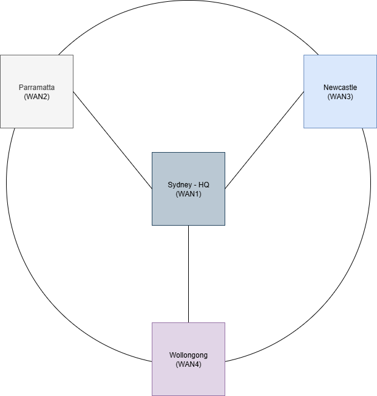
    - **Description:** 
        
        The screenshot above illustrates the proposed WAN network in its basic form. The adopted topology is a hybrid configuration, combining both star and ring structures. In this design, Sydney HQ serves as the central hub, interconnecting with the city branches located in Parramatta, Newcastle, and Wollongong.

1. **WAN Network Diagram (Surface Level):** [WAN Network Diagram Surface Level Draw.io File](images/network_files/Project-Network-WAN-Network-Diagram.drawio) 
    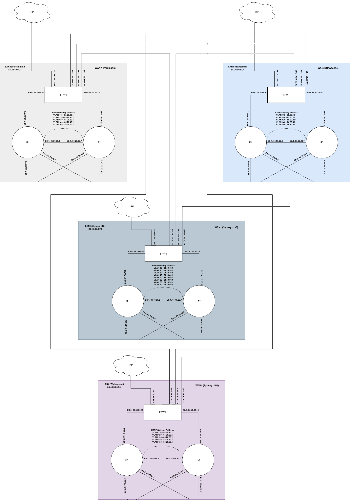
    
    - **Description:** 
        
        The screenshot above presents the proposed WAN network in its surface-level form. While it does not depict the complete internal connections within each WAN, it provides information about the subnets within the WANs and the network interfaces used to connect both to other LANs via the WAN and to their respective Internet Service Providers (ISPs). It can also be observed that the proposed WAN consists of the following LANs, each identified by its corresponding subnet:
        - **WAN1: LAN1 (Sydney HQ)- Subnet: 61.10.80.0/24**
        - **WAN2: LAN2 (Parramatta) - Subnet: 85.20.80.0/24**
        - **WAN3: LAN3 (Newcastle) - Subnet: 85.30.80.0/24**
        - **WAN4: LAN4 (Wollongong) - Subnet: 85.40.80.0/24**

## Network Design Diagrams and Justifications

### Truelec Headquarters - Sydney

**Proposed Network Diagram:** [Network Diagram Sydney - HQ Draw.io File](images/network_files/Project-Network-HQ-Network-Diagram.drawio)

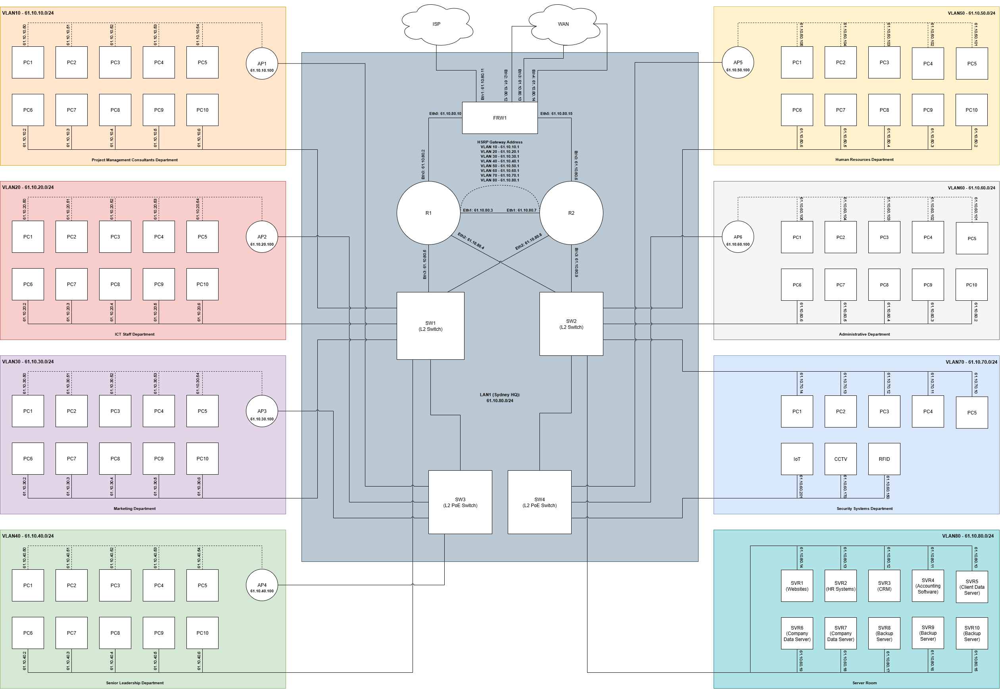

- **Location:** Sydney (CBD, NSW)
- **Staff Size:** 50–75 (with capacity for additional users)
- **Departments/Rooms:** 
    - Project Management Consultants 
    - ICT Staff
    - Marketing
    - Senior Leadership
    - Administrative
    - Human Resources
    - Security System
    - Server Room

- **Proposed Network Diagram Explanation (Sydney - HQ):** 
        
    The proposed network diagram for Truelec Sydney HQ illustrates the eight departments/rooms, each with its own network design based on the assumed number of PCs and devices. Each department/room is allocated a dedicated VLAN with its corresponding subnet. Access points are deployed in each department, with the exception of the Server Room and the Security Systems Department, where wireless access has been intentionally restricted for security reasons. At the core of the departmental network lies **LAN1 (subnet 61.10.80.0/24)**, which houses the routers, switches, and firewalls that provide connectivity and network management.

- **Proposed ISP Fiber Optic Connection:** FTTH/FTTP Fiber to the Home, (enterprise) and FTTB (if in a tower)

    - **Explanation:** 

        For the Sydney HQ, We proposed an enterprise-grade FTTH/FTTP connection (or FTTB if the office is located in a commercial tower) to guarantee high bandwidth, low latency, and reliable service. Since HQ hosts Truelec’s critical IT systems (web, HR, CRM, accounting, client data, company data and backup servers) and supports the largest number of staff, it requires a dedicated fiber link that can handle inter-branch VPN traffic, video conferencing, and future cloud services. Enterprise fiber also comes with SLA-backed performance (very high uptime) and scalability, ensuring Truelec can expand or add redundancy without major redesign.

- **Switching Explanation:**

    For **switching**, the proposed network design incorporates four switches: two Layer 2 (L2) Access Switches (48-port each) and two Layer 2 (L2) PoE Switches (48-port each). The two L2 Access Switches provide a combined total of 96 network interfaces, sufficient to accommodate between 50 and 70 company employees as well as dedicated servers requiring wired connections. The two L2 PoE Switches are designated for PoE-powered devices and security equipment, including access points (APs), CCTVs, RFID readers, and IoT devices. This configuration also provides scalability, enabling the seamless integration of additional security or PoE-dependent devices in the future without requiring major reconfiguration.

    All switches in the proposed design are configured for VLAN switching. VLANs are included in the design to separate different groups of users and services, which makes the network more secure and easier to manage. This approach also helps Truelec use its bandwidth more efficiently, reduce unnecessary traffic, and keep each department’s data flow organized. 
        
    The specific VLAN assignments for each department are as follows:
    - **Project Management Consultants (VLAN 10) - Subnets: 61.10.10.0/24** 
    - **ICT Staff (VLAN 20) - Subnets: 61.10.20.0/24**
    - **Marketing (VLAN 30) - Subnets: 61.10.30.0/24**
    - **Senior Leadership (VLAN 40) - Subnets: 61.10.40.0/24**
    - **Administrative (VLAN 50) - Subnets: 61.10.50.0/24**
    - **Human Resources (VLAN 60) - Subnets: 61.10.60.0/24**
    - **Security System (VLAN 70) - Subnets: 61.10.70.0/24**
    - **Server Room (VLAN 80) - Subnets: 61.10.80.0/24**

- **Routing and Redundancy Explanation:**

    For **routing**, the proposed network design incorporates six Access Points (APs) and two routers.

    For the **AP configuration**, the six APs are only set to forward network traffic to the switch, and then onward to the router for processing.

    For the **routers**, they are configured with static reservations, DHCP pools, VLAN routing and Hot Standby Router Protocol (HSRP). 
            
    - **Static reservations** are applied to dedicate specific IP addresses for key devices in each department, such as admin PCs, printers, or other systems that require fixed IPs. This ensures that important devices always use predictable addresses, keeping the network organized and easier to manage.

    - Setting a **DHCP pool** is intended to automate IP address allocation for regular staff devices, laptops, and mobile clients. By assigning IPs dynamically from a defined pool, the network reduces administrative overhead while still maintaining efficiency. Each VLAN has its own pool, allowing for clear segmentation, and ensuring that devices only receive addresses appropriate to their department.

    - For **VLANs** connected to Router 1 (VLAN1 to VLAN4) to communicate with other departments connected to Router 2 (VLAN5 to VLAN8), inter-VLAN routing is required. We decided to use the **router-on-a-stick** technique, wherein a single physical interface on each router is configured as a trunk port and subdivided into logical subinterfaces, each assigned to a VLAN and its corresponding IP address. This setup allows traffic from one VLAN to be tagged, forwarded to the router, and then routed to another VLAN through the same physical link. 
        
    By using **router-on-a-stick**, Truelec achieves efficient communication across all VLANs without needing multiple physical interfaces per VLAN, while still maintaining logical separation between departments.

    - **Hot Standby Router Protocol (HSRP)** was also configured on the routers to provide redundancy in the network design. HSRP is a Cisco proprietary protocol that enables multiple routers to function as a group, with one operating as the active router and another as the standby, ensuring continuous availability if the active router fails. In this design, both Layer 2 access switches are connected to both routers, allowing one router to act as the active gateway while the other remains on standby.
        
        
    In short, HSRP allows two routers to share a single virtual gateway IP address. Each VLAN is assigned its own HSRP virtual gateway, and all devices within that VLAN are configured to use it as their default gateway.
    
    This configuration provides fault tolerance, and the roles can switch if a failure occurs. Combined with Router-on-a-Stick, this setup delivers both inter-VLAN routing and high availability, ensuring reliable network performance.

- **Security Explanation:**

    For **security**, we have decided to place a firewall in front of the routers and connected to both the WAN and ISP, wherein it acts as a protective barrier that inspects all inbound and outbound traffic. The firewall enforces security policies, blocks unauthorized access, and filters malicious content before it can reach the internal network. By controlling the flow of traffic between the internal VLANs, the WAN links to branch offices, and the public Internet, the firewall ensures that Truelec’s systems remain secure while still allowing legitimate communication across all sites.

### Truelec - Parramatta

**Proposed Network Diagram:** [Network Diagram Parramatta Draw.io File](images/network_files/Project-Network-Parramatta-Network-Diagram.drawio)

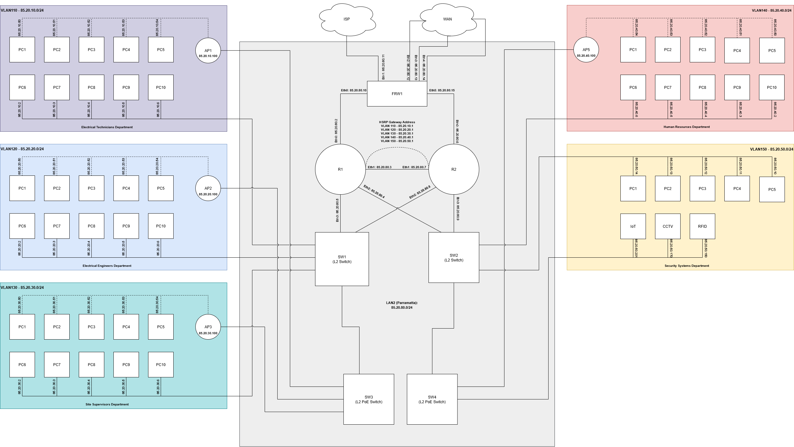
    
- **Location:** Parramatta (Greater Western Sydney)
- **Staff Size:** 15 to 30 (with capacity for additional users)
- **Departments:** 
    - Electricians 
    - Electrical Engineers 
    - Site Supervisors 
    - Human Resources (Support Staff)
    - Security System

- **Proposed ISP Fiber Optic Connection:** FTTB (Fiber to the Building, Business, or Basement)
    - **Explanation:** 
        We assumed FTTB for this site, as Parramatta offices are commonly located in multi-tenant commercial buildings where fiber is delivered to a shared comms room. This option provides a business-grade service with reliable bandwidth for 15–30 staff, secure VPN access to HQ, and future cloud connectivity.

### Truelec - Newcastle

**Proposed Network Diagram:** [Network Diagram Newcastle Draw.io File](images/network_files/Project-Network-NewCastle-Network-Diagram.drawio)

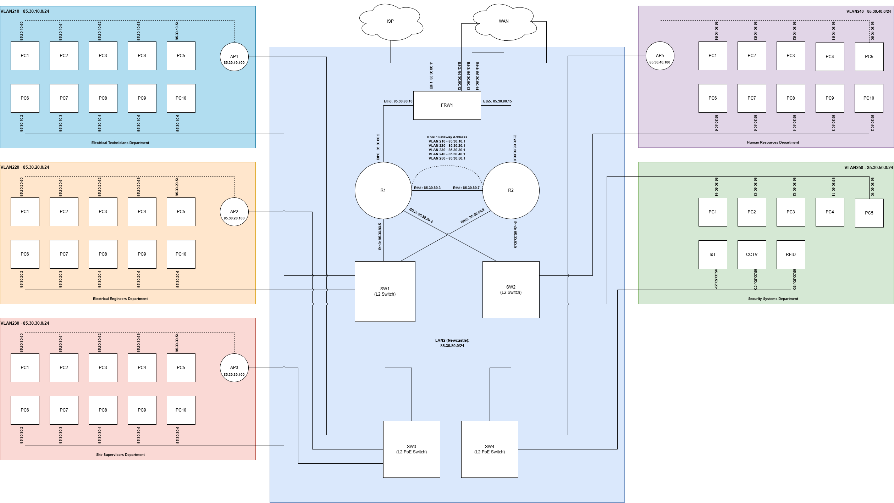

- **Location:** Newcastle (Hunter Region, ~160 km north of Sydney)
- **Staff Size:** 15 to 30 (with capacity for additional users)
- **Departments:** 
    - Electricians 
    - Electrical Engineers 
    - Site Supervisors 
    - Human Resources (Support Staff)
    - Security System
          
- **Proposed ISP Fiber Optic Connection:** FTTC (Fiber to the Curb)
    - **Explanation:** 

        We assumed FTTC for this site, as fiber services in regional business areas are often deployed to the street cabinet before running over short copper into the premises. This provides high bandwidth at a lower cost, suitable for 15–30 staff, APs, and inter-branch connectivity.

### Truelec - Wollongong
**Proposed Network Diagram:** [Network Diagram Wollongong Draw.io File](images/network_files/Project-Network-Wollongong-Network-Diagram.drawio)

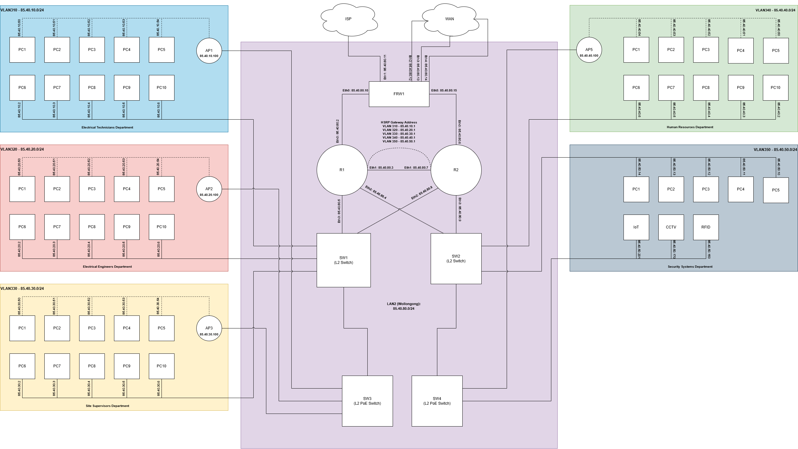

- **Location:** Wollongong (Illawarra Region, ~80 km south of Sydney)
- **Staff Size:** 15 to 30 (with capacity for additional users)
- **Departments:** 
    - Electricians 
    - Electrical Engineers 
    - Site Supervisors 
    - Human Resources (Support Staff)
    - Security System 

- **Proposed ISP Fiber Optic Connection:** FTTC (Fiber to the Curb)

    - **Explanation:**
    
    Similar to Newcastle, We assumed FTTC for this site, as it is the most commonly available option in suburban business areas of Wollongong. This delivers adequate performance and reliability for 15–30 staff, APs, and day-to-day branch operations, with FTTN as a fallback if FTTC is not available at the premises.

## Proposed Network Diagram Explanation (Parramatta, Newcastle and Wollongong)

The proposed network diagrams for Parramatta, Newcastle, and Wollongong are logically similar to the design implemented at the Sydney HQ but are scaled down to accommodate up to 15 to 30 users while still maintaining redundancy and security. Each branch follows the same overall design principles, with the assumption that all five departments are present and supported by a consistent set of network components including PCs, routers, firewalls, and switches. The key difference across the branches lies in the use of unique IP addressing schemes, VLAN assignments, subnets, and gateway configurations, ensuring separation while maintaining a unified design approach.

## WiFi Design

1. **Truelec - Sydney HQ**
    - **Access Point Emulator Used:** [Cisco WAP581 Online Emulator](https://www.cisco.com/assets/sol/sb/WAP581_Emulators/WAP581_Emulator_v1-0-0-4/main.htm)
    - **Wifi Design:** [Wi-Fi Network Diagram Sydney - HQ Draw.io File](images/network_files/Project-Network-HQ-Wifi-Diagram.drawio)
    
    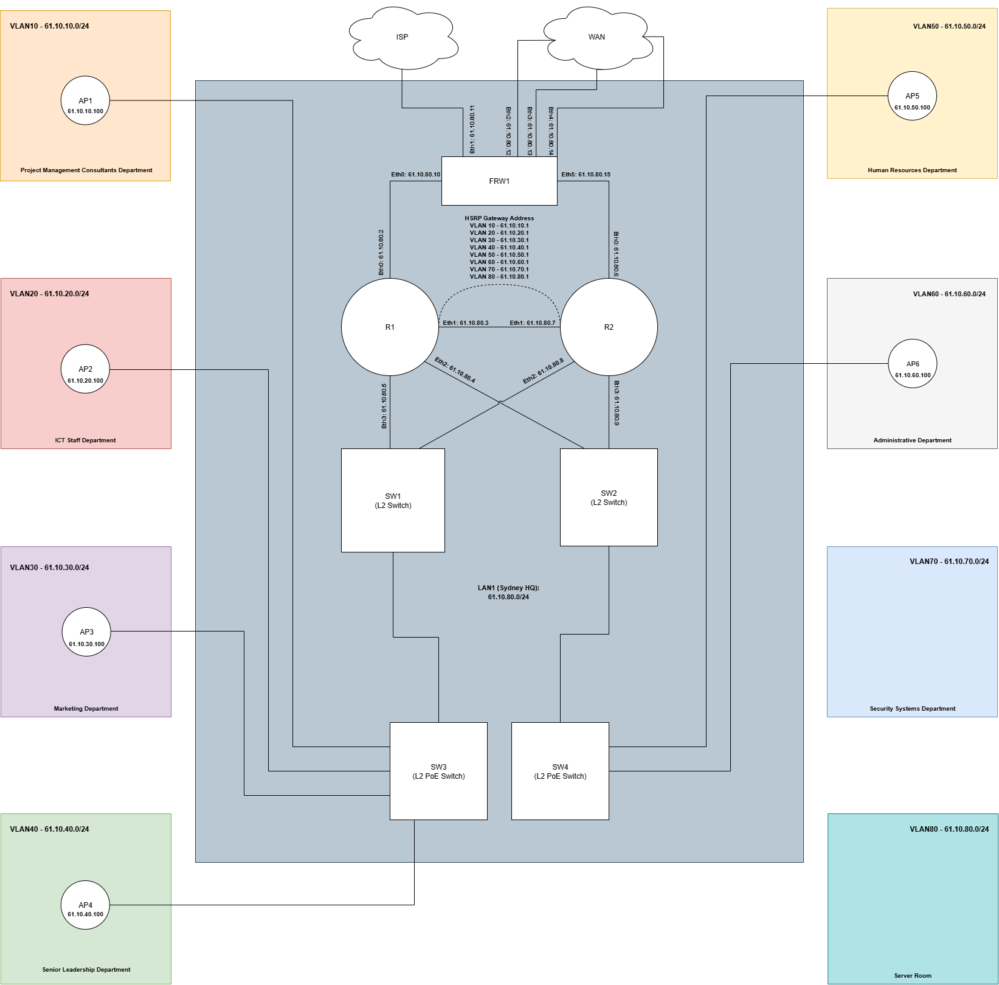
    - **Wifi Design Explanation:**

        The proposed Wi-Fi network design assigns one access point (AP) to each department at the Sydney HQ, with the exception of the Security Systems department and the Server Room, resulting in a total of six APs. Each AP is configured with a static IP address, with AP1 to AP4 connected through Router 1, and AP5 and AP6 connected through Router 2. While in practice multiple APs may be deployed within a single department to ensure full coverage and redundancy, this design assumes a simplified model in which only one AP is allocated per department.

    - **Wifi Configuration:**
        - **SSID, System Contact, System Location Configuration:**

            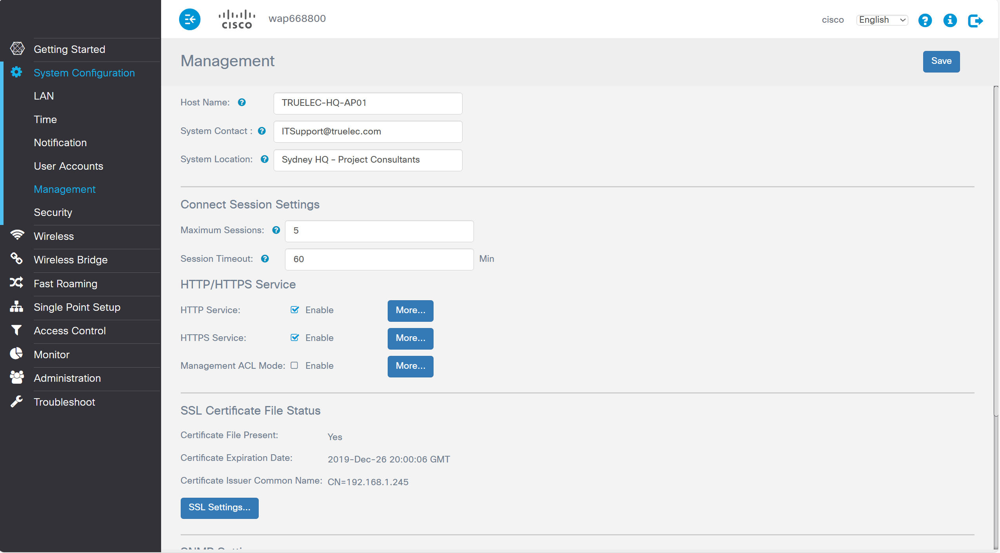
            
            We adopted the SSID naming format [Company]-[Site]-[DeviceType][Number]. For this network, Truelec represents the company, HQ identifies the location, and AP01 denotes the first access point at that site. The System Contact field is kept consistent across all sites, set to the central IT support email (ITSupport@truelec.com), ensuring a single point of contact. The System Location field is site-specific, providing clear information on the physical placement of the device so that troubleshooting can be performed efficiently.

        - **IP address Configuration:**
            
            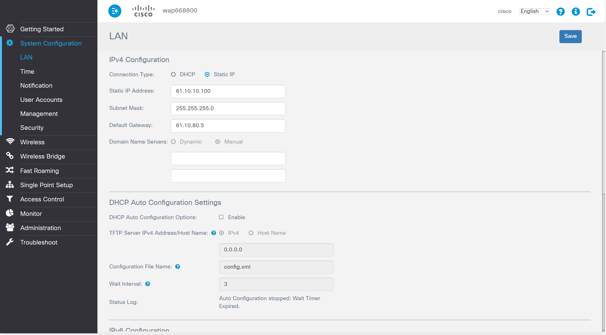

            We assigned each access point a static IP address within its respective VLAN subnet, ensuring that it aligns with the subnet addressing scheme and the corresponding HSRP gateway address for that VLAN.

        - **Firmware Configuration:**
            
            

            We reviewed the firmware configuration of each access point to verify if updates were available. Keeping firmware up to date is an important security measure, as it helps protect the access points from known vulnerabilities and exploits. Regular updates ensure that the devices remain secure, stable, and aligned with best practices for enterprise network management.

        - **Radio (5GHz and 2.4GHz) Configuration:**
            
            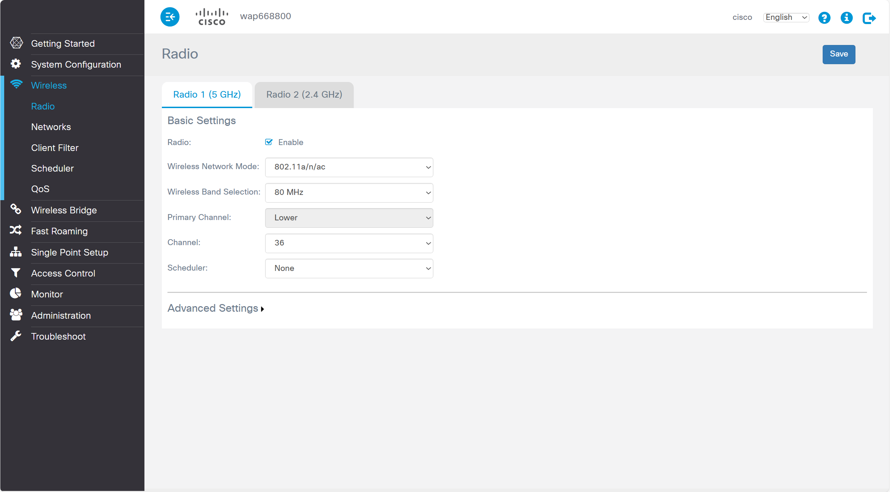
            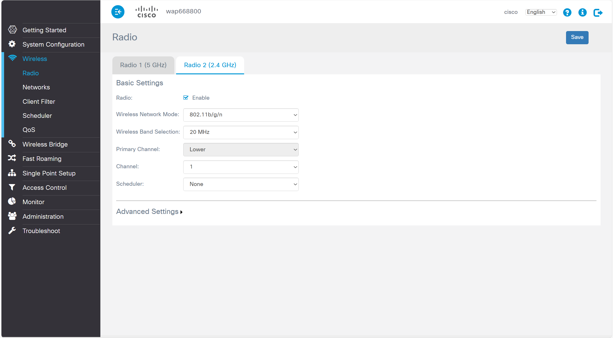

            For the 5 GHz radio configuration, the wireless network mode was left at its default setting, with the band selection set to 80 MHz across the network. To minimize interference, we distributed the channels so that neighboring APs do not share the same one. The assignments are as follows:

            1. **AP1: Channel 36**
            2. **AP2: Channel 44**
            3. **AP3: Channel 149**
            4. **AP4: Channel 153**
            5. **AP5: Channel 157**
            6. **AP6: Channel 161**

            For the 2.4 GHz radio configuration, we opted to use channels 1, 6, and 11, as these are the only three clean, non-overlapping channels. With six APs, the assignments were made as follows:

            1. **AP1: Channel 1**
            2. **AP2: Channel 6**
            3. **AP3: Channel 11**
            4. **AP4: Channel 1**
            5. **AP5: Channel 6**
            6. **AP6: Channel 11**

            This approach ensures proper channel reuse across the site, preventing overlap and interference between adjacent APs.

2. **Truelec - Parramatta**
    - **Wifi Design:** [Wi-Fi Network Diagram Parramatta Draw.io File](images/network_files/Project-Network-Parramatta-Wifi-Diagram.drawio)
    
        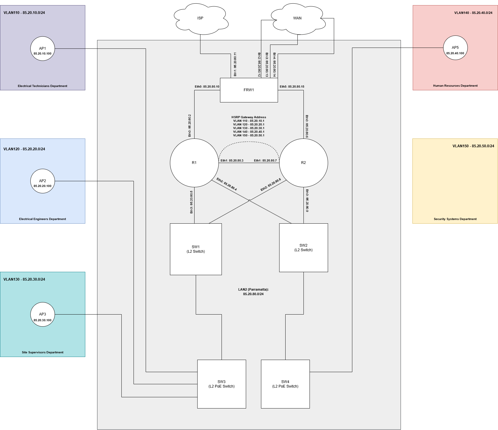
    - **Wifi Configuration:**
        - **SSID, System Contact, System Location Configuration:**

            
        - **IP address Configuration:**

            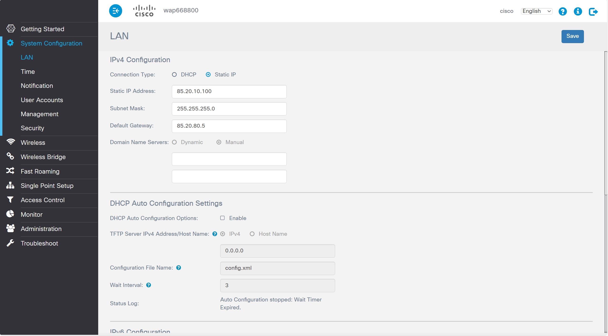
        - **Firmware Configuration:**
            
            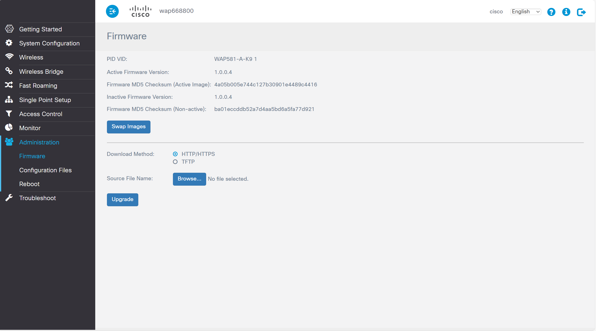

        - **Radio (5GHz and 2.4GHz) Configuration:**
            
            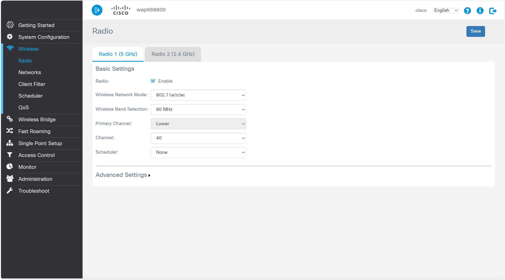
            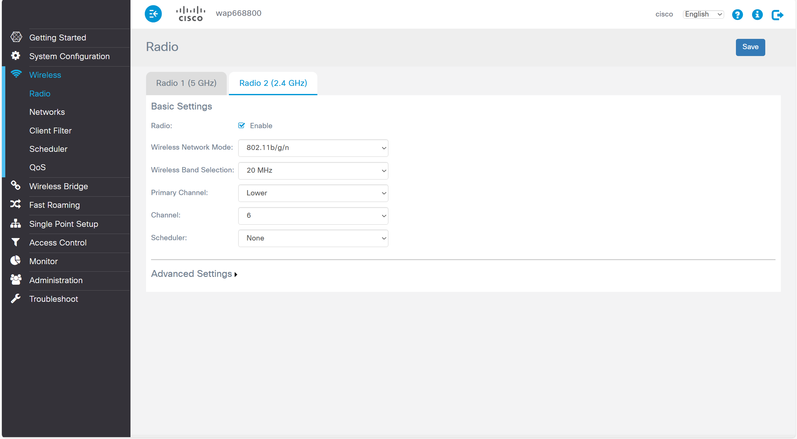

3. **Truelec - Newcastle**
    - **Wifi Design:** 
        [Wi-Fi Network Diagram Newcastle Draw.io File](images/network_files/Project-Network-NewCastle-Wifi-Diagram.drawio)

        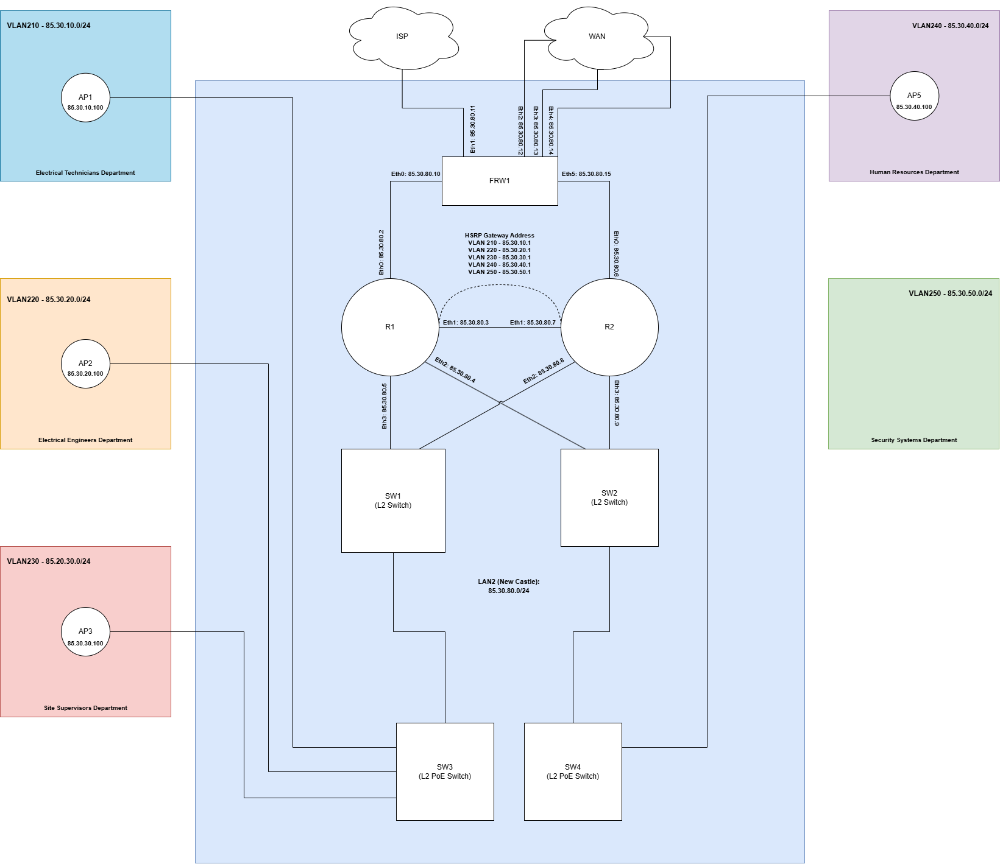

        - **SSID, System Contact, System Location Configuration:**

            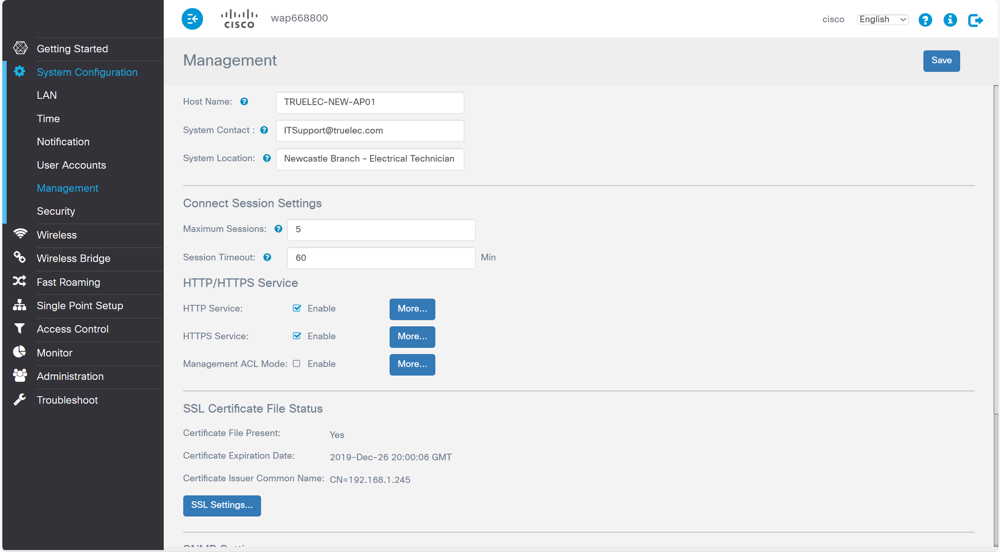
        - **IP address Configuration:**
            
            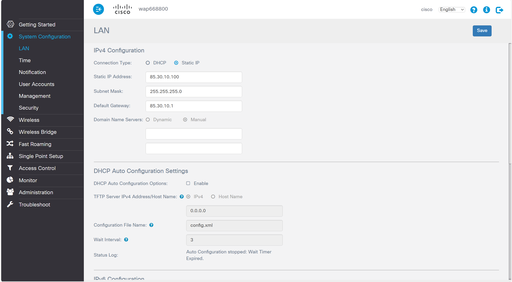
        - **Firmware Configuration:**
            
            

        - **Radio (5GHz and 2.4GHz) Configuration:**
            
            
            

5. **Truelec - Wollongong**
    - **Wifi Design:**
        [Wi-Fi Network Diagram Wollongong Draw.io File](images/network_files/Project-Network-Wollongong-Wifi-Diagram.drawio)
            
        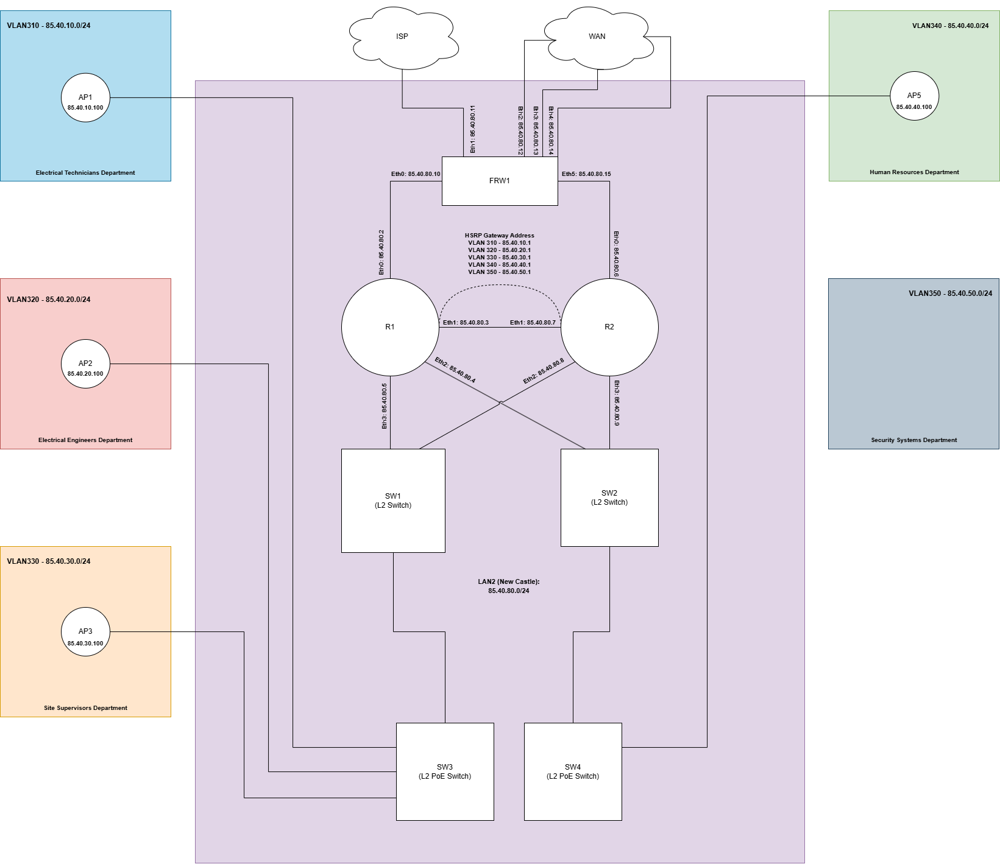

        - **SSID, System Contact, System Location Configuration:**
        
           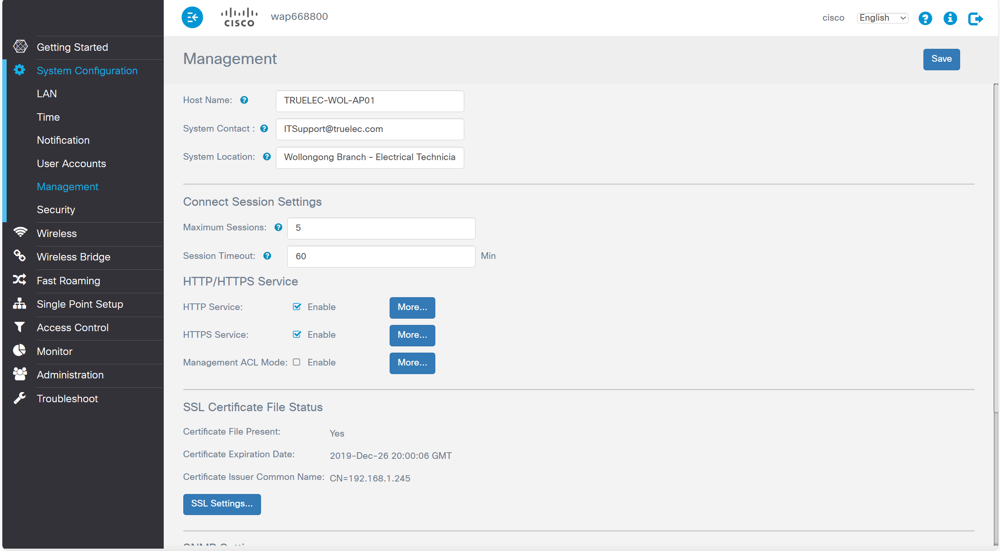
        
        - **IP address Configuration:**
            
            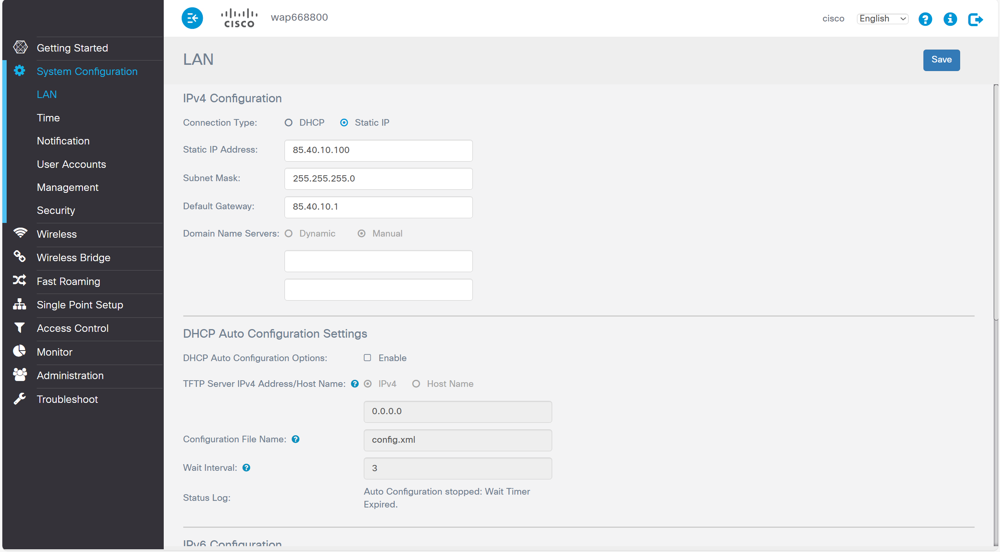
        - **Firmware Configuration:**
            
            
        - **Radio (5GHz and 2.4GHz) Configuration:**
            
            
            

- **Wifi Network and Configuration Explanation (Parramatta, Newcastle, Wollongong):**

    The proposed Wi-Fi network design for Parramatta, Newcastle, and Wollongong remains logically similar to the structure implemented at the Sydney HQ but is scaled down to support 15 to 30 users while still maintaining redundancy and security. In each branch, only four APs are deployed to cover five departments, with the Security Systems department intentionally excluded from Wi-Fi access for security reasons.

    For the Wi-Fi configuration, the SSID naming convention follows the site code, ensuring each branch has a unique identifier. For example:

    1. TRUELEC-PAR-AP01 for Parramatta

    2. TRUELEC-NEW-AP01 for Newcastle

    3. TRUELEC-WOL-AP01 for Wollongong

    Each AP is also assigned a static IP address that corresponds to its location and VLAN subnet, ensuring clear organization and consistent network management across all sites. As for firmware and radio configuration, these follow the same structure and logic as defined for the Sydney HQ, maintaining consistency in channel allocation, security posture, and update practices across all Truelec sites.

## Address Allocations

**Note:** The IP address ranges used in this network design follow the requirements specified in the project brief, which state that the first octet (A in A.B.C.D) must be derived from the last two digits of the student IDs of the group members. In this case, our student IDs are:
- **12292861 (Joshnell Briggs Zareno)**
- **12284185 (Angie Marcela Cardenas Cardenas)**

Therefore, the addresses starting with 61.x.x.x and 85.x.x.x were used. This approach ensures that the IP addressing scheme is unique to our group and fully complies with the project requirements.

1. **Truelec - Sydney HQ**
    - **IP Tables:** [Sydney - HQ IP tables](images/network_files/Tables.pptx)

        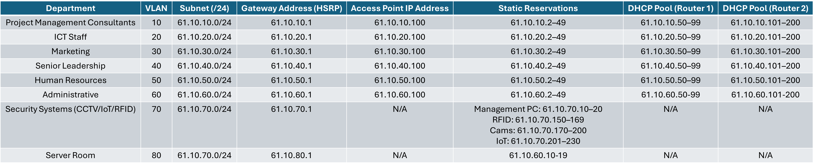
            
        The table above essentially documents the LAN segmentation, gateway redundancy, Wi-Fi AP allocation, and IP management strategy for HQ.

        - VLAN – The tag number identifying each department’s logical network segment. For example, Project Management Consultants are assigned VLAN 10.

        - Subnet (/24) – Defines the IP address range for that VLAN, using a /24 mask (255.255.255.0). For instance, VLAN 10 uses the 61.10.10.0/24 network.

        - Gateway Address (HSRP) – The virtual IP address used as the default gateway for devices in the VLAN. Provided by HSRP (Hot Standby Router Protocol) for redundancy.

        - Access Point IP Address – Management IPs for wireless access points associated with each VLAN. For example, 61.10.10.100 is reserved for APs in VLAN 10.

        - Static Reservations – Specific IP ranges reserved for critical devices such as management PCs, RFID readers, CCTV cameras, or IoT sensors.

        - DHCP Pool (Router 1 / Router 2) – Dynamic IP ranges assigned to endpoints in each VLAN. Split between Router 1 and Router 2 for load-sharing and redundancy. Example: VLAN 10 DHCP is split between 61.10.10.50–99 (Router 1) and 61.10.10.101–200 (Router 2).

        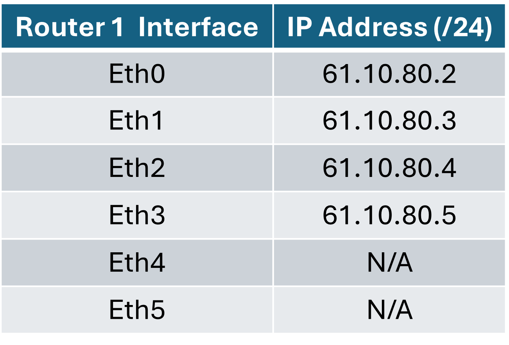

        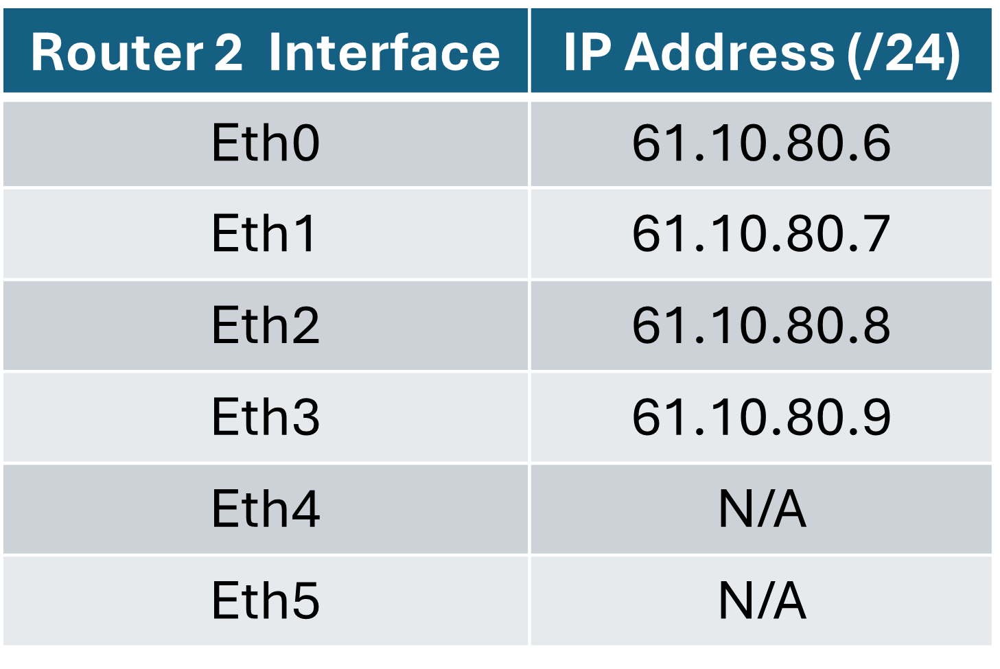

        Routers 1 and 2 each have interfaces Eth0–Eth3 assigned IPs from the 61.10.80.0/24 network (61.10.80.2–5 for Router 1, 61.10.80.6–9 for Router 2), used for internal links to switches, firewall, and server VLANs. Interfaces Eth4–Eth5 remain unused for future expansion. Together, both routers operate under HSRP, providing gateway redundancy, VLAN routing (router-on-a-stick), and seamless failover for the HQ network.

        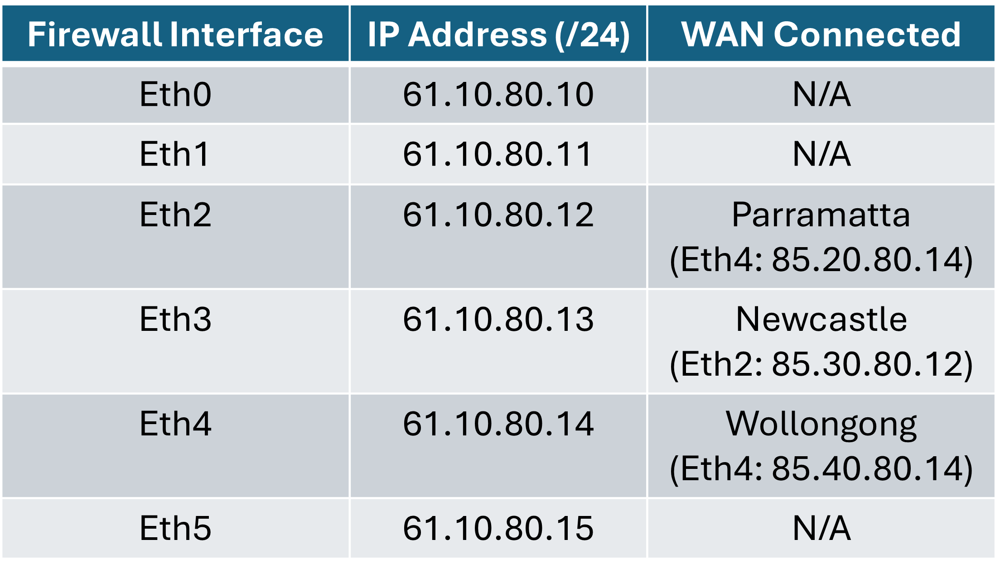

        The table above outlines firewall connections at HQ. Each firewall interface has an internal IP in the 61.10.80.0/24 range and may also connect to branch WAN IPs.

        - Eth0–Eth1 (61.10.80.10–11): Internal interfaces, used for LAN connections from the core routers/switches.
        - Eth2 (61.10.80.12): Connected to Newcastle WAN (85.30.80.12).
        - Eth3 (61.10.80.13): Connected to Wollongong WAN (85.40.80.14).
        - Eth4 (61.10.80.14): Connected to Parramatta WAN (85.20.80.14).
        - Eth5 (61.10.80.15): Currently unused.

        This design allows the firewall to act as the WAN termination point for multiple branch offices, enforcing security policies while maintaining branch connectivity.

1. **Truelec - Parramatta**

    - **IP Tables:** [Parramatta IP tables](images/network_files/Tables.pptx)

        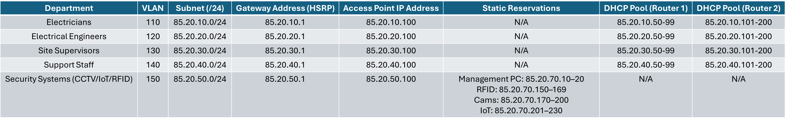

        Parramatta uses VLANs 110–140 for staff (Electricians, Engineers, Supervisors, Support) and VLAN 150 for Security (CCTV/IoT/RFID). Each has a /24 subnet with HSRP gateway and AP IP. DHCP pools are split between Router 1 (.50–.99) and Router 2 (.101–.200).

        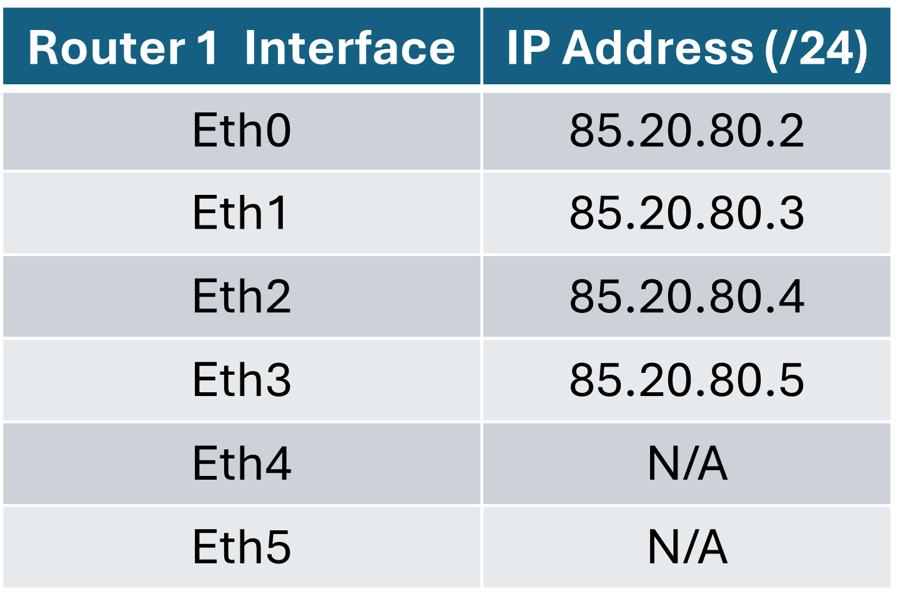

        

        Router 1 (85.20.80.2–5) and Router 2 (85.20.80.6–9) provide internal links and redundancy via HSRP. Eth4–Eth5 remain unused for expansion.

        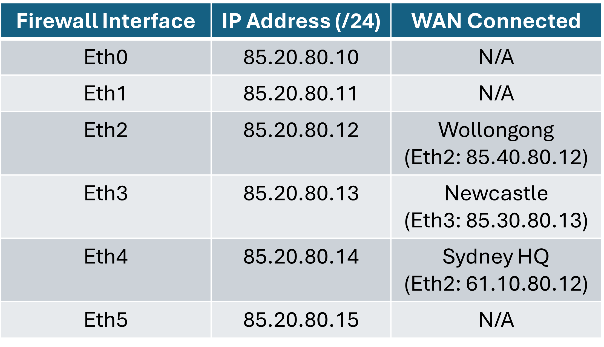

        Firewall uses 85.20.80.10–15, with links to Wollongong, Newcastle, and Sydney HQ, ensuring secure WAN connectivity and branch redundancy.

1. **Truelec - Newcastle**

    - **IP Tables:** [Newcastle IP tables](images/network_files/Tables.pptx)

        

        Newcastle assigns VLANs 210–240 for staff (Electricians, Engineers, Supervisors, Support) and VLAN 250 for Security (CCTV/IoT/RFID). Each VLAN uses a /24 subnet with HSRP gateway and AP IP. DHCP pools are split between Router 1 (.50–.99) and Router 2 (.101–.200).

        

        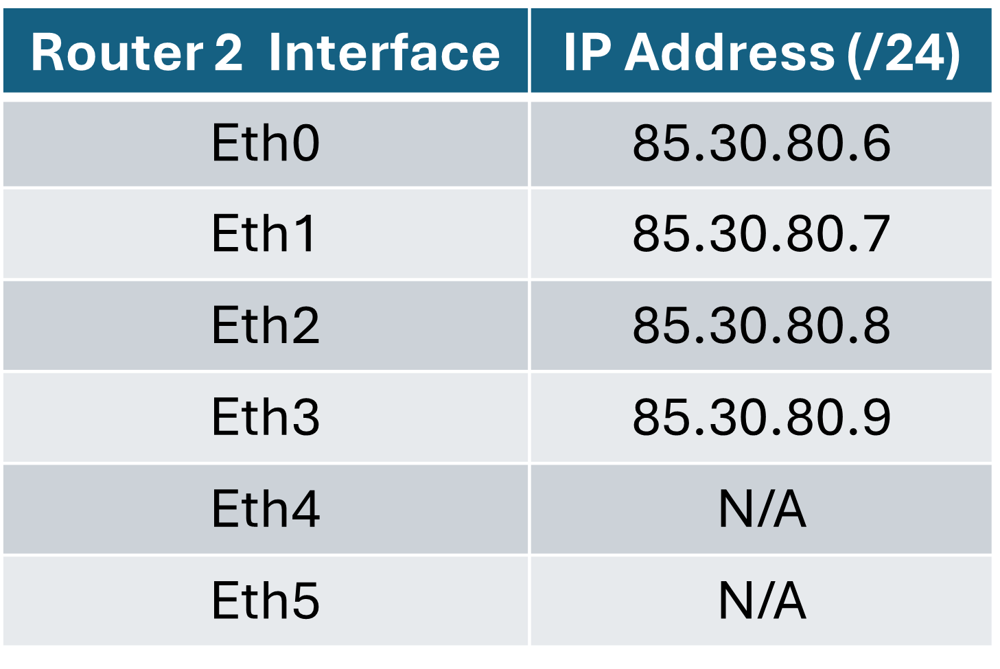

        Router 1 (85.30.80.2–5) and Router 2 (85.30.80.6–9) handle internal connectivity and redundancy via HSRP. Eth4–Eth5 remain unused for expansion.

        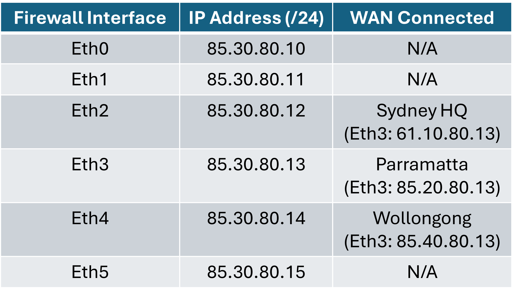
    
        Firewall uses 85.30.80.10–15, with WAN links to Sydney HQ, Parramatta, and Wollongong, ensuring secure branch-to-branch and HQ connectivity.

1. **Truelec - Wollongong**

    - **IP Tables:** [Wollongong IP tables](images/network_files/Tables.pptx)

        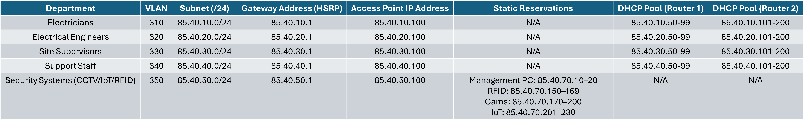

        Wollongong uses VLANs 310–340 for staff (Electricians, Engineers, Supervisors, Support) and VLAN 350 for Security (CCTV/IoT/RFID). Each VLAN has a /24 subnet with HSRP gateway and AP IP. DHCP pools are split between Router 1 (.50–.99) and Router 2 (.101–.200).

        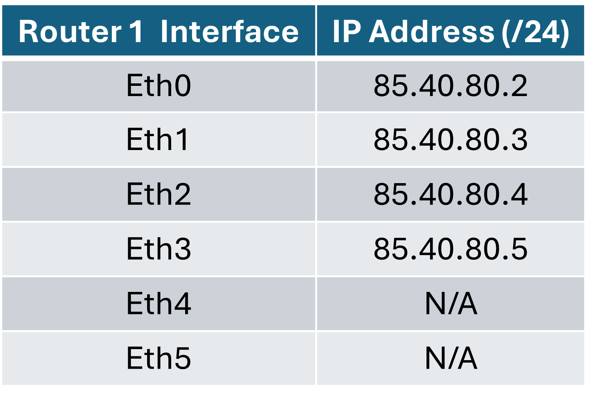

        

        Router 1 (85.40.80.2–5) and Router 2 (85.40.80.6–9) handle local routing with redundancy under HSRP. Eth4–Eth5 are unused for future expansion.

        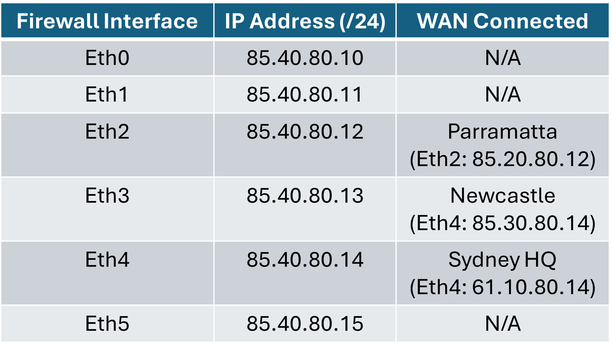

        Firewall (85.40.80.10–15) provides WAN links to Parramatta, Newcastle, and Sydney HQ, ensuring secure branch connectivity and redundancy.

## Recommended Hardware

1. **Truelec - Sydney HQ**
    - **Router:** Cisco Catalyst 8200 Series (Cisco C8200-1N-4T)
    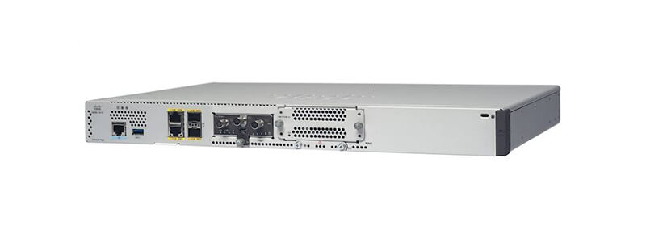
        - **Data Sheet:** [Cisco Catalyst 8200 Series Data Sheet](https://www.cisco.com/c/en/us/products/collateral/routers/catalyst-8200-series-edge-platforms/nb-06-cat8200-series-edge-plat-ds-cte-en.html)
        - **Explanation:**
        
            We selected the Cisco Catalyst 8200-1N-4T routers because they are designed for enterprise WAN edge environments, providing high performance, scalability, and support for advanced features such as HSRP, inter-VLAN routing, SD-WAN, and VPN services. Using two routers at HQ ensures redundancy and high availability, so that if one fails, the other can continue to handle network traffic seamlessly. With up to 4 high-speed interfaces, these routers can manage the heavy demand of 50–75 staff, multiple VLANs, inter-branch traffic, and future cloud service integration.

    - **Access Point:** Cisco WAP581
        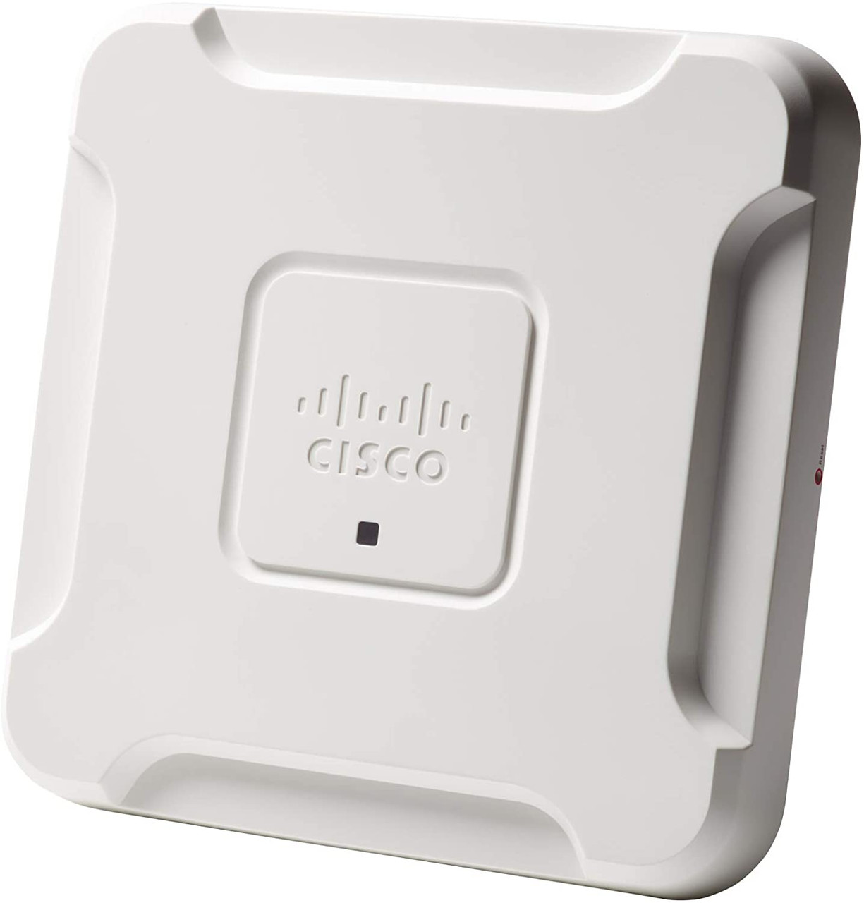
        - **Data Sheet:** [Cisco WAP581 Data Sheet](https://www.cisco.com/c/en/us/products/collateral/wireless/small-business-500-series-wireless-access-points/datasheet-c78-738872.html#:~:text=This%20data%20sheet%20describes%20the%20benefits%2C%20specifications%2C%20and,2%20Access%20Point%20with%202.5GbE%20LAN%20Data%20Sheet.)
        - **Explanation:**
        
            The Cisco WAP581 was chosen for its enterprise-ready MU-MIMO capabilities, dual-band support (2.4 GHz and 5 GHz), and ability to handle multiple SSIDs mapped to VLANs, which is crucial for departmental segmentation. Its 2.5GbE uplink ensures that the AP can handle high user density without becoming a bottleneck. Six units are deployed at HQ, with one per department (excluding security and server VLANs), to provide reliable coverage and strong performance for up to 75 staff.

    - **Firewall:** Cisco Firepower 1120
        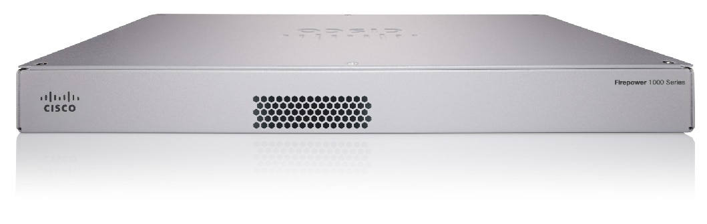
        - **Data Sheet:** [Cisco Firepower 1120 Data Sheet](https://www.cisco.com/c/en/us/products/collateral/security/firepower-1000-series/datasheet-c78-742469.html)
        - **Explanation:**
            
            The Cisco Firepower 1120 is selected as the main network security appliance at HQ. It provides up to 2–3 Gbps firewall throughput and includes next-generation firewall (NGFW) features such as intrusion prevention, deep packet inspection, advanced malware protection, URL filtering, and application-level visibility. Unlike a traditional firewall that only filters based on ports and IPs, the Firepower 1120 can inspect traffic at the application and user level, ensuring that Truelec’s critical services and cloud workloads are protected. Centralized management via Cisco FMC also makes it easier to maintain consistent policies across sites. A single unit is sufficient at HQ to secure outbound and inbound traffic, but its scalability leaves room for future growth.

    - **Switch:** 
        - Cisco Catalyst 9200L 48-port PoE+ (Cisco C9200L-48P-4X-E)
        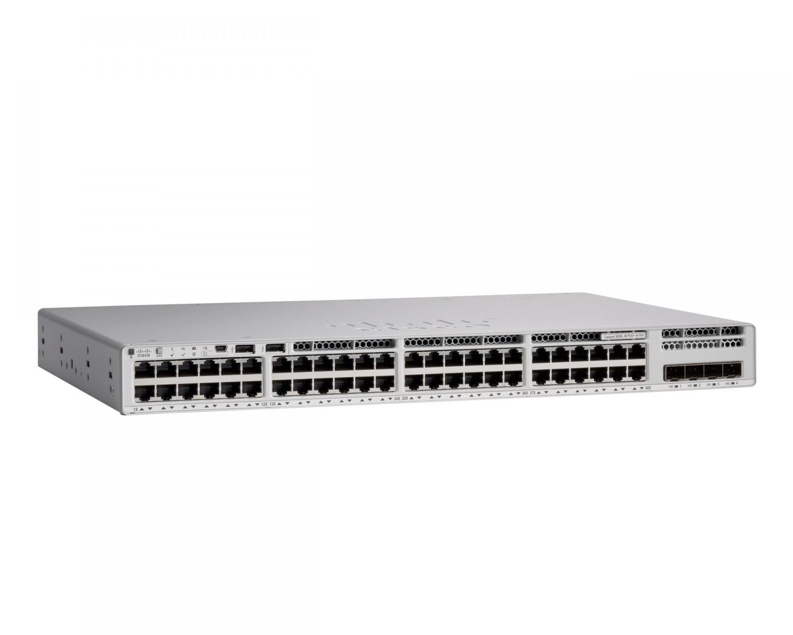
            - **Data Sheet:** [Cisco Catalyst 9200L 48-port PoE+ (Model: C9200L-48P) Data Sheet](https://www.cisco.com/c/en/us/products/collateral/switches/catalyst-9200-series-switches/nb-06-cat9200-ser-data-sheet-cte-en.html)
            - **Explanation:**
                
                We selected two of these switches to power PoE-enabled devices such as APs, CCTV cameras, RFID readers, and IoT sensors. With a high PoE budget and 48 ports each, these switches can handle both current needs and future expansion. The 4×10G SFP+ uplinks allow high-speed connections to the routers and aggregation layer, ensuring that bandwidth-demanding applications (such as video surveillance) are not constrained.

        - Cisco Catalyst 9200L 48-port Non-PoE (Cisco C9200L-48P-4G-E)
        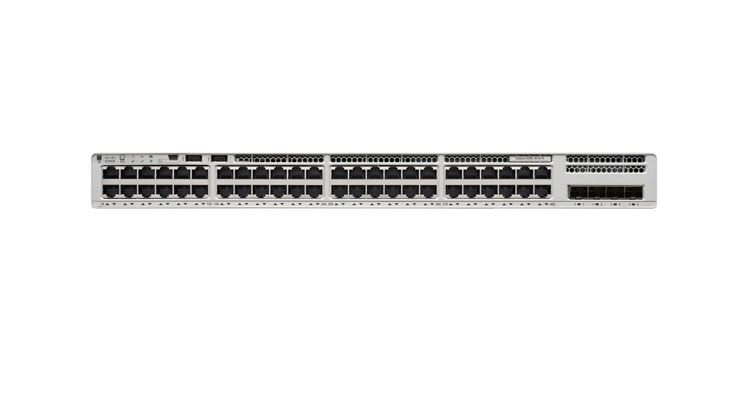
            - **Data Sheet:** [Cisco Catalyst 9200L 48-port PoE+ (Cisco C9200L-48P-4G-E) Data Sheet](https://www.cisco.com/c/en/us/products/collateral/switches/catalyst-9200-series-switches/nb-06-cat9200-ser-data-sheet-cte-en.html)
            - **Explanation:**
                
                Two non-PoE Catalyst 9200L switches were chosen to provide aggregation and VLAN management for wired PCs and servers that do not require PoE. By separating PoE and non-PoE switching, Truelec reduces costs while still maintaining consistent enterprise-grade performance. The 4×1G SFP uplinks are sufficient for connecting to the routers/firewall, and the stackable design ensures redundancy and easy management.

1. **Truelec - Parramatta, Newcastle, Wollongong**

    - **Router:** Cisco ISR C1111-4P
    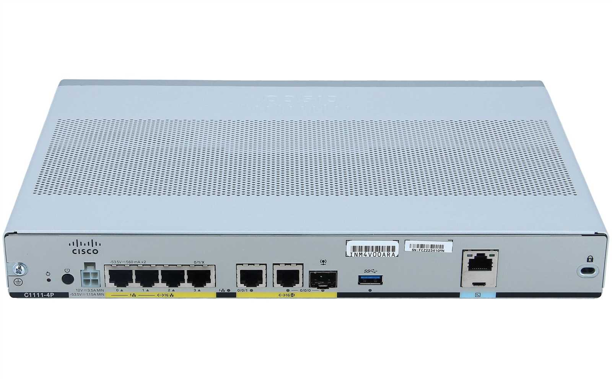
        - **Data Sheet:** [Cisco ISR 1100/1000 Data Sheet](https://www.cisco.com/c/en/us/products/collateral/routers/1000-series-integrated-services-routers-isr/datasheet-c78-742893.html)
        - **Explanation** 
            
            The Cisco ISR 1111-4P router was selected for each branch because it is a compact yet enterprise-ready router that supports features such as HSRP, VLAN routing, static reservations, and DHCP services. Using two routers per branch provides redundancy and ensures reliable connectivity for up to 30 users. This model also supports WAN edge capabilities, making it suitable for handling branch Internet connections and secure communication with HQ.
    
    - **Access Point:** Cisco WAP581
    
        - **Data Sheet:** [Cisco WAP581 Data Sheet](https://www.cisco.com/c/en/us/products/collateral/wireless/small-business-500-series-wireless-access-points/datasheet-c78-738872.html#:~:text=This%20data%20sheet%20describes%20the%20benefits%2C%20specifications%2C%20and,2%20Access%20Point%20with%202.5GbE%20LAN%20Data%20Sheet.)
        - **Explanation:** 
        
            Each branch will use four Cisco WAP581 to provide dual-band wireless coverage (2.4 GHz and 5 GHz) with support for MU-MIMO and multiple SSIDs mapped to VLANs. This ensures staff can connect wirelessly with good performance and proper VLAN segregation. Although only one AP is allocated in the simplified design, more WAP581 units can be added if coverage or capacity needs grow in the future.

    - **Firewall:** Cisco Firepower 1010
    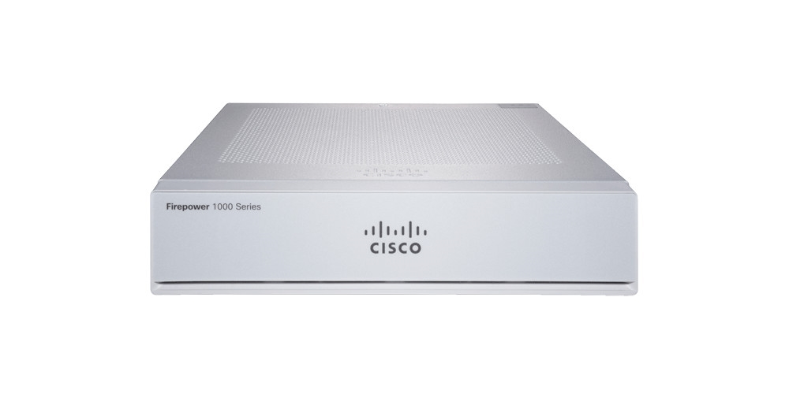
        - **Data Sheet:** [Cisco Firepower 1010 Data Sheet](https://www.cisco.com/c/en/us/products/collateral/security/firepower-1000-series/datasheet-c78-742469.html)
        - **Explanation:** 
            The Cisco Firepower 1010 firewall was chosen for the branches as a compact NGFW appliance tailored for small-to-medium offices. Despite its size, it delivers enterprise-grade features including intrusion prevention, application control, advanced malware protection, URL filtering, and deep packet inspection. By enforcing policies at both the application and user level, it ensures that branch traffic to the WAN and Internet remains secure. A single Firepower 1010 per branch provides sufficient performance for 15–30 users while keeping the design consistent with HQ’s NGFW-based security approach.

    - **Switch:** 
        - Cisco Catalyst 9200L 24-port PoE+ (Cisco C9200L-24P-4X-E)
        
            - **Data Sheet:** [Cisco Catalyst 9200L 24-port PoE+ (Cisco C9200L-24P-4X-E) Data Sheet](https://www.cisco.com/c/en/us/products/collateral/switches/catalyst-9200-series-switches/nb-06-cat9200-ser-data-sheet-cte-en.html)
            - **Explanation:** 
            
                Two PoE-enabled switches are deployed at each branch to power APs, IP cameras, RFID readers, and other PoE-capable devices. The 24-port design provides enough capacity for branch staff, while the PoE+ budget ensures that wireless and security devices operate reliably. The inclusion of 4×10G uplinks also ensures fast connections to the branch routers and firewalls.

        - Cisco Catalyst 9200L 24-port Non-PoE (Cisco C9200L-24P-4G-E)
        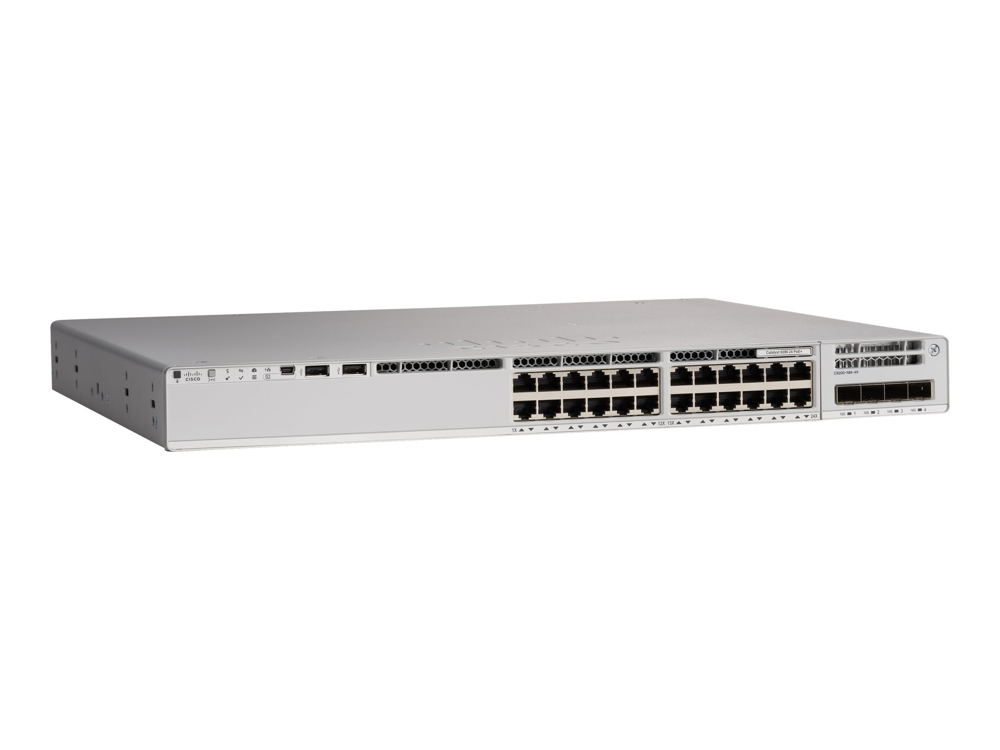
            - **Data Sheet:** [Cisco Catalyst 9200L 24-port PoE+ (Cisco C9200L-24P-4X-E) Data Sheet](https://www.cisco.com/c/en/us/products/collateral/switches/catalyst-9200-series-switches/nb-06-cat9200-ser-data-sheet-cte-en.html)
            - **Explanation:**

                Two non-PoE switches are deployed to provide VLAN management and connectivity for wired PCs and devices that do not require PoE. Separating PoE and non-PoE switching reduces cost while maintaining consistent Cisco Catalyst performance. With stackable support, these switches add redundancy and scalability for the branches.

## Reference

Cisco Systems 2023, *Cisco 500 Series Wireless Access Points datasheet*, viewed 4 September 2025, <https://www.cisco.com/c/en/us/products/collateral/wireless/small-business-500-series-wireless-access-points/datasheet-c78-738872.html>

Comparitech 2025, *How to set up a VLAN*, viewed 7 September 2025, <https://www.comparitech.com/net-admin/how-to-set-up-a-vlan/>

CompSource 2025, *Cisco WAP581-A-K9-RF wireless access point (refurbished)*, viewed 4 September 2025, <https://www.compsource.com/buy/WAP581BK9RF/Cisco-91>

GeeksforGeeks 2025, *Hot Standby Router Protocol (HSRP)*, viewed 7 September 2025, <https://www.geeksforgeeks.org/computer-networks/hot-standby-router-protocol-hsrp/>

ITPrice 2025, *Cisco WAP581 price list and licensing*, viewed 4 September 2025, <https://itprice.com/cisco-gpl/wap581>

Newegg 2025, *Cisco WAP581-A-K9 dual-radio MU-MIMO wireless access point*, viewed 4 September 2025, <https://www.newegg.com/cisco-wap581-a-k9/p/N82E16833960078>

TechTarget 2025, *Virtual LAN (VLAN)*, viewed 7 September 2025, <https://www.techtarget.com/searchnetworking/definition/virtual-LAN>
