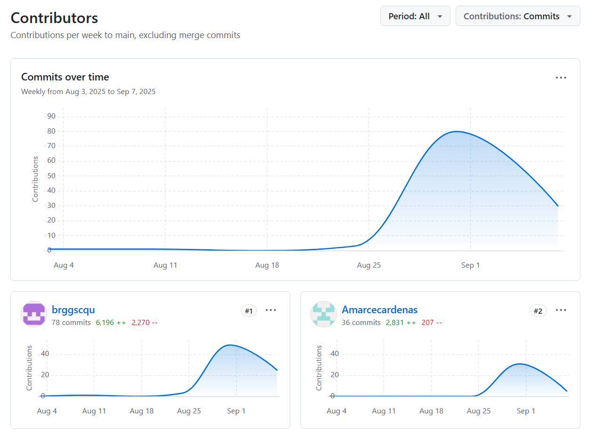
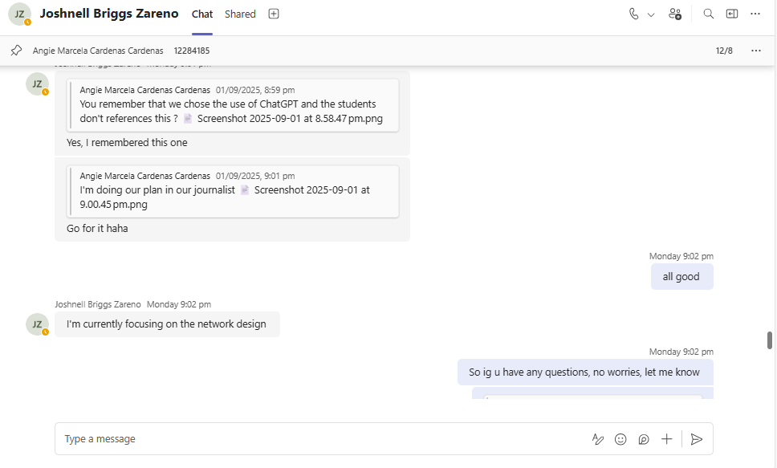
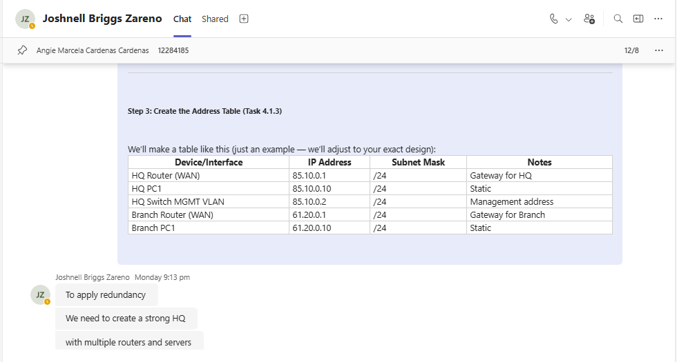
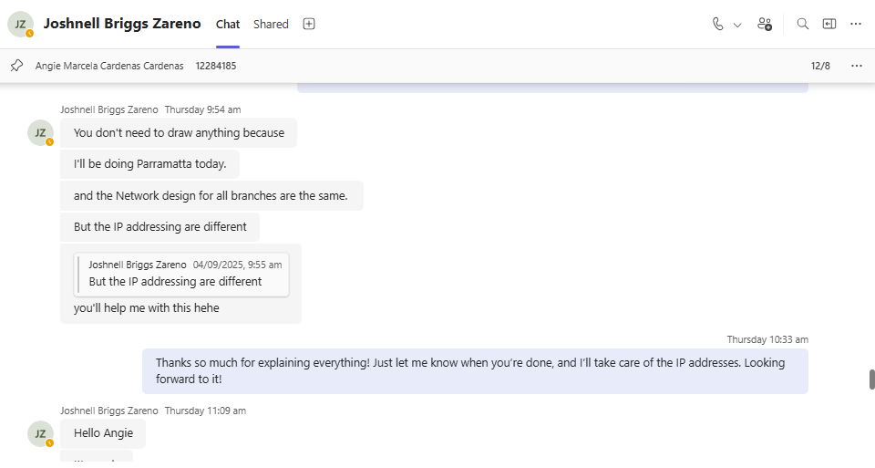
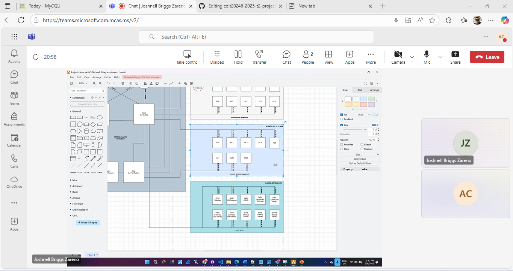
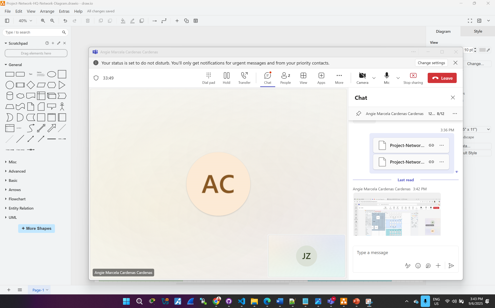
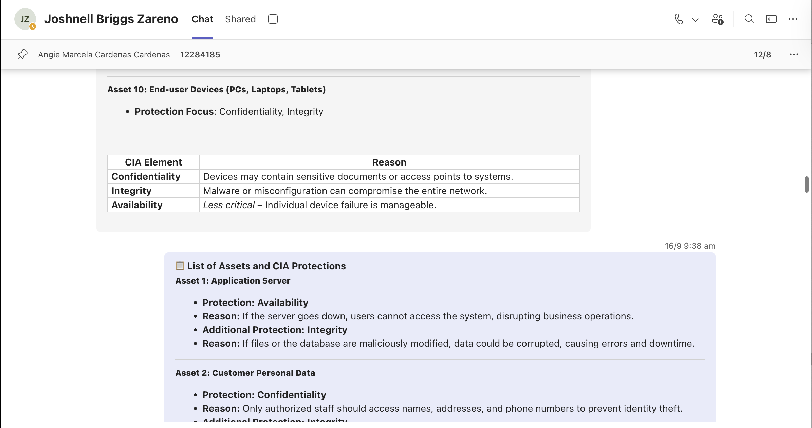
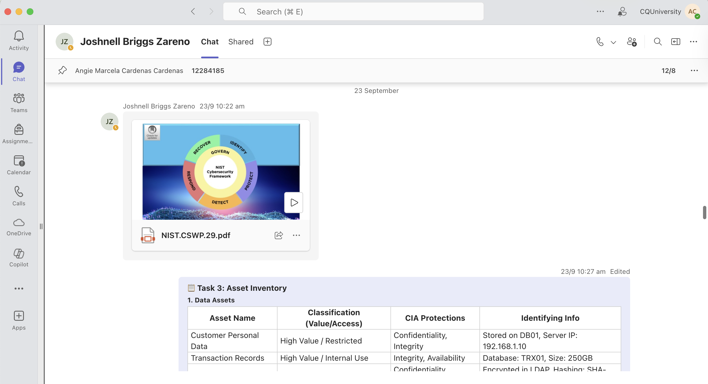
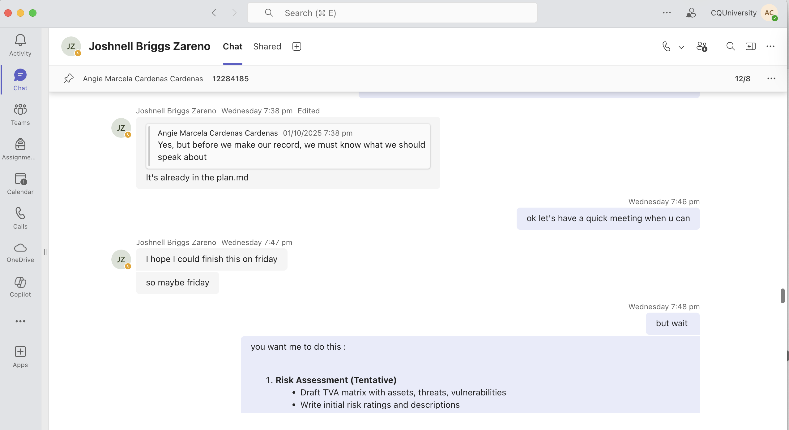
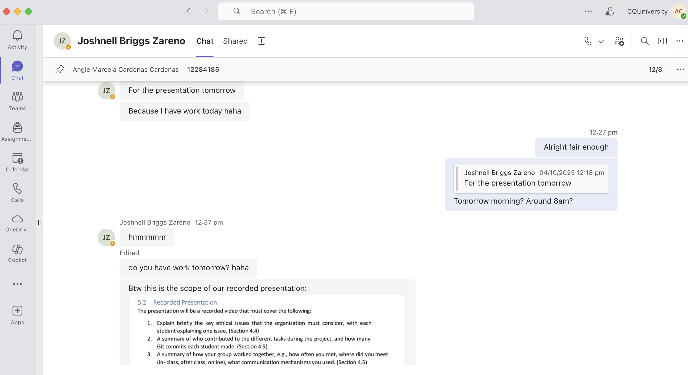

# Project Plan

[Communication](#communication-plan) | [Schedule](#schedule) | [Network Design](./network.md) | [Cloud Services](./cloud.md) | [Security](./security.md) | [Ethics](./ethics.md) | [Reflection](./reflection.md) | [Return to index](./README.md)

## Communication Plan

- **Method:** Microsoft Teams, and in-person (during tutorials)
- **Frequency:** Every Saturday at 6:00 PM (teams) and every Tuesday during class tutorials
- **Collaboration Tools:** GitHub, draw.io, and shared folders for screenshots

---

## Schedule 

| Week | Dates         | Activities                                                                                                                         | Status   | Notes                          |
|------|---------------|------------------------------------------------------------------------------------------------------------------------------------|----------|--------------------------------|
| 5    | From 18th Aug | Group formation, setup GitHub repo, create project plan, define responsibilities, and brainstorming                                | ✔        | GitHub initialized             |
| 6    | From 25th Aug | Define assumptions and IP addressing, start WAN diagrams and WiFi diagrams                                                         | ✔        | Initial diagrams uploaded      |
| 7    | From 1st Sep  | Complete network diagrams, justify WiFi settings, finalize IP tables                                                               | ✔        | Ongoing commits                |
| 8    | From 8th Sep  | Final adjustments, writeups, justification texts, polish Markdown files and draw.io connections for **Project Part 1**             | ✔        | Preparing for submission       |
| 9    | From 15th Sep | Conduct mini cyber security risk assessment, identify assets, threats, vulnerabilities, and draft TVA matrix                       | ✔        | To be developed                |
| 10   | From 22nd Sep | Recommend and document security controls for highest-risk data asset; integrate controls into network design                       | ✔        | Build on Week 9 outcomes       |
| 11   | From 29th Sep | Analyse ethical and social issues; draft report section on privacy, regulations, and impacts of data breaches                      | ✔        | Research laws/regulations      |
| 12   | From 6th Oct  | Final reflections, GitHub commit screenshots, task split table, record presentation, finalize Markdown report (**Project Part 2**) |  ✔        | Final submission preparation   |
 

---

## Group Contributions and Task Distribution

**Student:** Angie Marcela Cardenas (12284185)

**Key Responsibilities:**

  - Project plan, communication, and scheduling
  - WiFi design for **Newcastle** and **Wollongong**
  - Created **network diagrams** and justifications for Newcastle and Wollongong
  - Created **IP tables** for Sydney HQ, Parramatta, Newcastle, Wollongong
  - Created **hardware descriptions**
  - (Tentative) Draft **TVA matrix** and **risk ratings**
  - (Tentative) Document user impact of **security controls** and **integration** into report
  - (Tentative) Draft **Ethics section** (privacy, regulations)
  - **Reflection** notes, screenshots, and presentation prep

**Student:** Joshnell Briggs Zareno (12292861)

**Key Responsibilities:**

  - Created **WAN network diagrams** (basic and surface level)
  - Wrote **WAN justification and explanations**
  - Designed **Sydney HQ** and **Parramatta** diagrams and WiFi plans
  - Provided **IP justification** for all four locations
  - Researched **devices** to recommend
  - Researched **datasheets** of recommended hardware
  - (Tentative) Validate **TVA matrix** against ACSC Essential Eight
  - (Tentative) Select **highest-risk asset** and recommend 3 controls with technical integration details
  - (Tentative) Research technical vulnerabilities tied to **ethics/privacy** issues
  - Compile **GitHub commit** history, task split table, and presentation preparation

## Individual Task Breakdown

**Student:** Angie Marcela Cardenas (12284185)

**Specific Contributions:**

1. **Network Design Diagrams and Justifications**
    - Create Network Diagram Newcastle  Draw.io
    - Network Diagram Newcastle  Draw.io justification and explanation 
    - Create Network Diagram Wollongong Draw.io
    - Network Diagram Wollongong  Draw.io justification and explanation

2. **Wifi Design**
    - Create Wifi Diagram Newcastle Draw.io 
    - Wifi Diagram Newcastle Draw.io justification and explanation 
    - Create Wifi Diagram Wollongong Draw.io 
    - Wifi Diagram Wollongong Draw.io justification and explanation

4. **Address Allocations**
    - Create IP table Sydney - HQ png file 
    - Create IP table Parramatta png file 
    - Create IP table Newcastle png file
    - Create IP table Wollongong  png file

5. **Recommended Hardware**
    - Created the description for each hardware

6. **Risk Assessment (Tentative)**  
   - Draft TVA matrix with assets, threats, vulnerabilities  
   - Write initial risk ratings and descriptions  

7. **Security Controls (Tentative)**  
   - Draft explanatory notes on user impact of controls (e.g., MFA inconvenience, performance issues)  
   - Document integration of controls into Markdown report  

8. **Ethical Issues (Tentative)**  
   - Draft Ethics section focusing on privacy implications and regulations  
   - Reference Australian Privacy Act and GDPR impacts  

9. **Reflection & Presentation**  
   - Compile screenshots of meetings and GitHub commits  
   - Write team collaboration reflection text  
   - Draft notes for the video presentation  
  
**Student:** Joshnell Briggs Zareno (12292861)

**Specific Contributions:**

1. **Assumptions**
    - Network Design Requirements
    - WAN Network diagram basic draw.io 
    - WAN Network Description basic justification and explanation 
    - WAN Network diagram surface level draw.io 
    - WAN Network Description surface level justification and explanation

2. **Network Design Diagrams and Justifications**
    - Create Network Diagram Sydney - HQ Draw.io 
    - Network Diagram Sydney - HQ Draw.io justification and explanation 
    - Create Network Diagram Parramatta  Draw.io 
    - Network Diagram Parramatta  Draw.io justification and explanation

3. **Wifi Design**
    - Create Wifi Diagram Sydney - HQ Draw.io 
    - Wifi Diagram Sydney - HQ Draw.io justification and explanation 
    - Create Wifi Diagram Parramatta Draw.io 
    - Wifi Diagram Parramatta Draw.io justification and explanation

4. **Address Allocations**
    - IP table Sydney - HQ png file justification and explanation 
    - IP table Parramatta png file justification and explanation 
    - IP table Newcastle png file justification and explanation 
    - IP table Wollongong Draw.io justification and explanation

5. **Recommended Hardware**
    - Researched about the Devices to recommend
    - Researched all of the data sheets 

6. **Risk Assessment (Tentative)**  
   - Validate TVA matrix against ACSC Essential Eight  
   - Ensure threats and vulnerabilities align with network design choices  

7. **Security Controls (Tentative)**  
   - Select highest-risk data asset (customer booking & payment data)  
   - Research and justify 3 recommended controls (MFA, encryption, patching/whitelisting)  
   - Explain where in the network controls will be implemented  

8. **Ethical Issues (Tentative)**  
   - Research technical vulnerabilities linked to privacy risks  
   - Draft supporting technical notes on how breaches could occur  

9. **Reflection & Presentation**  
   - Compile GitHub commit history screenshots  
   - Create task distribution and commit comparison table  
   - Draft notes for the video presentation  

## GitHub Commit Policy

- Each student committed individually after completing tasks.
- Multiple commits per week were made by each member.
- Commits reflect real-time progress, not bulk uploads.

**Week 8 GitHub Commits:** 

**Week 12 GitHub Commits: (Ongoing)**

## Screenshots of Communication and Collaboration

**Microsoft Teams Communication and Collaboration:** 
| Description                         | Microsoft Teams Screenshot                                                                             |
|-------------------------------------|--------------------------------------------------------------------------------------------------------|
| Week 5  (Chats Teams)               |         |
|                                     |         |
| Week 6  (Chats Teams)               |           |
| Week 7  (Meetings Teams)            |         |
| Week 8  (Meetings Teams)            |         | 
| Week 9  (Chats Teams)               |         |
| Week 10 (Chats Teams)               |         |                                                                                              
| Week 11 (Chats Teams)               |         |                                                                                          
| Week 12 (Chats Teams)               |         |

## Reflection on Team Collaboration

- The group maintained consistent communication via Microsoft Teams and in-class meetings.
- Both members contributed equitably according to their strengths.
- GitHub was used regularly, demonstrating active participation from both.
- Tasks were clearly distributed and executed on schedule.
- Screenshots and commit logs provide evidence of professional collaboration and engagement.

---

### Week 5 – From 18th August 2025

This week was primarily dedicated to brainstorming and idea exploration for our network design project. Key activities included:

  - Conducted initial discussions on project scope, clarifying deliverables and reviewing the project brief to ensure alignment with requirements.

  - Held a brainstorming session for network design options, where we considered different WAN topologies (star, ring, hybrid) and debated their pros and cons in terms of cost, redundancy, and scalability.

  - Explored wireless network requirements, generating ideas about the possible number of access points per branch and identifying potential challenges in coverage for larger store layouts.

  - Sketched early concepts for IP addressing, exchanging ideas on how to apply the student-ID rule and testing different subnetting strategies for future scalability.

  - Shared research responsibilities among team members, with each person tasked to look into specific aspects (e.g., WAN redundancy, VLAN configuration, wireless security standards).

The focus this week was less on finalizing details and more on generating a broad pool of ideas, ensuring that multiple design alternatives were considered before moving into structured design work in Week 6.

### Week 6 – From 25th August 2025

During this week, we focused on establishing the foundation of our network design. Key activities included:

- Defined the **project assumptions**, including:
- Headquarters location (Sydney)
- Estimated number of employees per site
- Branch locations: Parramatta, Newcastle, and Wollongong

- Began designing the **WAN network topology** using draw.io, to visualize the interconnection between sites, ensuring redundancy and availability.

- Initiated the **WiFi network drafts**, setting parameters such as the number of access points, zone coverage, and security types.

- Planned the **IP addressing scheme** based on the last two digits of our student IDs, following the rule of avoiding private IP addresses and sticking to /24 or /16 masks.

### Week 7 – From 1st September 2025

This week was focused on the technical development of the network design, including WiFi setup, IP addressing, and detailed justifications.

- Completed all **network diagrams** for the headquarters (Sydney HQ) and the three branches, each with an accompanying explanation to justify our design choices, such as scalability, segmentation, and redundancy.

- Finalized the **WiFi network configurations**, including:
  - SSID naming per site
  - Channel selection to avoid interference
  - Authentication and encryption methods (e.g., WPA2 Enterprise)
  - Number and distribution of access points

- Created and reviewed the **IP addressing tables** for each site, considering departmental segmentation (e.g., administration, operations, marketing).

- Wrote comprehensive explanations for every design choice and documented them inside the `network.md` file.

### Week 8 – From 8th September

In the final week before submission, we focused on consolidating and finalizing all work:

- Made final adjustments to diagrams and ensured **logical and visual consistency** across all draw.io files.

- Polished all **Markdown documents** (`plan.md`, `network.md`, etc.), reviewing spelling, grammar, formatting, and technical accuracy.

- Reviewed all **technical justifications** to ensure they clearly explained the reasoning behind each decision and aligned with project requirements.

- Coordinated the preparation of **meeting screenshots** and validated the checklist of deliverables.

- Ensured all **file naming conventions**, folder structures, and GitHub commits were correctly organized and ready for submission.

### Week 9 – From 15th September 2025

In this week, we will shift our focus from pure network design into security analysis.

  - Conduct a mini cyber security risk assessment using the provided template.

  - Identify key assets across all categories (data, hardware, software, networks, people).

  - Map at least eight threats (from the unit’s list of 12), including data breaches, denial of service, and insider misuse.

  - Brainstorm vulnerabilities in our network design, such as weak WiFi authentication or insufficient patch management.

  - Responsibilities will be assigned: Angie will draft risk ratings, and Joshnell will validate the alignment with the Essential Eight and NIST references.

Expected outcome: A draft TVA matrix with threats, vulnerabilities, and impacted assets for further refinement.

### Week 10 – From 22nd September 2025

This week will be focused on moving from risk identification to security control recommendations.

  - Select the highest-risk data asset from Week 9’s risk matrix (sensitive customer booking and payment data).

  - Research potential security controls from NIST SP800-53 and the unit lectures.

  - We will recommend three key controls:
    - Multi-Factor Authentication (MFA) for remote access and admin logins.
    - Encryption at rest and in transit for customer data.
    - Regular patching and application whitelisting to limit malware threats.

We will document how these controls integrate into our design (e.g., MFA on Sydney HQ servers, encryption on database storage, patching policies across branches).

We will also discuss disadvantages for users, such as possible login delays or reduced performance.d disadvantages for users, such as possible login delays or reduced performance.

### Week 11 – From 29th September 2025

In this week, we will explore the ethical and social issues linked to our design and the travel agency scenario.

  - We plan to analyse privacy implications of storing and processing customer data (names, emails, payment details, travel history).

  - Research relevant data protection regulations, such as the Australian Privacy Act and GDPR (due to international clients).

  - Discuss impacts of data breaches, including reputational loss, financial penalties, and harm to customers (identity theft, financial fraud).

  - Draft the Ethics section of the report, with references to unit materials and external sources.

  - Record notes for the final presentation, ensuring each group member has an ethical issue to present.

### Week 12 – From 6th October 2025

In the final project week, we will concentrate on reflection and final preparation (Project Part 2).

  - Compile GitHub commit history screenshots showing contributions from both members.

  - Create a task distribution table comparing commits to responsibilities.

  - Reflect on teamwork: what worked well (consistent communication, clear division of tasks) and what challenges arose (time pressure, merging diagrams).

  - Recommend future techniques, such as more frequent short commits, earlier draft reviews, and stricter sprint deadlines.

  - Practice and record the video presentation, making sure both members speak clearly and identify themselves.

  - Conduct a final review of the Markdown report, ensuring all diagrams, screenshots, and references are properly linked.
