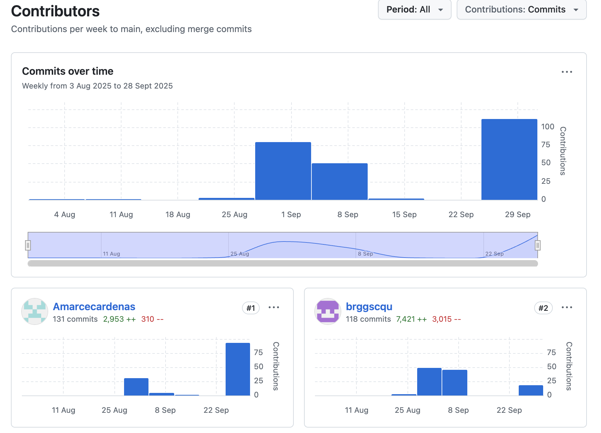
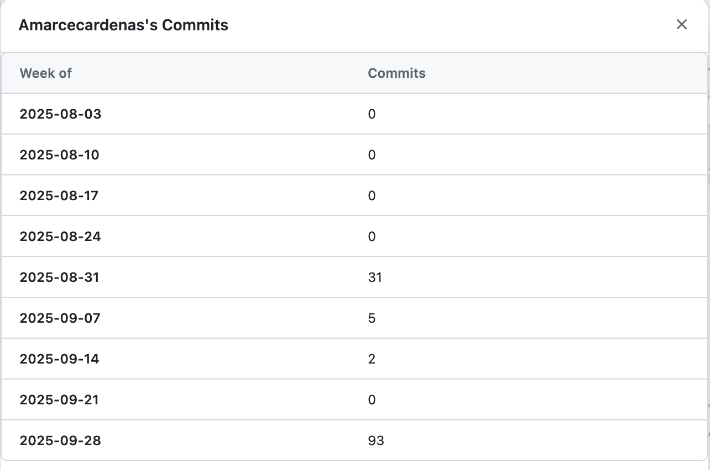
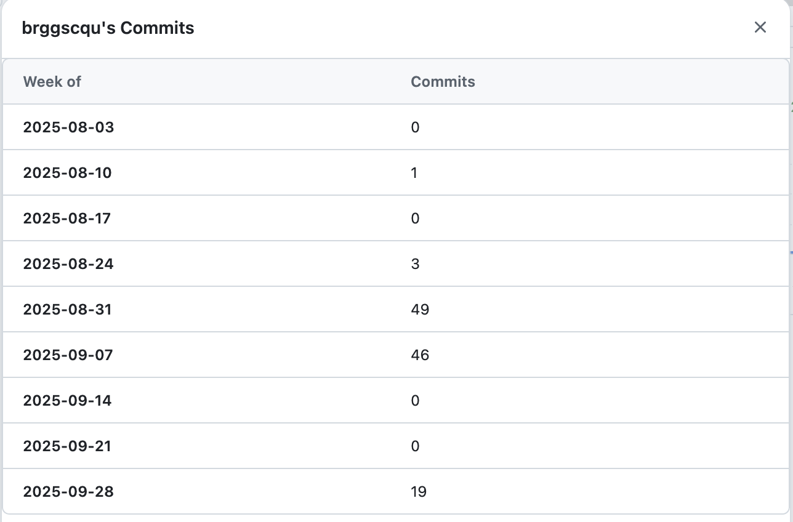

# Project Reflection
This section reflects on the success and challenges in the project and with teamwork.

[GitHub Commits](#github-commits) | [List of Tasks](#list-of-tasks) | [Reflection on Commits and Tasks](#reflection-on-commits-and-tasks) | [Reflection on Group Work](#reflection-on-group-work) | [Plan](./plan.md) | [Network Design](./network.md) | [Cloud Services](./cloud.md) | [Security](./security.md) | [Ethics](./ethics.md) | [Return to index](./README.md)

## GitHub Commits

## List of Tasks    
  
**Student:** Angie Marcela Cardenas (12284185)
 
**Specific Contributions:**

1. **Network Design Diagrams and Justifications (Network.md)** 
    - Create Network Diagram Newcastle  Draw.io
    - Network Diagram Newcastle  Draw.io justification and explanation  
    - Create Network Diagram Wollongong Draw.io
    - Network Diagram Wollongong  Draw.io justification and explanation

1. **Wifi Design (Network.md)**
    - Create Wifi Diagram Newcastle Draw.io 
    - Wifi Diagram Newcastle Draw.io justification and explanation 
    - Create Wifi Diagram Wollongong Draw.io 
    - Wifi Diagram Wollongong Draw.io justification and explanation

1. **Address Allocations (Network.md)**
    - Create IP table Sydney - HQ png file 
    - Create IP table Parramatta png file 
    - Create IP table Newcastle png file
    - Create IP table Wollongong png file

1. **Recommended Hardware (Network.md)**
    - Created the description for each hardware

1. **Project Plan (Project.md)**
    - Created a project for each week
    - Drafted the project task distribution
    - Created the meetings schedule
    - Documented which diagrams, Wi-Fi designs, IP tables, and hardware were created by each student

1. **Cloud Services (Cloud.md)**
    - Created the comparison table for AWS, Azure and On-Premise Server
    - Created the break-down additional cost for On-premise servers
    - Added an explanation for break-down additional cost for On-premise servers table
    - Exported the excel file for the AWS Virtual Machine specification
    - Exported the excel file for the Azure Virtual Machine specification
    - Exported the excel file for the Azure Database specification
    - Exported the excel file for the Azure Backup/Disaster Recovery specification
    - Exported the excel file for the On-Premise Server specification
    - Created the Justification of Chosen VM Specifications
    - Evaluated which VM to recommend (collaboration)
    - Listed the references used

1. **Risk Assessment (Security.md)**  
   - Draft TVA matrix with assets and vulnerabilities  
   - Manually ranked the TVA
   - Maps the asset list on the excel file
   - Created the Asset list
   - Evaluated the lowest and highest risk (collaboration)  
   - Checked for any errors in the TVA matrix

1. **Security Controls (Security.md)**  
   - Draft explanatory notes on user impact of controls
   - Document integration of controls into Markdown report
   - Created the Summary report
   - Listed the references used

1. **Ethical Issues (Ethics.md)**  
   - Draft Ethics section focusing on privacy implications and regulations  
   - Reference Australian Privacy Act and GDPR impacts
   - Created the Risks of Unauthorized access
   - Created the Data Protection regulations
   - Listed the references used    

1. **Reflection & Presentation (Reflection.md)**  
   - Compile screenshots of meetings and GitHub commits  
   - Write team collaboration reflection (collaboration) 
   - Write team collaboration github commits reflection (collaboration) 
   - Create task distribution and commit comparison table (collaboration)  
   - Draft notes for the video presentation (collaboration) 

**Student:** Joshnell Briggs Zareno (12292861)

**Specific Contributions:**

1. **Assumptions (Network.md)**
    - Network Design Requirements
    - WAN Network diagram basic draw.io 
    - WAN Network Description basic justification and explanation 
    - WAN Network diagram surface level draw.io 
    - WAN Network Description surface level justification and explanation

1. **Network Design Diagrams and Justifications (Network.md)**
    - Create Network Diagram Sydney - HQ Draw.io 
    - Network Diagram Sydney - HQ Draw.io justification and explanation 
    - Create Network Diagram Parramatta  Draw.io 
    - Network Diagram Parramatta  Draw.io justification and explanation

1. **Wifi Design (Network.md)**
    - Create Wifi Diagram Sydney - HQ Draw.io 
    - Wifi Diagram Sydney - HQ Draw.io justification and explanation 
    - Create Wifi Diagram Parramatta Draw.io 
    - Wifi Diagram Parramatta Draw.io justification and explanation

1. **Address Allocations (Network.md)**
    - IP table Sydney - HQ png file justification and explanation 
    - IP table Parramatta png file justification and explanation 
    - IP table Newcastle png file justification and explanation 
    - IP table Wollongong Draw.io justification and explanation

1. **Recommended Hardware (Network.md)**
    - Researched about the Devices to recommend
    - Researched all of the data sheets 

1. **Project Plan (Project.md)**
    - Created the reflection on the team collaboration
    - Collected screenshots of chat logs and remote sessions from teams
    - Finalized the project task distribution
    - Created a table for task statuses for each markdown files
    - Listed each student with ID and main responsibilities

1. **Cloud Services (Cloud.md)**
    - Researched cloud infrastructure suitable for Truelec
    - Created the details cloud infrastructure components for Truelec
    - Added an explanation for comparison table for AWS, Azure and On-Premise Server table
    - Created the AWS Virtual Machine specification
    - Created the Azure Virtual Machine specification
    - Created the Azure Database specification
    - Created the Azure Backup/Disaster Recovery specification
    - Created the On-Premise Server specification
    - Evaluated Cloud VM solutions (AWS and Azure) with On-Premise infrastructure
    - Evaluated which VM to recommend (collaboration)
    - Explained why there are difference server types (Web, Database and backup/disaster recovery virtual machines)

1. **Risk Assessment (Security.md)**
   - Created unique vulnerabilities 
   - Maps the unique vulnerability on the excel file  
   - Validated and finalized TVA matrix
   - Evaluated the lowest and highest risk (collaboration)  
   - Ensure threats and vulnerabilities align with network design choices  

1. **Security Controls (Security.md)**  
   - Select highest-risk data asset
   - Research and justify 3 recommended controls based in NIST SP 800-53
   - Explain where in the network controls will be implemented  

1. **Ethical Issues (Ethics.md)**  
   - Research technical vulnerabilities linked to privacy risks  
   - Draft supporting technical notes on how breaches could occur
   - Created the Data privacy concerns
   - Drafted the Security measures
   - Finalized the Security measures
   - Created the Ethical Considerations
   - Created the conclusion  

1. **Reflection & Presentation (Reflection.md)**
   - Listed the specific tasks
   - Created the distribution table
   - Compile GitHub commit history screenshots 
   - Write team collaboration reflection (collaboration) 
   - Write team collaboration github commits reflection (collaboration)  
   - Create task distribution and commit comparison table (collaboration)
   - Draft notes for the video presentation (collaboration) 

## Reflection on Commits and Tasks

Weeks with commits from all students: **6 out of 8 active weeks** (between Week 5 and Week 12).

This reflects a solid and consistent collaboration during most of the active development period. Both team members contributed in Weeks 6, 7, 8, and 12, with some variation in Weeks 9 and 10 where fewer commits were made. Overall, collaboration was evident during all critical project milestones and submission phases.

While full consistency across all weeks could have improved traceability, the contributions made during key development sprints (design, cloud, risk, and ethics) show a balanced team effort.

While this shows collaboration, it would have been stronger if all students committed every week. Still, overall contributions appear balanced and sufficient.

**Comparison of Git Commits and Contributions**

1. **Observed Git Commit Counts**
    - **Student 1:** Angie Marcela Cardenas (12284185): **131 commits**
    - **Student 2:** Joshnell Briggs Zareno (12292861): **118 commits**

Both students maintained nearly equal commit counts, showing strong collaboration and balance. The GitHub contribution graph also confirms that each student was active during major development periods.

1. **Tasks Performed**

    Angie’s tasks were often documentation-heavy and design-based. For example, she created multiple network diagrams, Wi-Fi layouts, IP tables, and extensive tables for cloud services. These types of tasks typically involve creating large artifacts (e.g., diagrams or tables) and then committing them once they are completed. As a result, her work may have required fewer commits but with larger, more substantial updates per commit.

    Joshnell’s tasks were more iterative and technical in nature. His responsibilities included drafting network assumptions, creating WAN diagrams, developing detailed security controls, and performing technical research on cloud infrastructure and NIST security controls. Such tasks are prone to frequent incremental updates (e.g., editing text explanations, refining Markdown, adjusting figures), which naturally produces a higher commit frequency.

1. **Reasons for Differences in Commit Numbers**

    Several factors explain why the number of commits may not directly align with workload:

    1. **Task Type:**
        - Angie’s work (tables, diagrams, and finalised explanations) tends to be prepared offline in tools like Draw.io or Excel and then uploaded as a single commit.
        - Joshnell’s work (assumptions, detailed notes, iterative Markdown edits) often requires multiple small pushes to GitHub.

    1. **Working Style:**
        - Angie may have preferred to complete tasks in bulk and then commit once.
        - Joshnell may have preferred to commit progressively, saving partial drafts and refinements.

    1. **Collaboration vs. Solo Work:**
        - Both students collaborated on risk assessments, reflections, and cloud recommendations, but commits may show only the last editor. This changes commit counts toward the student who finalised or merged the files.

    1. **File Types:**

        - Binary/image files (e.g., PNG diagrams, Excel exports) often result in a single large commit.

        - Text-based Markdown files (e.g., Security.md, Ethics.md) encourage more frequent commits since even small edits can be saved incrementally.
  
1. **Proportionality of Commits to Contributions**

    The number of commits does not always reflect the true weight of each contribution. For example, Angie recorded more commits overall because her work involved frequent exporting of specifications, updating tables, and uploading diagrams. Each of these steps generated separate commits, which made her activity appear higher in the repository.

    By comparison, Joshnell created the original specifications (AWS, Azure VM, Database, Backup/DR, On-Prem) and wrote the justifications. His tasks were larger and more complex but often completed in fewer commits, since major sections were drafted and refined offline before being pushed.

    In practice, both students made substantial contributions, just in different ways: Angie’s role produced a higher volume of commits linked to structured outputs and documentation, while Joshnell focused on designing and justifying the technical foundations. Together, these complementary approaches kept the project balanced.

## Reflection on Group Work

Throughout the project, we maintained consistent and effective collaboration by combining weekly scheduled teams calls with in-person discussions during tutorials. Our communication was clear, with each member taking initiative and responsibility over specific areas of the project, based on individual strengths and technical expertise.
 
While our schedules occasionally made synchronous collaboration challenging, we overcame this through flexible task delegation and asynchronous work via GitHub and Microsoft Teams. This allowed us to track progress in real time, provide feedback, and integrate our contributions efficiently.

One challenge we faced was aligning our different work styles and pacing. However, by mid-project we had established a rhythm that enabled productive teamwork and a clear division of responsibilities.

For future projects, we recommend setting even more structured mid-week check-ins to detect early delays, and using a shared checklist for each submission milestone. Additionally, keeping a live changelog or short video updates might help in reducing version conflicts or duplicated effort.

Overall, the collaboration was respectful, balanced, and productive. The project benefitted from our complementary skills, and we successfully delivered a technically sound and well-documented solution.
