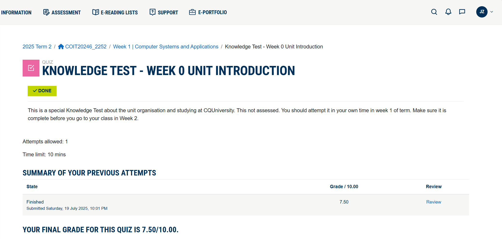
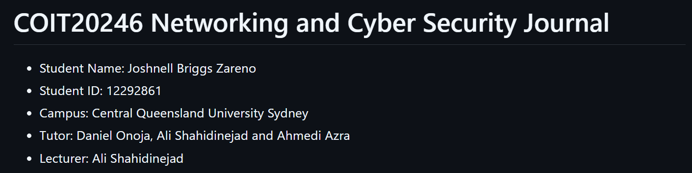
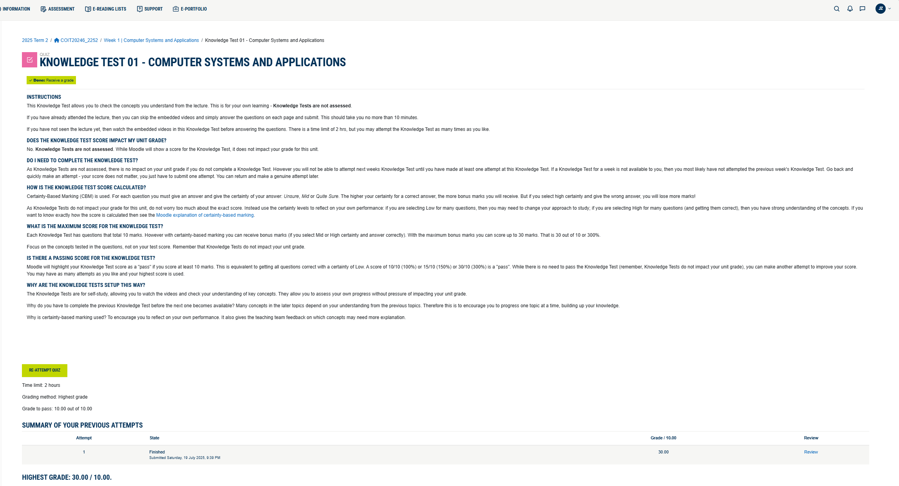
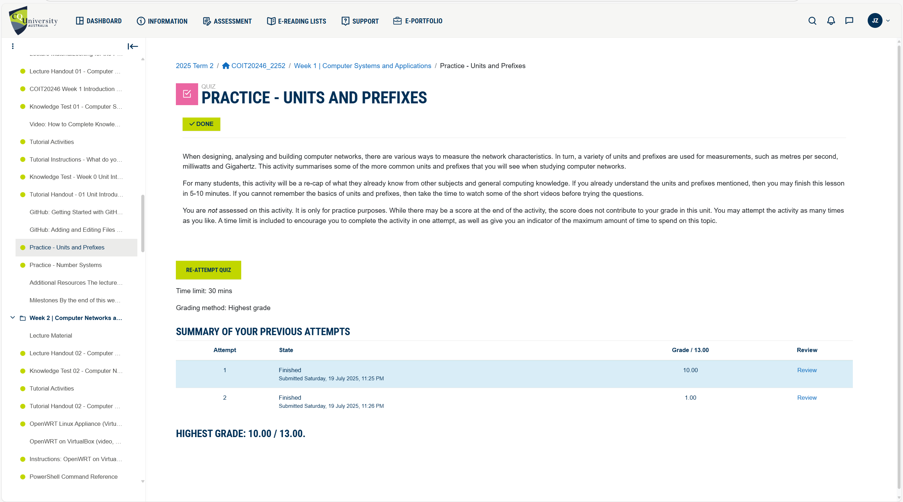
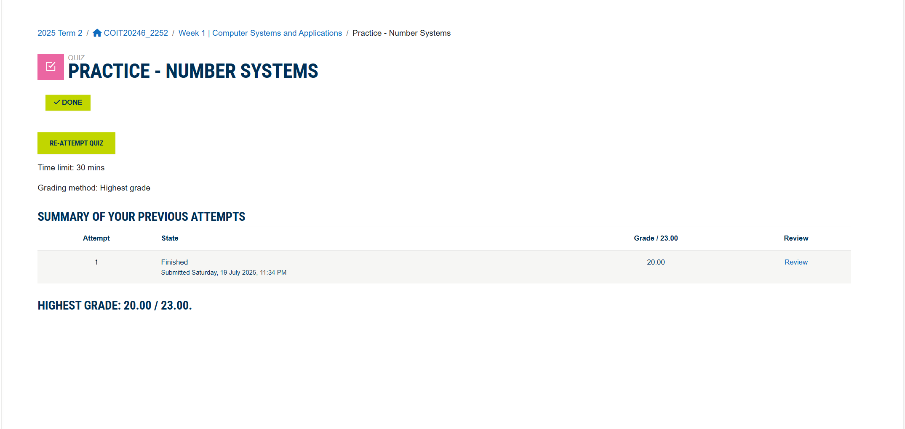

# Week 1 | Unit Introduction

## Task 1. Complete the Knowledge Test for Week 0

## Task 5. Summary of My Knowledge

I hold a Bachelor's degree in Electronics Engineering and have gained cybersecurity experience through my previous work at Trend Micro. I also possess foundational knowledge in networking and cybersecurity, including the following areas:

- Analyzed and reverse-engineered malicious scripts including Batch, JavaScript, JScript, Python, PowerShell, and VBScript, identifying malicious behaviour and malware obfuscation.
- Basic knowledge of networking fundamentals, including IPv4 subnetting, Cisco router/switch configuration, and Packet Tracer utilization are acquired during Cisco course in college.
- Hands-on experience in malware analysis using HxD, Kali Linux, OllyDbg, Process Hacker, Process Monitor, SysTracer, TCPView, x32Dbg, and Wireshark.
- Malware behavioral analysis, exploit assessment, and perform controlled attack simulations.

The following is a screenshot of the details:

## Task 5. Knowledge Test Score

The following is a screenshot of my Knowledge Test score:

## Task 7. Practice Units and Prefixes

The following is a screenshot of my Practice Test score:

