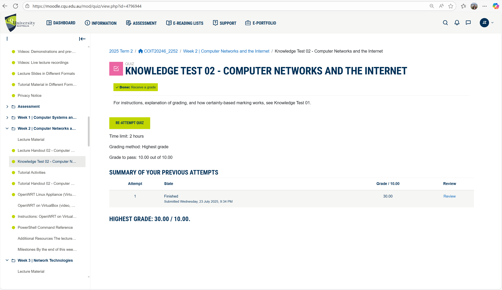
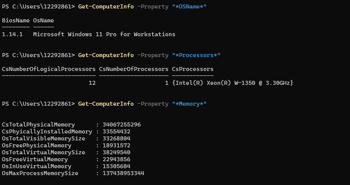
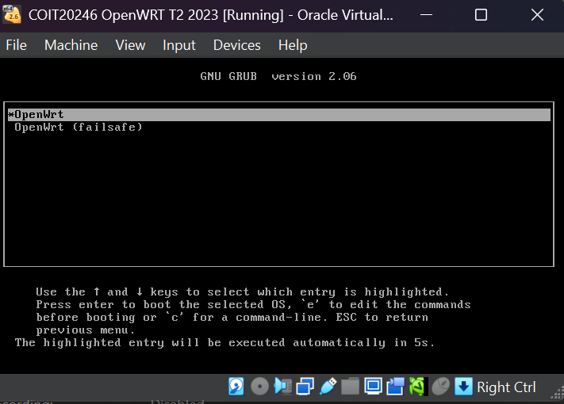
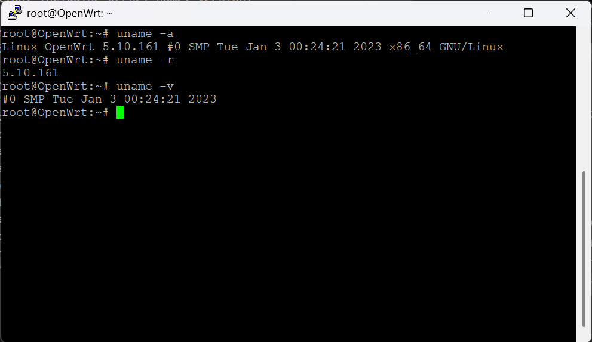
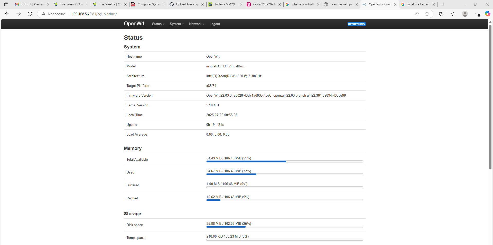
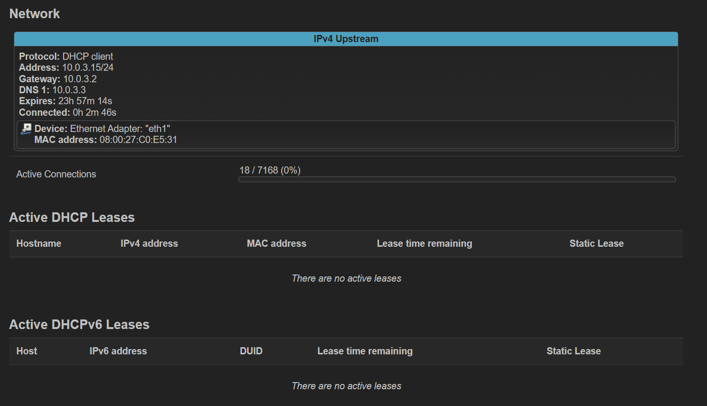
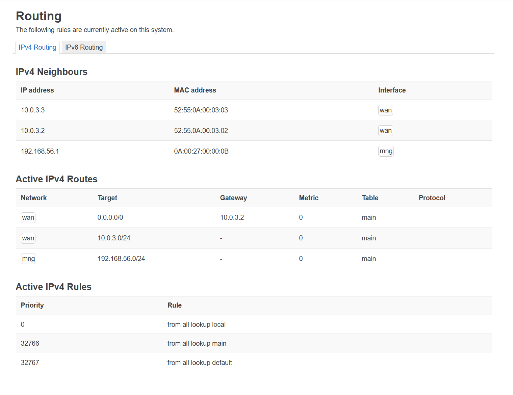
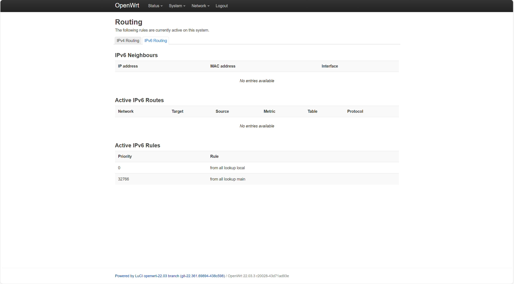

# Week 2 | Computer Systems and Applications

## Task 1. Complete the Knowledge Test

## Task 2. View Computer Information

Commands used: 
1. Get-ComputerInfo -Property "OSName"
2. Get-ComputerInfo -Property "*Processors"
3. Get-ComputerInfo -Property "*Memory*"

Note: 

- **CsTotalPhysicalMemory** = **34,067,255,296 Byte**. When converted to GiB, This becomes the accurate value of the computer's **Installed Physical Memory (RAM)** = **31.7276039 GiB**.
- **CsPhysicallyInstalledMemory** = **33554432 KiB**. When converted to GiB, it becomes **34,359,738,368 Bytes**
- To calculate the computer's BIOS memory reserves, we find the difference (in bytes) between the Total Physical Memory (CsTotalPhysicalMemory) and the Usable Memory (CsTotalPhysicalMemory): **BIOS Memory reserves** = **34,359,738,368 Byte** - **34,067,255,296 Byte** = **292,483,072 Byte**

## Task 3. Deploy Linux Web Server

Questions: 
1. What is the boot manager used for?
- **Answer:** A Boot Manager is a software utility that allows a user to choose between multiple operating systems at startup and directs the system to boot into the selected OS.

2. What is the kernel loaded? Give the name and version of each.
- **Answer:** 
  - **Kernel Name:** Linux
  - **Hostname:** OpenWrt
  - **Kernel Release:** 5.10.161
  - **Kernel Version:** #0 SMP Tue Jan 3 00:24:21 2023
  - **Machine Hardware Name:** x86_64
  - **Operating System:** GNU/Linux

3. Give answers to the questions about boot manager and kernel. Explain where/how you found the value, as well as giving the value.
- **Answer:** The Boot Manager appears after powering on the OpenWright, allowing the user to choose an operating system to load. The name of the Boot Manager is 'GNU GRUB' version 2.06. 

Kernel details can be found here (setup Host address): 192.168.56.2:81. We can also find the kernel details using commands such as: 

Commands Used:
1. uname -a → prints all available information, including kernel name, version, architecture, etc.
2. uname -r → prints the kernel release version
3. uname -v → prints the kernel build version

4. Give a short one paragraph description of VirtualBox and OpenWRT. That is, describe them so a new IT student could understand what they are. Use your favourite AI chatbot, e.g., ChatGPT, to create a short description of VirtualBox and OpenWRT. Include the AI description, as well as the prompt, under yours and compare. Comment on the differences. 

**Answer:** 
- **Personal Description:** VirtualBox is free software that lets you run multiple operating systems on one computer. It's useful for testing, learning, and experimenting safely. OpenWRT is a custom operating system for routers that gives you more control, features, and security than typical router firmware.
- **Prompt Given to AI Chatbot (ChatGPT):** "Give me a short description of VirtualBox and OpenWRT suitable for a new IT student."
- **AI Chatbot (ChatGPT) Description:** VirtualBox is a free tool that allows you to create and run virtual machines, letting you use different operating systems on the same computer. OpenWRT is an open-source operating system for routers that adds advanced networking features and customization options.
- **Description Difference:** Both versions are suitable for new IT students. If clarity and technical accuracy are key, the AI version edges ahead. If relatability and simplicity are more important, I believe my version works better but Ideally, blending both gives the best result!

## Task 4. Browse to OpenWRT Websites

1. Screenshot of example web site:
  
   
2. Screenshot of OpenWRT management interface showing system information, e.g.  CPU, RAM, disk sizes, OS version.
  
 
3. Screenshot of OpenWRT management interface showing network information, e.g. Protocol, Address, Gateway, DNS 1, DNS 2.
  
  
  
  

4. List the values about the OpenWRT system.

**OpenWRT System Status:**
- Hostname: OpenWrt
- Model: innotek GmbH VirtualBox
- Architecture: Intel(R) Xeon(R) W-1350 @ 3.30GHz
- Target Platform: x86/64
- Firmware Version: OpenWrt 22.03.3 r20028-43d71ad93e / LuCI openwrt-22.03 branch git-22.361.69894-438c598
- Kernel Version: 5.10.161
- Local Time: 2025-07-22 00:58:26
- Uptime: 0h 19m 21s
- Load Average: 0.00, 0.00, 0.00

**OpenWRT Memory Status:**

- Total Available: 54.86 MiB / 106.46 MiB (51%)
- Used: 34.41 MiB / 106.46 MiB (32%)
- Buffered: 1.00 MiB / 106.46 MiB (0%)
- Cached: 10.74 MiB / 106.46 MiB (10%)

**OpenWRT Storage Status:**

- Disk Space: 25.90 MiB / 102.33 MiB (25%)
- Temp Space: 228.00 KiB / 53.23 MiB (0%)

**OpenWRT Network Status:**
- Protocol: DHCP client
- Address: 10.0.3.15/24
- Gateway: 10.0.3.2
- DNS 1: 10.0.3.3
- Expires: 23h 57m 14s
- Connected: 0h 2m 46s
- Device: Ethernet Adapter: "eth1"
- MAC Address: 08:00:27:C0:E5:31

## References

1. Microsoft. (n.d.). Get-ComputerInfo (Microsoft.PowerShell.Management). Microsoft Learn. Retrieved July 25, 2025, from https://learn.microsoft.com/en-us/powershell/module/microsoft.powershell.management/get-computerinfo

2. The Open Group. (2024). uname(1) - Linux manual page. Linux Man Pages Online. Retrieved July 25, 2025, from https://man7.org/linux/man-pages/man1/uname.1.html

3. Oracle Corporation. (2024). VirtualBox User Manual. Oracle VM VirtualBox. Retrieved July 25, 2025, from https://www.virtualbox.org/manual/UserManual.html

4. OpenWRT Project. (2023). What is OpenWRT? OpenWRT Wiki. Retrieved July 25, 2025, from https://openwrt.org/about

5. Lenovo. (n.d.). Boot manager essentials: Speed up your startup. Lenovo US Glossary. Retrieved July 30, 2025, from https://www.lenovo.com/us/en/glossary/boot-manager/
