# Week 3 | Computer Networks and the Internet

## Task 1. Complete the Knowledge Test 

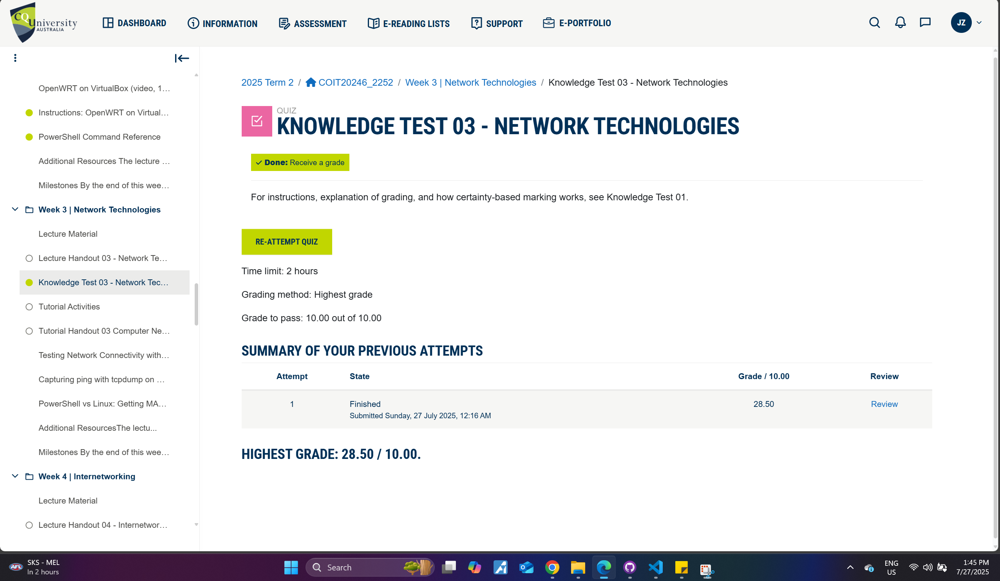

## Task 2. View Your Addresses

### Screenshot(s) of the PowerShell command(s) and output

1. **Get-NetAdapter**
- **Description:** A Powershell command that gathers data on the network adapters configured on a system. It shows information including adapter name, MAC address, link speed, status, and description of the interface. This command is helpful for diagnosing network issues, managing adapters, and verifying connectivity settings on Windows machines.

- **Screenshot:**
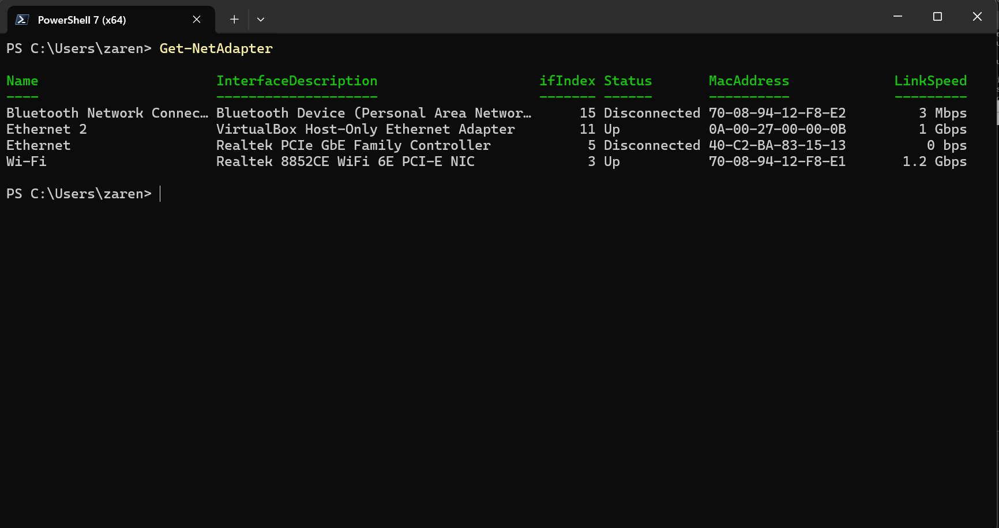

2. **Get-NetIPConfiguration**
- **Description:** A Powershell command that displays detailed IP configuration information for network adapters. It shows IPv4 and IPv6 addresses, default gateways, DNS servers, and interface indexes. This command is useful for troubleshooting network connectivity, verifying IP settings, and managing network configurations on Windows systems.

- **Screenshot:**
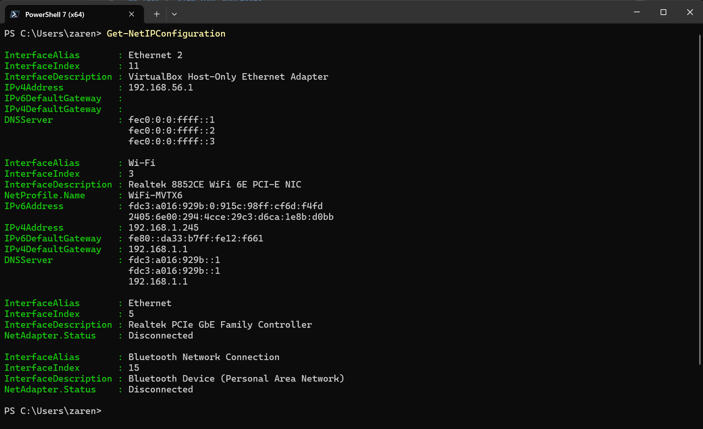

3. **Get-NetIPAddress -InterfaceIndex <InterfaceIndex Number>**
- **Description:** A PowerShell command that retrieves IP address information for a specific network adapter identified by its interface index. It displays IPv4 and IPv6 addresses, prefixes, and address types. This command is useful for checking or managing the IP configuration of a particular network interface.

- **Screenshot:**
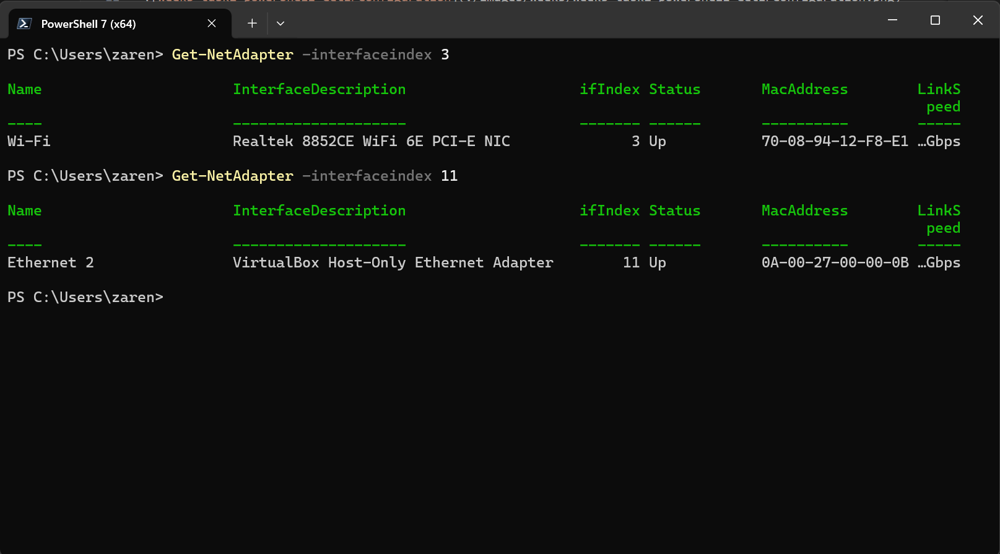

4. **Test-NetConnection <IPv4>** 
- **Description:** A PowerShell command that tests connectivity to the specified IPv4 address. By default, it performs a ping test and shows results like round-trip time, source address, and whether the destination is reachable. It’s mainly used for network troubleshooting and verifying host availability.

- **Screenshot:**
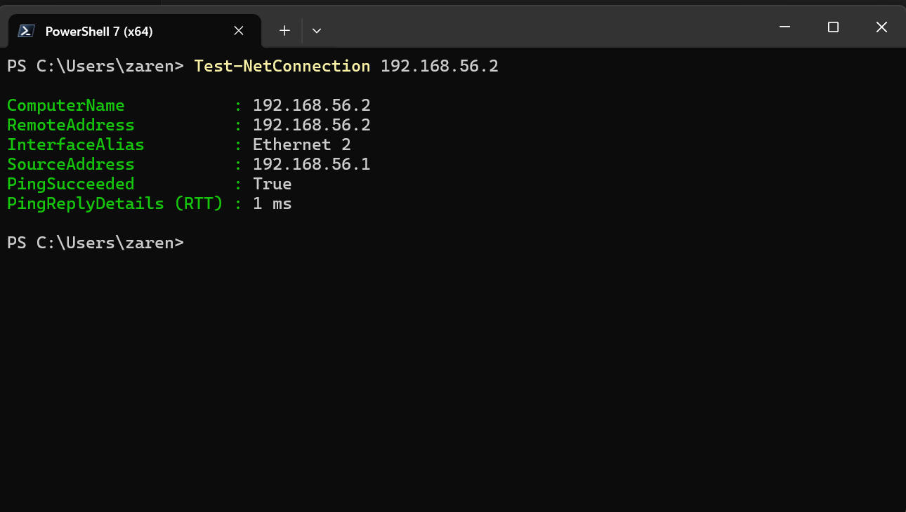

5. **Test-Connection <IPv4>**
- **Description:** A PowerShell command that sends ICMP echo requests (similar to the traditional ping command) to the specified IPv4 address. It checks connectivity, packet loss, and response time, making it useful for basic network troubleshooting and verifying if a host is reachable.

- **Screenshot:**
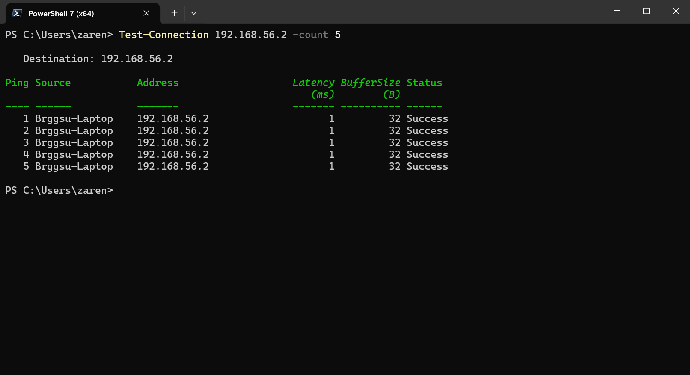

6. **ip link**
- **Description:** A Linux command used to view and manage network interfaces, showing their state, MAC addresses, and other details. Commonly used in terminals or SSH clients like PuTTY.

- **Screenshot:**
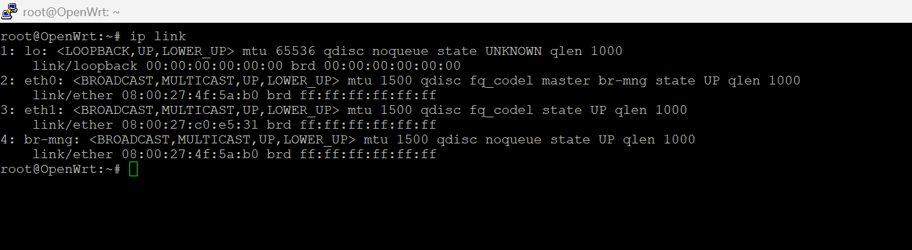

7. **ip addr** 
- **Description:** A Linux command used to display IP addresses (IPv4/IPv6) assigned to network interfaces. Also used in Linux shells or via PuTTY for remote management.

- **Screenshot:**
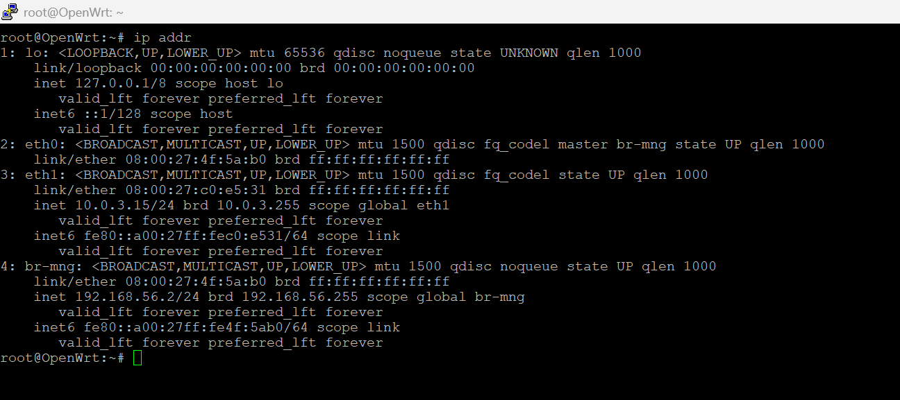

8. **ping <IPv4/IPv6/hostname>** 
- **Description:** Sends ICMP echo requests to a specified host to test connectivity, measure packet loss, and check response time.

- **Screenshot:**
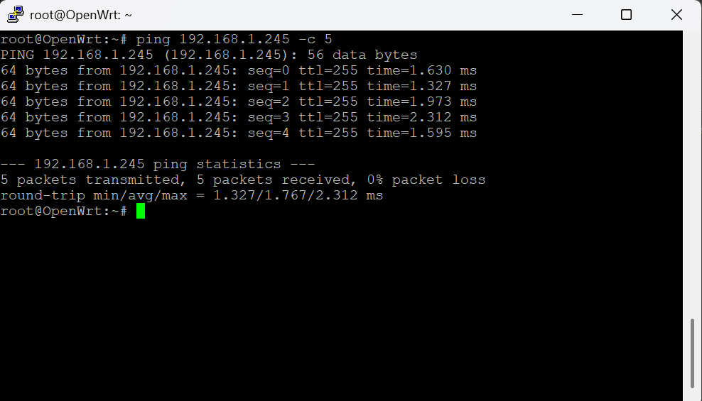

9. **Get‐NetAdapter ‐Name "Ethernet 3" | Format‐List ‐Property**
- **Description:** Retrieves detailed information about the network adapter named "Ethernet" and displays all available properties in a readable list format.

- **Screenshot:**
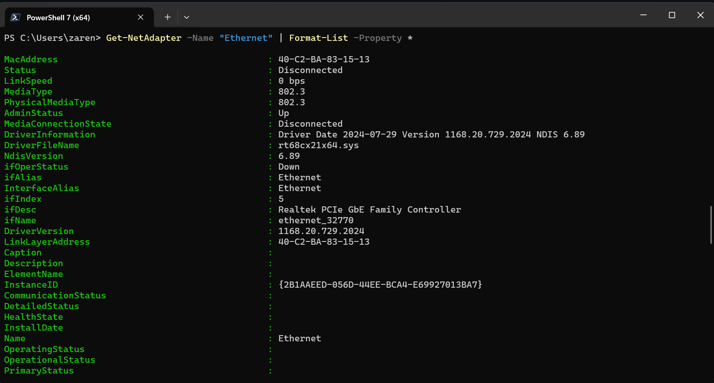

### List the values of each address and describe what it identifies

1. **Bluetooth Device (Personal Area Network)**
    - **MAC Address:** 70-08-94-12-F8-E2
    - **Description:** It enables a Bluetooth Personal Area Network (PAN), allowing your computer to share or receive internet/network access through Bluetooth. 
    -**Screenshot:**
    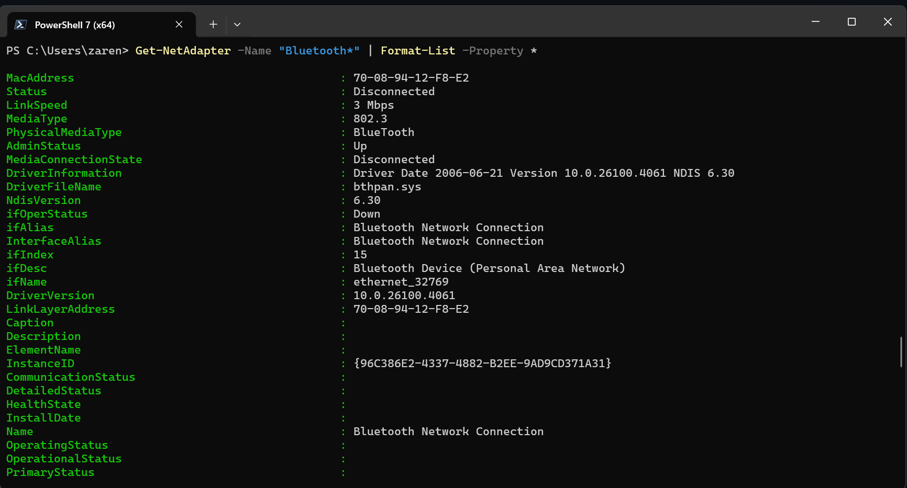
    
2. **Ethernet 2 - VirtualBox Host-Only Ethernet Adapter**
    - **MAC Address:** OA-00-27-00-00-0B 
    - **Description:** It is used to create a private network between the host computer and virtual machines in VirtualBox. It allows file sharing, testing, and communication between host and VMs without internet access or external network involvement.
    -**Screenshot:**
    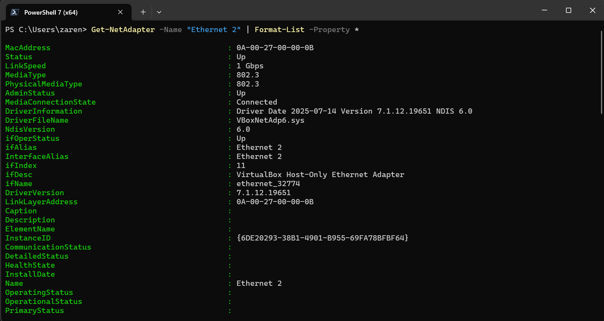

3. **Ethernet - Realtek PCIe GbE Family Controller** 
    - **MAC Address:** (40-C2-BA-83-15-13) 
    - **Description:** It is a physical wired network adapter on your computer. It is used to connect to a local network or the internet via an Ethernet cable, providing stable and high-speed (Gigabit) network connectivity.
    - **Screenshot:**
    

4. **Wi-Fi – Realtek 8852CE WiFi 6E PCI-E NIC** 
    - **MAC Address:** (70-08-94-12-F8-E1) 
    - **Description:** It is a wireless network adapter that supports Wi-Fi 6E (6 GHz band, along with 2.4 GHz & 5 GHz). It provides high-speed, low-latency wireless internet and network connectivity, ideal for gaming, streaming, and modern high-bandwidth applications.
    -**Screenshot:**
    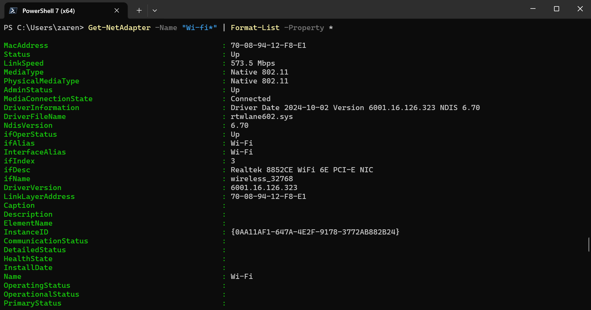

## Task 3. Ping Your Local Router 

1. Commands used to get the local router's (default gateway) IPv4 address.

- **Screenshot:**

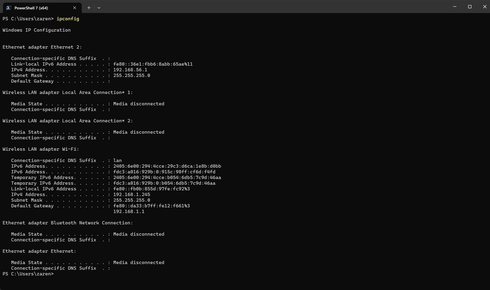

2. Command used to ping the local router's (default gateway) IPv4 address.

- **Screenshot:**
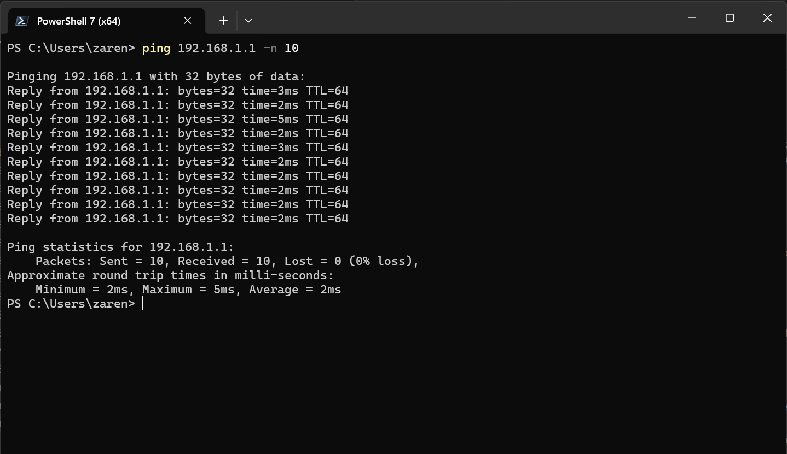

- By using the ping command in PowerShell, we can view detailed ping statistics displayed below the results. These show the total packets transmitted, received, and lost, as well as the round trip times (RTT) measured in milliseconds, showing the minimum, maximum, and average delay.
- **Packets Sent:** 4
- **Packets Received:** 4
- **Packets Lost:** 0 (0% loss)
- **Minimum delay:** 2ms 
- **Maximum delay:** 5ms
- **Average delay:** 2ms
- **Analysis:** The delay between the computer and the router is influenced by several factors. Wired connection (Ethernet) generally have consistently low latency, while wireless connections (Wi-Fi) may experience higher or variable latency due to interference and weaker signal strength. Physical obstructions, distance from the router, and interference from other electronic devices, such as microwaves, Bluetooth devices, or neighboring Wi-Fi networks, can further increase delay. Additionally, the router’s processing load, especially when handling multiple devices or heavy network traffic, may cause fluctuations. Background activities, like streaming or downloading, and minor variations from the computer’s network adapter and drivers also contribute.

## Task 4. Ping your OpenWRT Linux Server 

- Commands used:
    - **ip link and ip addr: (OpenWRT Linux Server):**
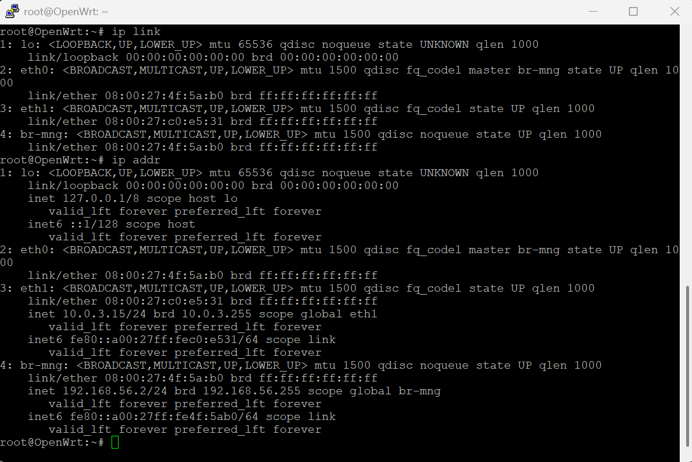

    - **tcpdump -i eth0 -n -w week3-task4-ping.pcap 'arp or icmp' (OpenWRT Linux Server)**
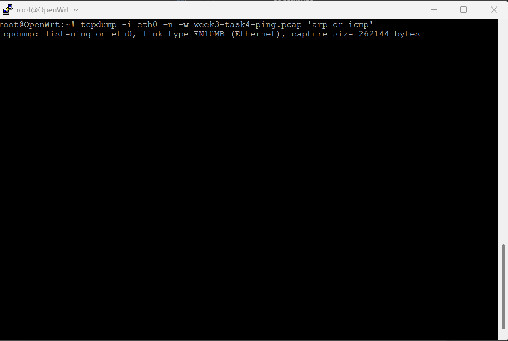

    - **ping 192.168.56.2 -n 10 (Windows)**
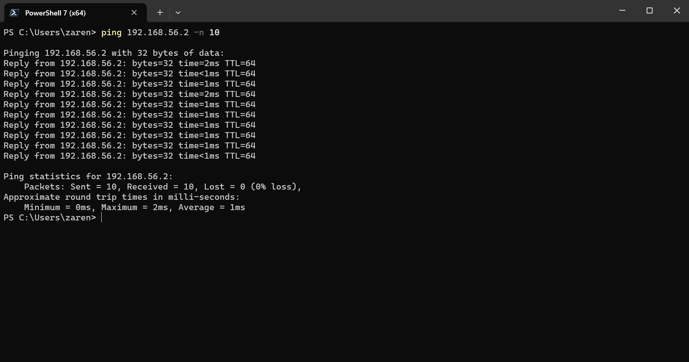
    
- Addresses found in the OpenWRT Linux Server:

1. **lo (Loopback Interface)**
    - State: UNKNOWN
    - MAC Address: 00:00:00:00:00:00
    - IPv4: 127.0.0.1/8 (scope: host)
    - IPv6: ::1/128 (scope: host)

2. **eth0 (Ethernet 0)**
    - State: UP
    - MAC Address: 08:00:27:4f:5a:b0
    - IPv4: None
    - IPv6: None
    - Master: br-mng
    - Note: eth0 is a port on the virtual switch (br-mng).

3. **eth1 (Ethernet 1)**
    - State: UP
    - MAC Address: 08:00:27:c0:e5:31
    - IPv4: 10.0.3.15/24 (broadcast: 10.0.3.255, scope: global)
    - IPv6: fe80::a00:27ff:fec0:e531/64 (scope: link)

4. **br-mng (Bridge)**
    - State: UP
    - MAC Address: 08:00:27:4f:5a:b0
    - IPv4: 192.168.56.2/24 (broadcast: 192.168.56.255, scope: global)
    - IPv6: fe80::a00:27ff:fe4f:5ab0/64 (scope: link)
    - Note: In Linux, you can assign an IP address to a bridge interface

## Task 5. Academic Integrity Policy
- Download link: https://delivery-cqucontenthub.stylelabs.cloud/api/public/content/student-academic-integrity-policy-and-procedure-938665.pdf
- Note: the Student Academic Integrity Policy and Procedure (current version - from 14 July 2025) was already uploaded in this location: (./images/week3/Student Academic Integrity Policy and Procedure (current version - from 14 July 2025).pdf)
- **Breaches of academic integrity are organised into five levels across two breach types, as follows:**

    1. Inappropriate academic conduct (level 1 breach of academic integrity) 
    - Academic misconduct: 
    2. minor academic misconduct (level 2 breach of academic integrity) 
    3. moderate academic misconduct (level 3 breach of academic integrity) 
    4. substantial academic misconduct (level 4 breach of academic integrity)
    5. serious academic misconduct (level 5 breach of academic integrity) 

## Task 7. Find Addresses of a Website

**Chosen Website:** https://www.homeaffairs.gov.au/

Command Used:

- **ping homeaffairs.gov.au - n 10** & **Test-NetConnection homeaffairs.gov.au**

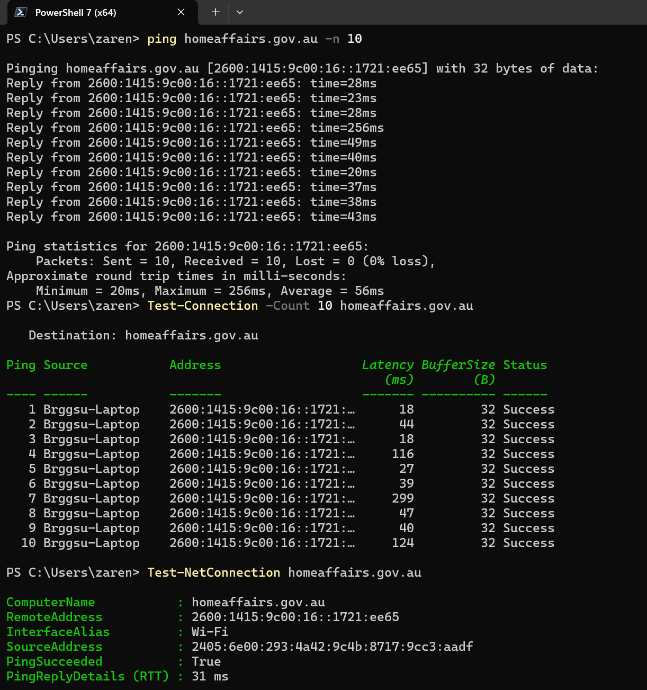

- **arp -a**

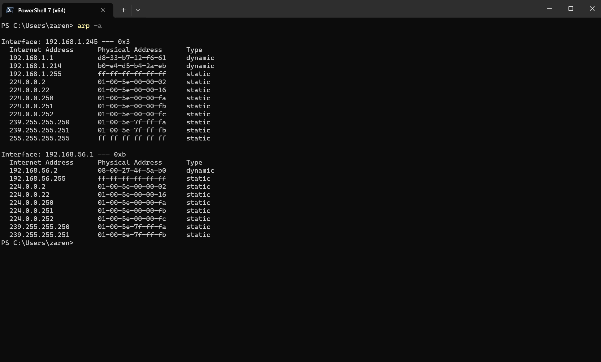

- **Analysis:**
In the first screenshot, we used the ping command to reach the Department of Home Affairs website. Even without knowing the IP address, DNS resolved the domain name and returned an IPv6 address. This happened because many modern networks prefer IPv6 due to the shortage of IPv4 addresses. In the second screenshot, we used the arp -a command to check if we could capture the website’s MAC address. We couldn't see the website's MAC address because MAC addresses only exist within local networks. Once traffic leaves our network and travels across the internet, only IP addresses are used, MAC addresses aren’t passed along.

## Task 8. Home Internet Connection

**Time of Testing:** 10:12PM AEST
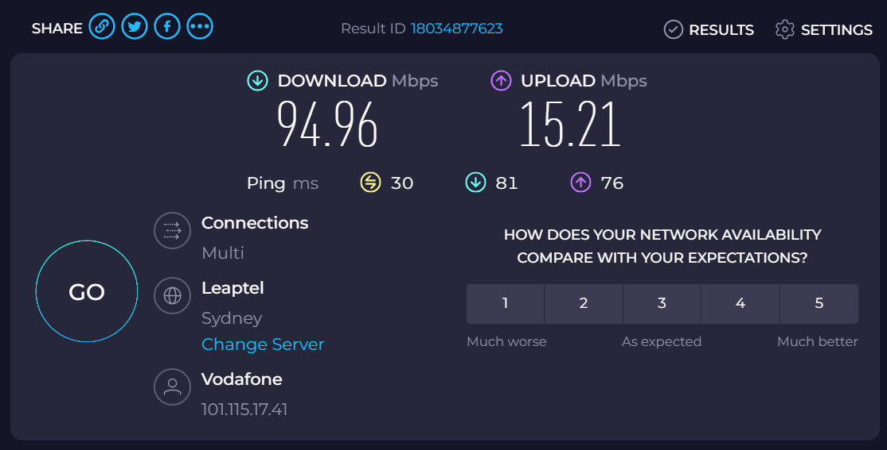

**Time of Testing:** 10:15PM AEST
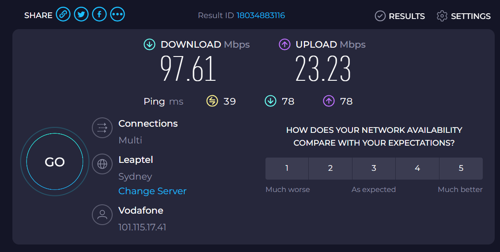

Details:

1. **Connection: Multi**
- This indicates multiple connections (threads) were used for testing to simulate real-world usage. It often improves accuracy for download/upload tests.

2. **Internet Service Provider (ISP): Vodafone**
- The ISP providing your internet connection. This is the company that assigns your IP address and routes your traffic.

3. **IP Address: 101.115.17.41**
- This is my public IPv4 address at the time of testing, assigned by Vodafone.

4. **Test Server: Server Host: Leaptel (Sydney)**
- The test was run against a server hosted by Leaptel in Sydney. This is where your data was sent to and received from to measure speed.

5. **Throughput/Download Speed 94.96 and 97.61 Mbps**
- Indicates the speed at which data is downloaded from the internet to the device. This impacts streaming, downloads, and browsing.

6. **Upload Speed 15.21 and 23.23 Mbps**
- Measures how fast data is sent from your device to the internet. This matters for video calls, uploading files, and online gaming.

7. **Ping (Latency) 30ms and 39 ms**
- the amount of time required a data packet to travel to the server and back. Lower ping means better responsiveness—important for gaming or video calls.

8. **Jitter (Download & Upload): 76ms and 78 ms**
- Variation in ping over time. High jitter may lead to issues in live data applications like voice or video calls, even with a good average ping.

**Analysis:** 

Here are two results of a speed test from a home laptop in Granville to a server in Sydney hosted by Leaptel.

The tests were performed at 10:12 PM AEST and 10:15 PM AEST. Even with just a three-minute gap, I observed noticeable differences in download speed (throughput), upload speed, ping (latency), and jitter.

Several factors may have contributed to these variations. One key factor is network usage performance can depend on the number of users connected to the network and how heavily they are using it. For example, in my case, my aunt had just turned off her mobile device to go to sleep, potentially reducing local network traffic. Another factor is how data is routed across the network; different routing paths may affect latency and overall speed depending on traffic congestion.

Additionally, the type of connection used, such as Wi-Fi or Ethernet, can impact speed and stability. Wi-Fi is often more susceptible to interference and signal weakening, especially if there are walls or a significant distance between the device and the router. In my case, I was using a Wi-Fi connection, and as far as I know, no one in the house uses an Ethernet cable.

## References

1. Hoffman, C. (2020, April 14). How to use the ip command on Linux. How-To Geek. Retrieved July 27, 2025, from https://www.howtogeek.com/657911/how-to-use-the-ip-command-on-linux/

2. How-To Geek. (2024, January). How to use the ip command on Linux. How-To Geek. Retrieved August 10, 2025, from https://www.howtogeek.com/657911/how-to-use-the-ip-command-on-linux/

3. Microsoft. (n.d.). arp. Microsoft Learn. Retrieved July 27, 2025, from https://learn.microsoft.com/en-us/windows-server/administration/windows-commands/arp

4. Microsoft. (n.d.). Get-NetAdapter (NetAdapter). Microsoft Learn. Retrieved July 27, 2025, from https://learn.microsoft.com/en-us/powershell/module/netadapter/get-netadapter
   
5. Microsoft. (n.d.). Get-NetIPAddress (NetTCPIP). Microsoft Learn. Retrieved July 27, 2025, from https://learn.microsoft.com/en-us/powershell/module/nettcpip/get-netipaddress

6. Microsoft. (n.d.). Get-NetIPConfiguration (NetTCPIP). Microsoft Learn. Retrieved July 27, 2025, from https://learn.microsoft.com/en-us/powershell/module/nettcpip/get-netipconfiguration

7. Microsoft. (n.d.). Test-Connection (Microsoft.PowerShell.Management). Microsoft Learn. Retrieved July 27, 2025, from https://learn.microsoft.com/en-us/powershell/module/microsoft.powershell.management/test-connection

8. Microsoft. (n.d.). Test-NetConnection (NetTCPIP). Microsoft Learn. Retrieved July 27, 2025, from https://learn.microsoft.com/en-us/powershell/module/nettcpip/test-netconnection

9. Microsoft. (n.d.). Test-Connection (Microsoft.PowerShell.Management). Microsoft Learn. Retrieved July 27, 2025, from https://learn.microsoft.com/en-us/powershell/module/microsoft.powershell.management/test-connection

10. Ookla. (n.d.). Speedtest by Ookla. Retrieved July 27, 2025, from https://www.speedtest.net/

