# Week 4 | Network Technologies 

## Task 1. Complete the Knowledge Test

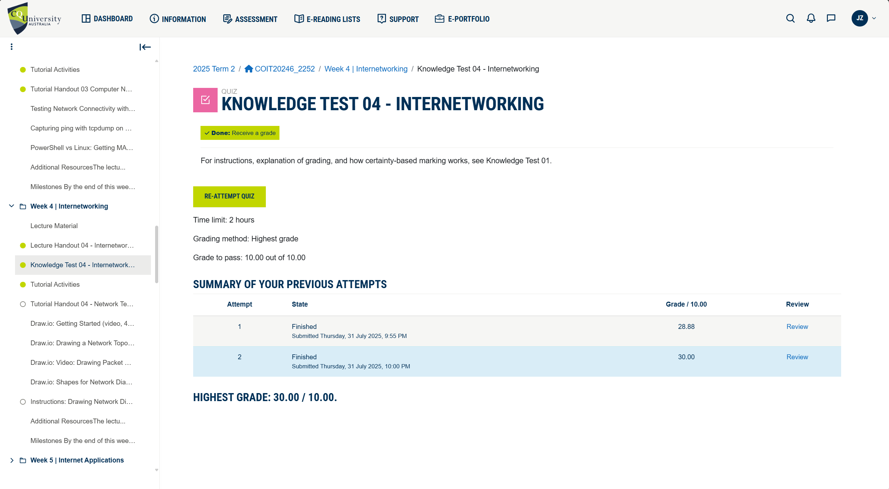

## Task 2. Project Initiation

- **Github Project Title:** coit20246-2025-t2-project-project-syd-angie-briggs

- **Github Link:** https://github.com/cquict2025/coit20246-2025-t2-project-project-syd-angie-briggs.git

- **Group members:**
    - **Student 1:** Angie Marcela Cardenas (12284185)
    - **Student 2:** Joshnell Briggs Zareno (12292861)

- **Email Screenshot:**
    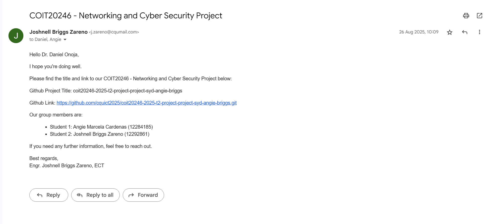

## Task 3. Draw Network Diagrams 
Using diagrams.net (draw.io) software, draw the following network diagrams: 

1.  A switched LAN with one switch and four PCs.

- **Draw.io FIle:** [week4-task3-lana.draw.io](./images/week4/week4-task3-lana.drawio)
- **Screenshot:**
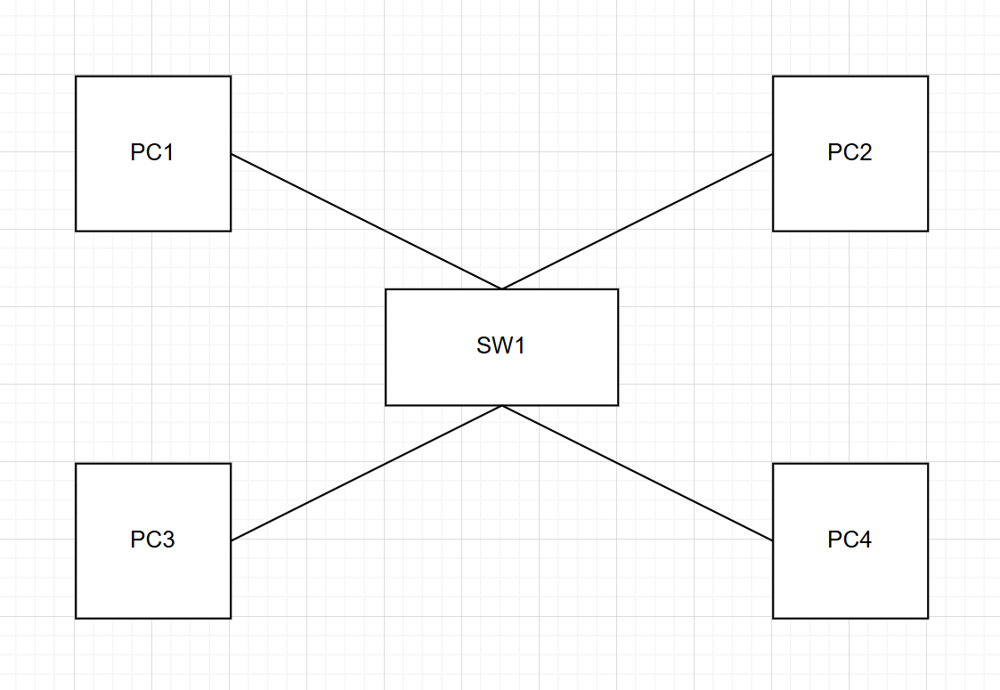

2. A switched LAN that has four PCs connected to one switch, four PCs connected to another switch, and those two switches are connected to a third switch in star topology. In total, there are eight PCs and three switches.

- **Draw.io FIle:** [week4-task3-lanb.draw.io](./images/week4/week4-task3-lanb.drawio)
- **Screenshot:**
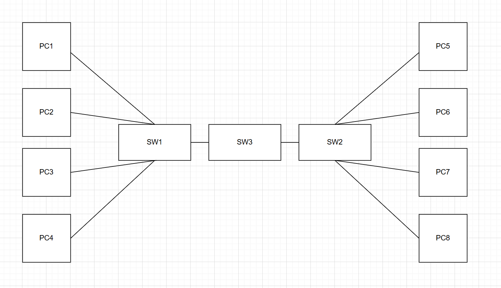

## Task 4. Analyse Ping Packet Capture

1. **Network Diagram**
    - **Draw.io FIle:** [week4-task4-ping.drawio](./images/week4/week4-task4-ping.drawio) 
    - **Screenshot:** 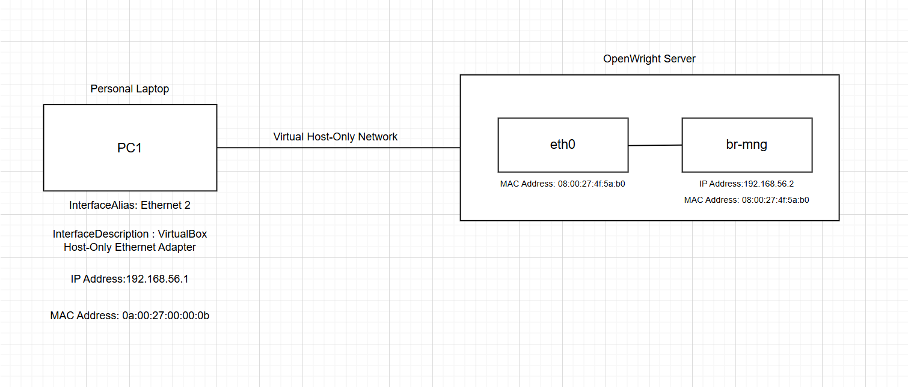
    - **Description:** The diagram above illustrates how my personal laptop connects to an OpenWright Linux server using VirtualBox. My laptop uses the "VirtualBox Host-Only Ethernet Adapter" (Ethernet 2) with an IP address of 192.168.56.1 and a MAC address of 0a:00:27:00:00:0b. This adapter is part of a Host-Only Network that links directly to the OpenWright server. On the server side, the connection reaches the eth0 interface, which is part of a virtual bridge called br-mng. The bridge (virtual switch) is assigned the IP address 192.168.56.2, and both eth0 (acting as a port for br-mng) and br-mng share the same MAC address: 08:00:27:4f:5a:b0. This setup enables direct communication between my laptop and the server over the VirtualBox host-only network, isolated from external traffic.

2. **Packet Diagram - ARP**
    - **Draw.io FIle:** [week4-task4-arp.drawio](./images/week4/week4-task4-arp.drawio)
    - **Screenshot:** 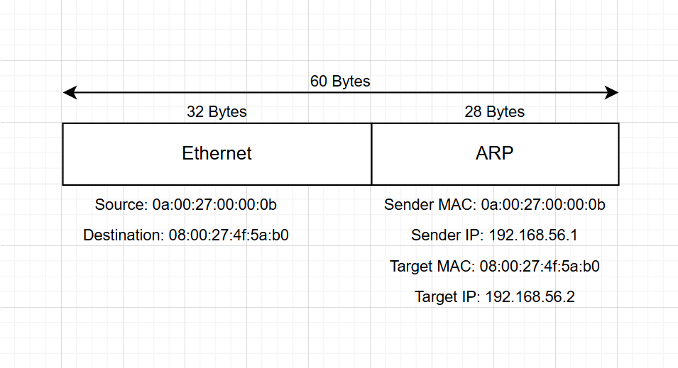
     - **Wireshark ARP Screenshot:** 
    - **Analysis:** ARP (Address Resolution Protocol) is used to find the MAC address of a device when only its IP address is known. In this case, my personal laptop (IP: 192.168.56.1, MAC: 0a:00:27:00:00:0b) needed to communicate with the OpenWright server (192.168.56.2) but didn’t know its MAC address. Since Ethernet communication requires MAC addresses, the laptop sent an ARP request asking, “Who has IP 192.168.56.2?” This request was broadcasted to all devices on the local network. The OpenWright server, which recognized the IP as its own, responded with its MAC address: 08:00:27:4f:5a:b0. With this response, the laptop could then send data directly to the server using the correct Ethernet address. This process happens automatically in the background and is essential for enabling IP-based communication over Ethernet within a local network. Without ARP, devices wouldn’t be able to translate IP addresses into the hardware-level addresses needed to actually deliver data.

3. **Packet Diagram - ICMP**
    - **Draw.io FIle:** [week4-task4-icmp.drawio](./images/week4/week4-task4-icmp.drawio)
    - **ICMP Screenshot:** 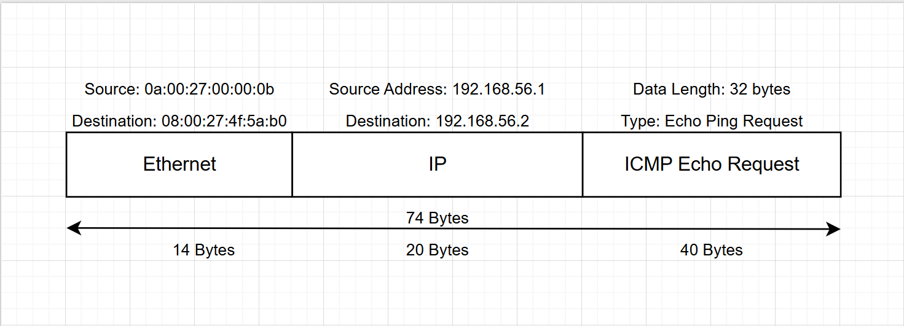

    - **Draw.io FIle:** [week4-task4-icmp1.drawio](./images/week4/week4-task4-icmp1.drawio)
    - **ICMP Screenshot:**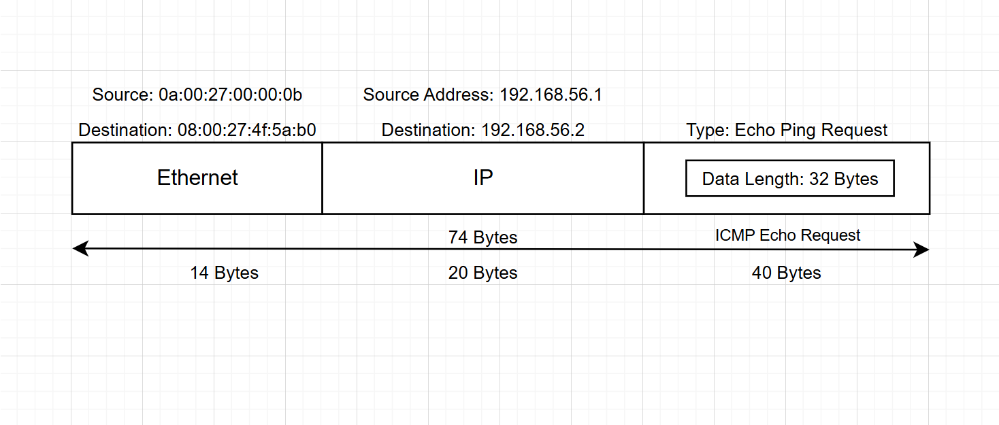
    
    - **Wireshark PCAP File:** [week3-task4-ping.pcap](./images/week3/week3-task4-ping.pcap)
    - **Wireshark ICMP Screenshot:** 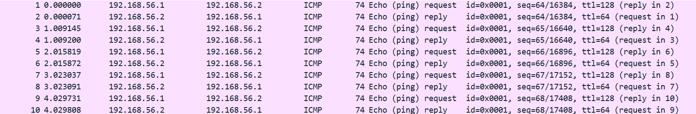
    - **Analysis:** The first two ICMP packets in the capture show a basic ping test from my laptop with IP address 192.168.56.1 to the OpenWright server at 192.168.56.2. The first packet is an ICMP Echo Request, where the laptop is asking the server if it is reachable. The second packet is an ICMP Echo Reply, where the server responds to confirm that it received the request. The purpose of the first packet is to check if the target is reachable, and the purpose of the second packet is to confirm that the target received the request and is reachable on the network. This exchange verifies that the network path between the two devices is working correctly. It confirms that the server is online, the laptop is properly configured, and that both devices are able to communicate over the local network using IP. This kind of test is commonly used to troubleshoot or verify connectivity.

## Task 5. View ARP Table

1. **Command Used:** arp -a
    - **Analysis:** The screenshot below shows the current status of the arp table where it only shows one dynamic type of IPv4 address 192.168.1.1 and the rest are static IPv4 addresses. The IPv4 address
    - **Screenshot:**
    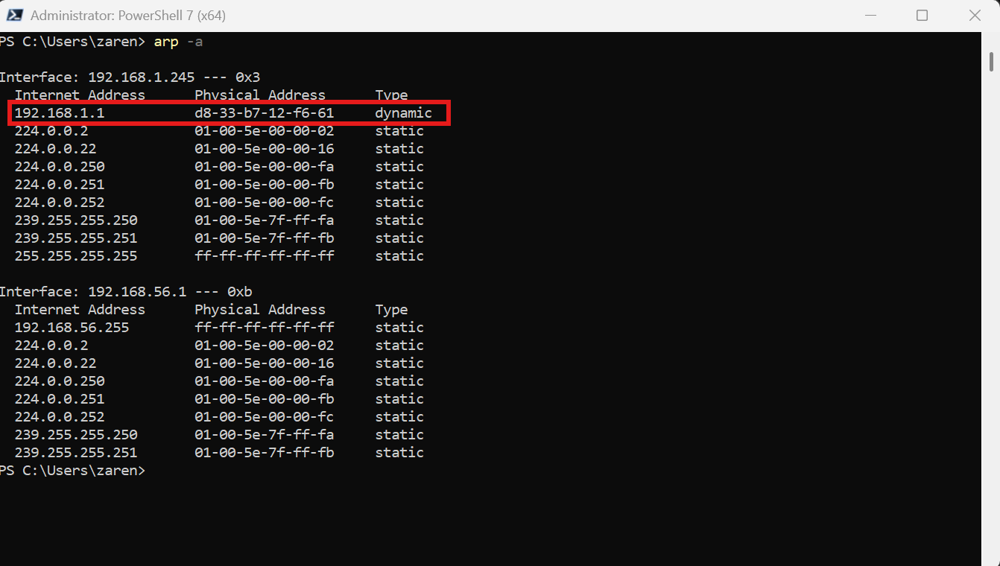

2. **Command Used:** ping -a 192.168.1.1 -n 5
    - **Analysis:** The screenshot below shows the current status of the ARP table, which contains one dynamic IPv4 address, 192.168.1.1, while the rest are static IPv4 addresses. The device with this IP address is named router.sagecom.net, indicating that it is my home router. Additionally, this device serves as my default gateway. The ping command uses the -a parameter to verify and display the hostname associated with an IP address.
    - **Screenshot:**
    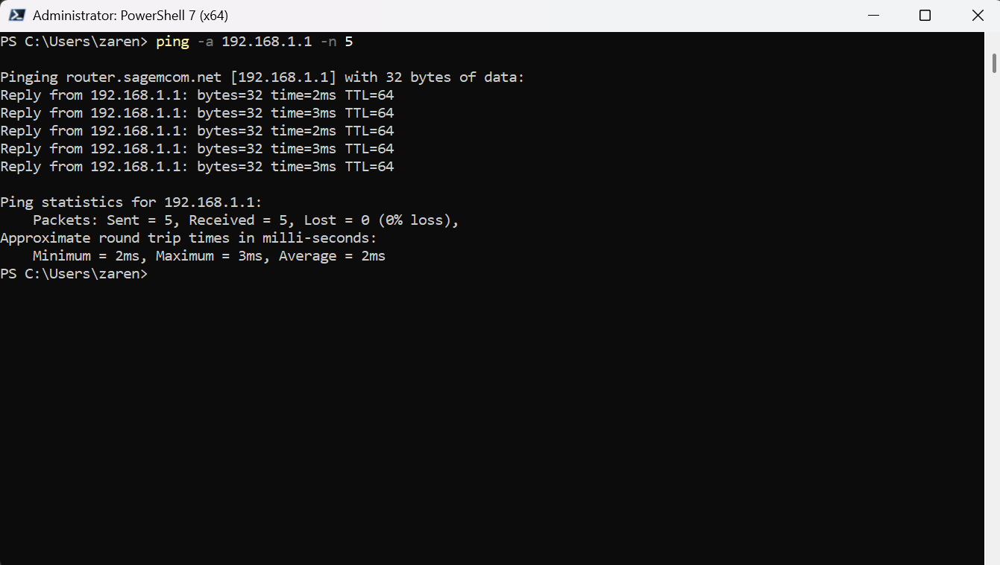

3. **Command Used:** ping -a 192.168.1.214 -n 5
    - **Analysis:** The screenshot below shows a ping to the IPv4 address 192.168.1.214. The device with this IP address is named Chromecast.lan, indicating that it is a Chromecast device — a hardware device that enables you to stream media to your TV wirelessly.
    - **Screenshot:** 
    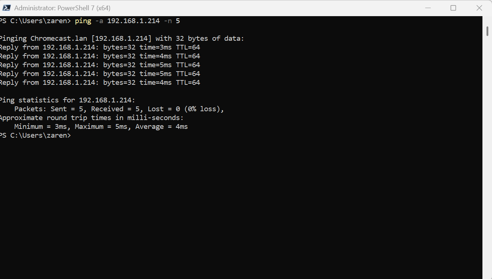

4. **Command Used:** arp -a
    - **Analysis:** The screenshot below shows the updated ARP table, where the IPv4 address 192.168.1.214 for Chromecast.lan now appears. This indicates that after the ping request, our Wi-Fi interface adapter, with the IPv4 address 192.168.1.245, was able to send an ICMP request and use a broadcast method to reach 192.168.1.214, adding it to the ARP table.
    - **Screenshot:**
    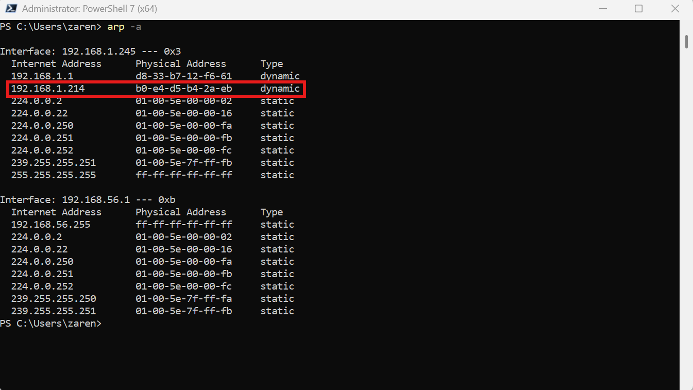

5. **Command Used:** ping -a 192.168.56.2 -n 5
    - **Analysis:** The screenshot below shows a ping command using the -a parameter to reach the IPv4 address 192.168.56.2, which belongs to an OpenWRT Linux server running on VirtualBox.
    - **Screenshot:**
    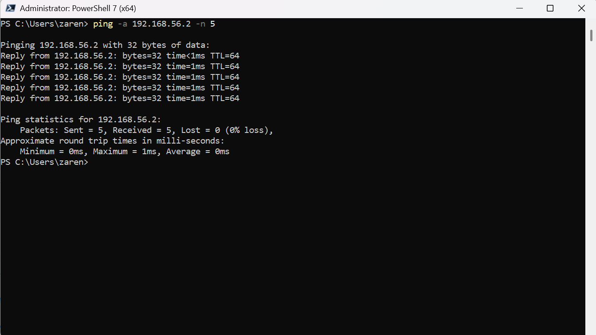

6. **Command Used:** arp -a
    - **Analysis:** The screenshot below shows the updated ARP table, where the IPv4 address 192.168.56.2 now appears.
    - **Screenshot:**
    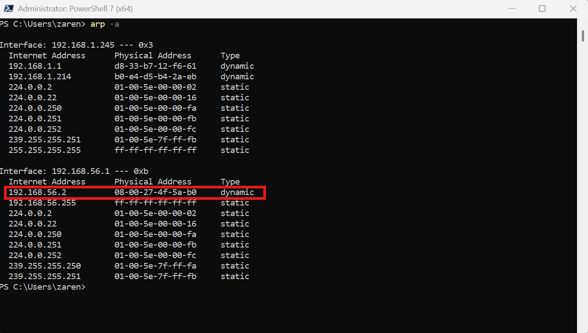

List of MAC addresses that are reachable:

1.  Hostname: **router.sagecom.net (Home Router)**
    - IPv4 Address: 192.168.1.1 
    - MAC Address: d8-33-b7-12-f6-61
2.  Hostname: **Chromecast.lan**
    - IPv4 Address: 192.168.1.214
    - MAC Address: b0-e4-d5-b4-2a-eb
3. Hostname: **None (Not Configured)**
    - IPv4 Address: 192.168.56.2          
    - MAC Address: 08-00-27-4f-5a-b0

## References:

1. GeeksforGeeks. (2021, June 24). Internet Control Message Protocol (ICMP). GeeksforGeeks. Retrieved August 1, 2025, from https://www.geeksforgeeks.org/computer-networks/internet-control-message-protocol-icmp/

2. GeeksforGeeks. (2023, March 13). How Address Resolution Protocol (ARP) works? GeeksforGeeks. Retrieved August 1, 2025, from https://www.geeksforgeeks.org/ethical-hacking/how-address-resolution-protocol-arp-works/

3. Wireshark Foundation. (n.d.). Wireshark User’s Guide. Retrieved August 1, 2025, from https://www.wireshark.org/docs/wsug_html_chunked/

4. Oracle Corporation. (2024). VirtualBox User Manual. Oracle VM VirtualBox. Retrieved August 1, 2025, from https://www.virtualbox.org/manual/UserManual.html

5. OpenWRT Project. (2023). OpenWRT Networking Overview. OpenWRT Wiki. Retrieved August 1, 2025, from https://openwrt.org/docs/guide-user/network/start

6. Hoffman, C. (2020, April 14). How to use the ip command on Linux. How-To Geek. Retrieved August 1, 2025, from https://www.howtogeek.com/657911/how-to-use-the-ip-command-on-linux/
