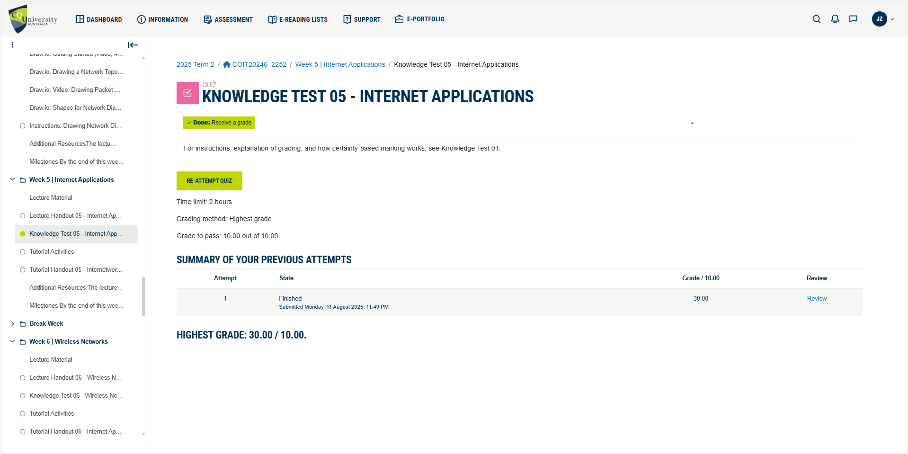
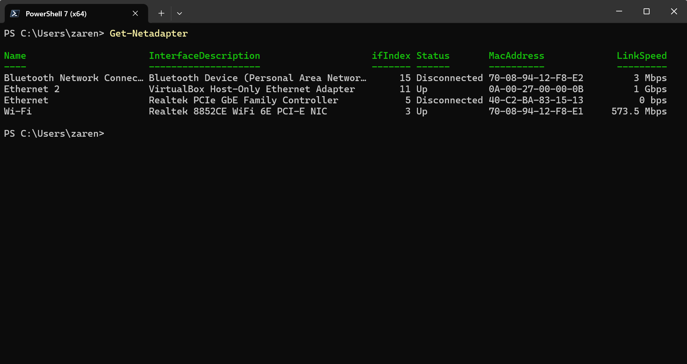
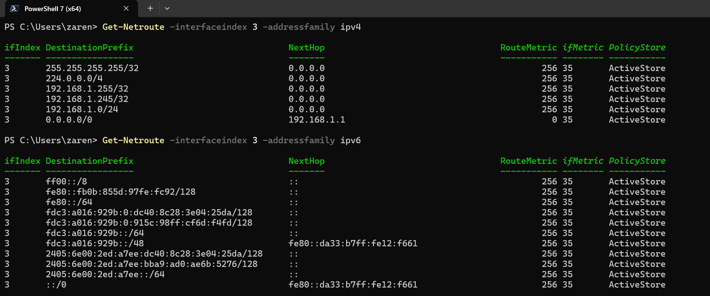
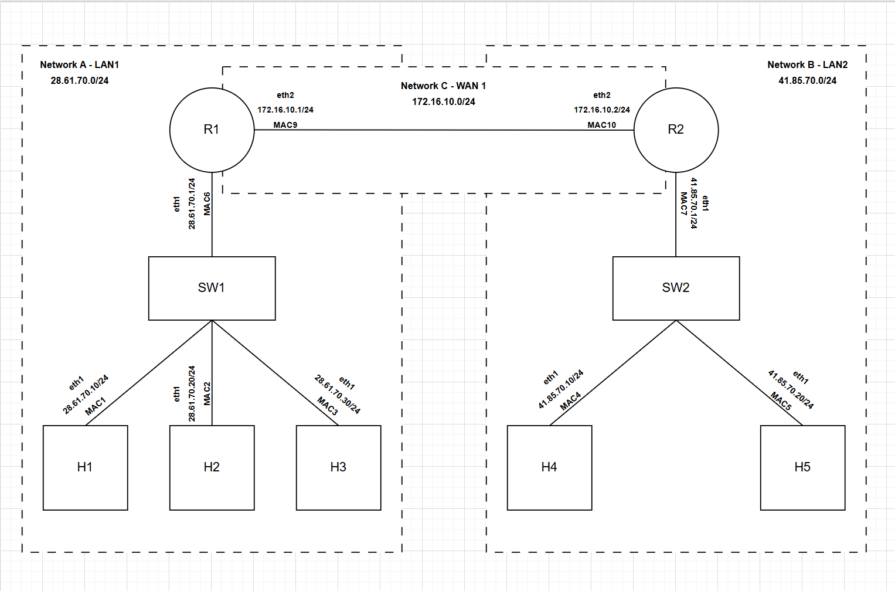
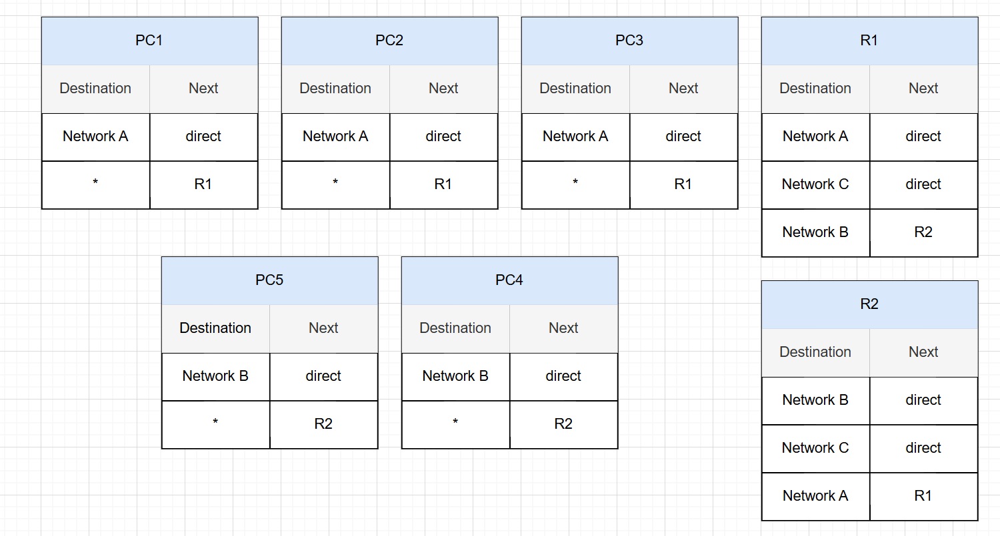
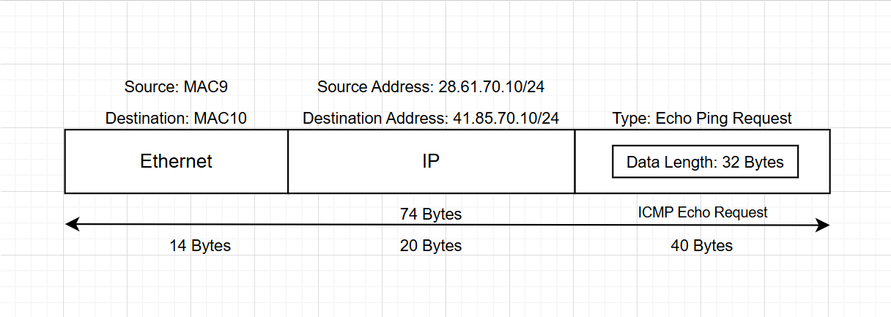
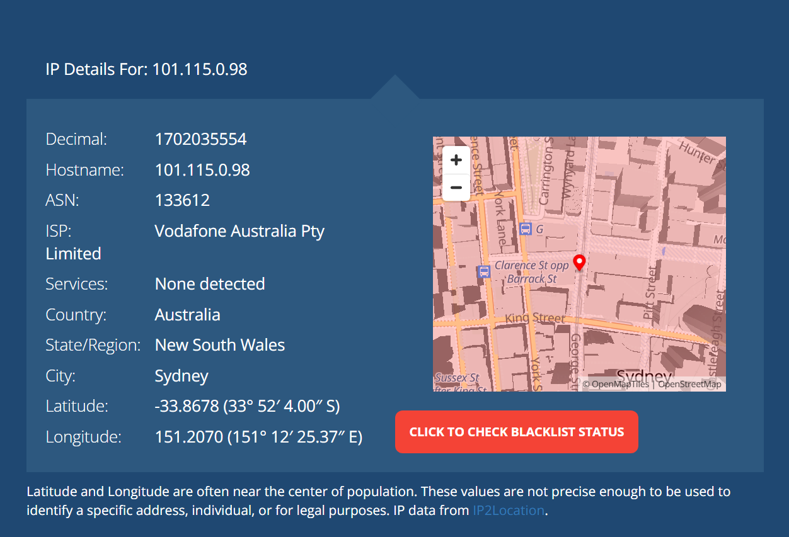
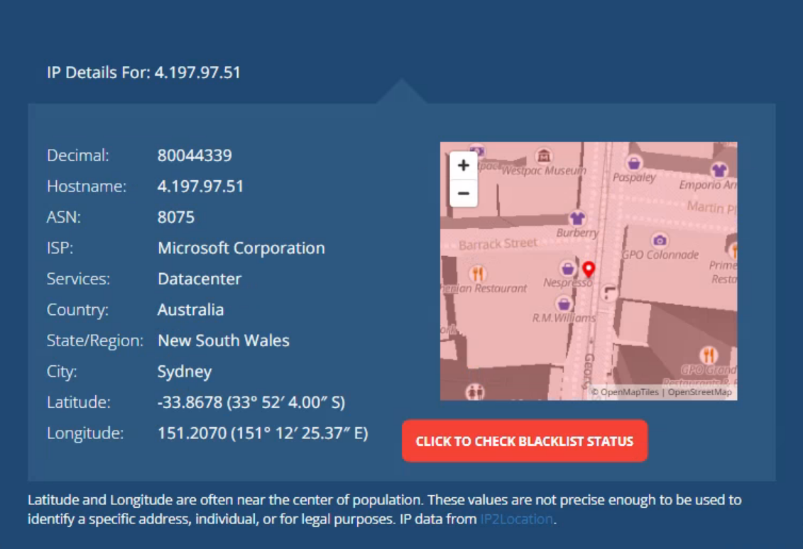

# Week 05 | Internetworking

## Task 1. Complete the Knowledge Test

## Task 2. View Routing Table

1. **Command Used:** Get-NetAdapter
    - **Explanation:** I used this command to identify my primary network adapter, which is the Wi-Fi adapter, and to obtain its interface index of 3.
    - **Screenshot:**
    

2. **Command Used:** Get-Netroute -interfaceindex <#> -addressfamily <ipv4/ipv6>
    - **Explanation:** I used this command to display the routing table of my primary network adapter. As shown in the screenshot below, the Get-NetRoute command was used to display the routing table for interface index 3 (our primary network adapter – Wi-Fi). It can also be observed that the IPv4 and IPv6 routing tables were displayed separately using the -AddressFamily parameter. In this case, our focus is on the IPv4 address.
    - **Screenshot:**
    

**Analysis of the IPv4 Routing Table – Primary Interface Index 3 (Wi-Fi)**

1. **IPv4 address:** 255.255.255.255/32
    - **Destination:** This is the IPv4 broadcast address for a single host.
    - **NextHop:** 0.0.0.0 means the packet is sent directly over the link (no gateway).
    - **Purpose:** Used for sending broadcast packets to a single device on the network.

2. **IPv4 address:** 224.0.0.0/4 0.0.0.0
    - **Destination:** This covers IPv4 multicast addresses (224.0.0.0 to 239.255.255.255).
    - **NextHop:** Directly connected (0.0.0.0).
    - **Purpose:** Used for multicast traffic (e.g., streaming, routing protocols).

3. **IPv4 address:** 192.168.1.255/32 
    - **Destination:** The broadcast address for the local subnet 192.168.1.0/24.
    - **NextHop:** Local link.
    - **Purpose:** Used to send broadcast messages to all hosts in the subnet.

4. **IPv4 address:** 192.168.1.245/32
    - **Destination:** This is my laptop's Wifi Adapter
 IP address.
    - **NextHop:** Local link (0.0.0.0).
    - **Purpose:** Loopback for local delivery — ensures traffic to itself is not sent out.

5. **IPv4 address:** 192.168.1.0/24 
    - **Destination:** The local subnet (192.168.1.0 to 192.168.1.255).
    - **NextHop:** Local link.
    - **Purpose:** Routing within the local network — no gateway needed.

6. **IPv4 address:** 0.0.0.0/0
    - **Destination:** Default route — matches all IPv4 addresses not in more specific routes.
    - **NextHop:** 192.168.1.1 (gateway/router).
    - **Purpose:** Used to send traffic to the internet or other networks outside the local subnet.

## Task 3. IP Network Design 

**Group members:**
- **Student 1:** Joshnell Briggs Zareno (12292861)
- **Student 2:** Angie Marcela Cardenas (12284185)

**Network Diagram Details:**

1. Physical Specfication:
    - 8-port Gigabit Ethernet switches - quantity of 2
    - 2-port routers - quantity of 2
    - Host PC - quantity of 5
    - Multiple LAN cables

2. Network Structure Specification:
    - A switched Ethernet LAN with three computers. 
    - Another switched Ethernet LAN with two computers. 
    - The two switched Ethernet LANs connected together via a 1 Gb/s Ethernet point-to-point WAN link. 
    - All three IP networks are using IPv4 with a /24 network mask.

3. Network ID specification:
    - Network A - LAN 1 (26.61.70.0/24)
        - Host 1 = eth1 - 26.61.70.10/24
        - Host 2 = eth1 - 26.61.70.20/24
        - Host 3 = eth1 - 26.61.70.30/24
        - Router 1 = eth1 - 26.61.70.1/24
    - Network B - LAN 2 (41.85.70.0/24)
        - Host 4 = eth1 - 41.85.70.10/24
        - Host 5 = eth1 - 41.85.70.20/24
        - Router 2 = eth1 - 41.85.70.1/24
    - Network C - WAN - 172.16.10./24
        - Router 1 = eth2 - 172.16.10.1/24
        - Router 2 = eth2 - 172.16.10.2/24

- **Network Diagram Drawio File:**
[week5-task3-network-diagram-with-routing-table.drawio](images/week5/week5-task3-network-diagram-with-routing-table.drawio)

- **Network Diagram Screenshot:**

- **Routing Table Screenshot:**

- **Description:** A packet diagram (ICMP) was captured on Router 1, where Host 1 in Network A – LAN 1 pings Host 4 in Network B – LAN 2. It shows the packet’s Ethernet and IP source and destination addresses, as well as the length of each header and other details such as the assumed data length and the request type, which is an Echo ping request.

- **ICMP Packet Diagram Drawio File:**
[week5-task3-ICMP.drawio](images/week5/week5-task3-ICMP.drawio
)
- **ICMP Packet Diagram Screenshot:**

## Task 4: Academic Integrity Outcomes

**Selected Scenario:**
In our discussion, the most interesting scenario involved a student using an AI text generator to complete a large part of an assignment, even though the unit profile specifically prohibited AI tools. The student submitted the work without attribution, and it was detected via similarity checks and content analysis on turnitin.

1. For the student(s) that performed poorly or breached academic integrity, what could have they done differently to avoid the problems? 
    - **Answer:** Reviewed the unit profile to understand the rules about AI tool usage. Looked for clarification from the Unit Coordinator before using AI in the assessment. Developed their own work and only used approved study support services (e.g., Academic Learning Centre). 

2. What level of breach of academic integrity occurred (if any), and what is the likely outcome according to CQU policy? Do you think the outcome according the CQU policy is fair to the student? 
Is it fair to you (who has studied hard)? 
    - **Answer:** This falls under cheating and potentially plagiarism if AI-generated material is unacknowledged. Since it was deliberate and involved a large part of the assessment, it’s at least Level 4 – Substantial academic misconduct. Likely penalties: fail grade for the unit, possible revocation of academic credit, temporary exclusion from study. Fairness: According to policy, the penalty is fair to both the student (clear rules and due process) and to others who worked honestly, because it preserves the integrity of the qualification.

3. If a student performs academic misconduct on an assessment but is not caught during the term, what are the potential future ramifications (for that student and/or for others)?
    - **Answer:** For the student: Gaps in skills/knowledge could cause poor performance in future units or in their profession. Risk of later discovery and revocation of qualification. For others: Devalues the credibility of CQU awards; could damage the university’s reputation and impact peers’ career prospects.

**Summary of Outcomes (according to CQU policy)**

1. Breach type: Cheating (unauthorised AI use).
2. Level: Level 4 – Substantial academic misconduct.
3. Outcomes/Penalties: Fail for the unit, possible credit revocation, potential exclusion for one or more terms, referral to ALC.

**Two Recommendations for Other Students**

- Always check the unit profile and CQU policy before starting assessments—especially regarding use of AI, collaboration, and referencing.

- Seek help early from the Academic Learning Centre or lecturers if unsure about assessment requirements, instead of risking a breach.

## Task 5: IP Address Lookup

1. Use an online IP address lookup website, e.g., search for “what is my IP address”. How accurately does it 
identify you and your location? Explain what is identified (e.g., your exact location? Your city? Your computer IP? Someone else’s IP?).
- **Answer:**

    - **Description:** The screenshot below shows the result from ["whatismyipaddress.com"](https://whatismyipaddress.com/) using my home laptop. 
    - **Screenshot**
    

    - **Description:** The screenshot below shows the result from ["whatismyipaddress.com"](https://whatismyipaddress.com/) using my virtual desktop at CQU.
    - **Screenshot**
    

    - **Analysis:** WhatIsMyIPAddress doesn’t use GPS coordinates from your device. Instead, it looks at your public IP address and checks a database to see where that IP range is registered.
    
        For example, the IP address 101.115.0.98 belongs to Vodafone Australia Pty, while 4.197.97.51 belongs to a Microsoft Corporation data center in Australia. These Internet service providers (ISPs) assign IP ranges to large geographic regions, not to individual homes, which is why the location shown is often the address of the ISP itself.

        Websites like WhatIsMyIPAddress maintain large databases that map IP ranges to cities. These databases are updated periodically and rely on ISP registration information, meaning they can be inaccurate by dozens or even hundreds of kilometers.

        Additionally, ISPs do not provide customer-specific location data without a legal request. Public services cannot pinpoint your street address from your IP — only your ISP has that capability.

## References:

1. Cloudflare. (2025). What is a WAN? Cloudflare. Retrieved August 15, 2025, from https://www.cloudflare.com/learning/network-layer/what-is-a-wan/

2. Microsoft. (2025a). Get-NetAdapter. Microsoft Learn. Retrieved August 15, 2025, from https://learn.microsoft.com/en-us/powershell/module/netadapter/get-netadapter?view=windowsserver2025-ps

3. Microsoft. (2025b). Get-NetRoute. Microsoft Learn. Retrieved August 15, 2025, from https://learn.microsoft.com/en-us/powershell/module/nettcpip/get-netroute?view=windowsserver2025-ps

4. Stack Exchange. (2015). How is next hop defined in routing table? SuperUser. Retrieved August 15, 2025, from https://superuser.com/questions/959242/how-is-next-hop-defined-in-routing-table

5. WhatIsMyIPAddress.com. (2025). What is my IP address? WhatIsMyIPAddress.com. Retrieved August 15, 2025, from https://whatismyipaddress.com/