# Week 06 | Internet Applications

## Task 1. Complete the Knowledge Test
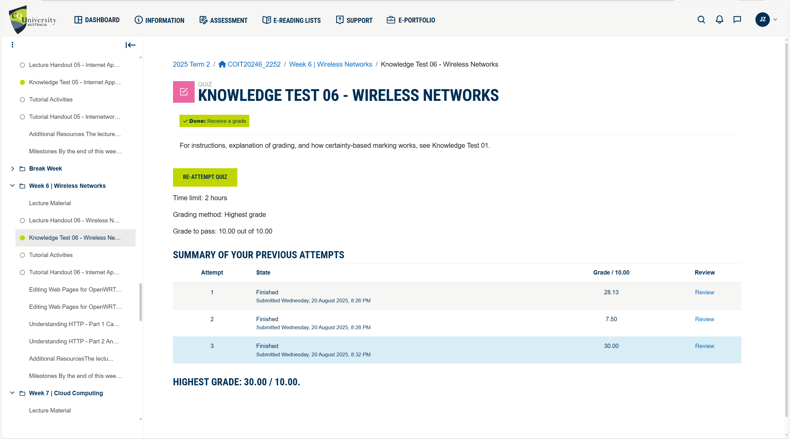

## Task 2. Create Web Pages in OpenWRT

- **New index.html File:**
[index.html](./images/week6/index.html)
- **New index.html Screenshot:**
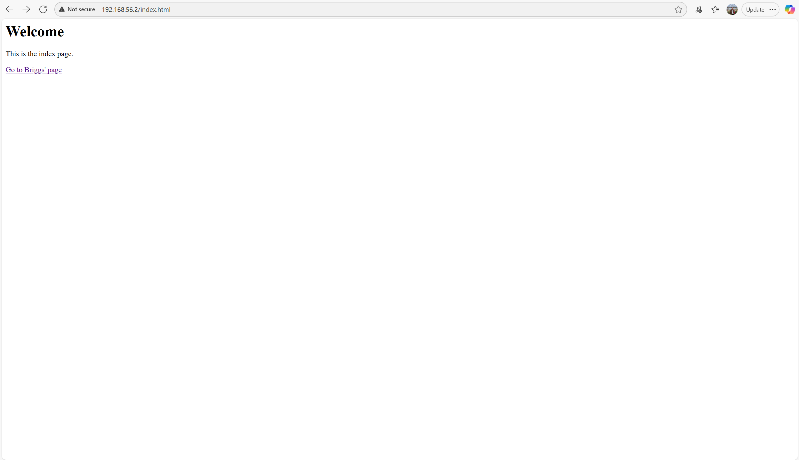

- **New index.html File:**
[12292861.html](./images/week6/12292861.html)
- **12292861.html Screenshot:**
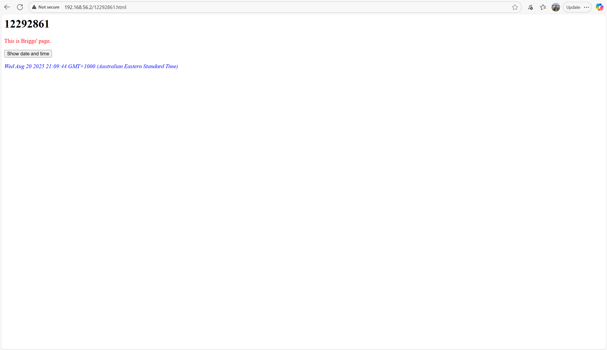

## Task 3. Capture HTTP Packets

- **Arp Table Screenshot:**
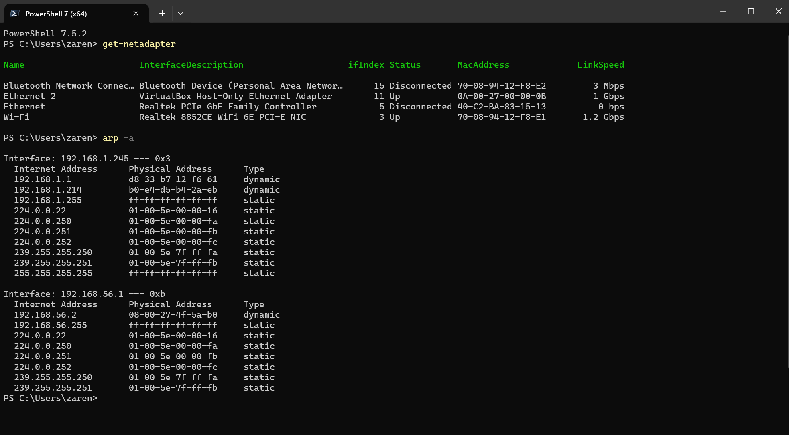

- Note: The captured pcap file is located at ./images/week6/http-12292861.pcap

## Task 4. Analyse HTTP Packet Capture

1. For each HTTP request/response, provide a short explanation of: what triggered the request, what was requested and what was the response. For example: “The user clicked on the link … which caused the browser to send a HTTP Request for /page.html. The server did not have that page so responded with … “. 
- **Screenshot:** 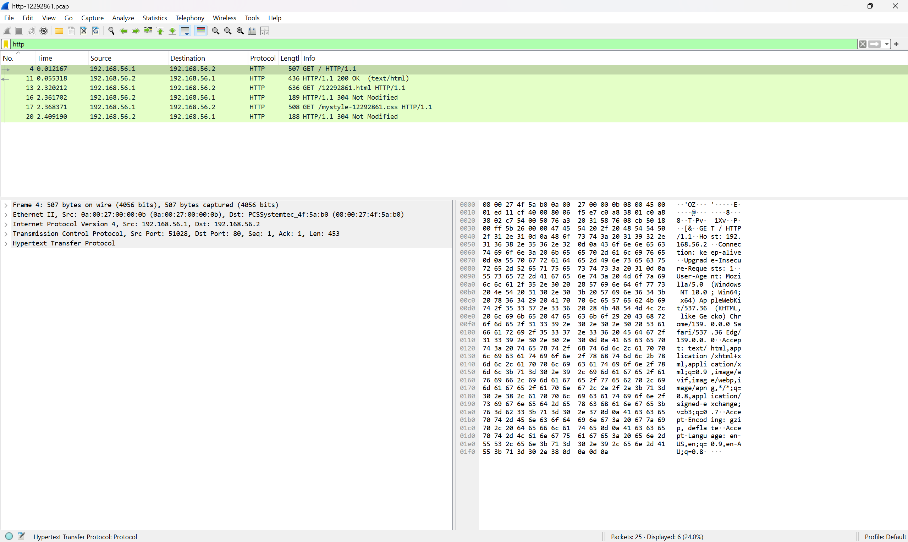

    - **Frame 4 – HTTP Request**
        - Trigger: The user (browser) typed the site address or clicked a link to the homepage file (index.html).
        - Request: GET / HTTP/1.1 — the browser asked for the root page of the server.
        - Response: (Seen in Frame 11) — the server responded with 200 OK and returned the HTML content of the home page (index.html).

    - **Frame 11 – HTTP Response**
        - Trigger: Response to Frame 4 request.
        - Request being answered: /index.html.
        - Response: 200 OK, with Content-Type: text/html. The browser received the page content to render.

    - **Frame 13 – HTTP Request**
        - Trigger: The home page file (index.html) referenced another file (12292861.html). The browser automatically followed this reference to load the file.
        - Request: GET /12292861.html HTTP/1.1
        - Response: (Seen in Frame 16) — the server replied with 304 Not Modified, meaning the file had not changed since the last time the browser cached it, so the browser reused its cached copy.

    - **Frame 16 – HTTP Response**
        - Trigger: Response to Frame 13 request.
        - Request being answered: /12292861.html.
        - Response: 304 Not Modified — the browser did not need to download the file again.

    - **Frame 18 – HTTP Request**
        - Trigger: The HTML file (12292861.html) referenced a CSS stylesheet (mystyle-12292861.css). The browser automatically requested it to style the page.
        - Request: GET /mystyle-12292861.css HTTP/1.1
        - Response: (Seen in Frame 20) — the server replied with 304 Not Modified, meaning the stylesheet had not changed, so the browser reused its cached version.

    - **Frame 20 – HTTP Response**
        - Trigger: Response to Frame 18 request.
        - Request being answered: /mystyle-12292861.css.
        - Response: 304 Not Modified — no new content, browser used cache.

2. For the first HTTP request/response, list the five (5) address values that identify the host, transport protocol and application.  
    - **Answer:**
    1. **Source IP address:** 192.168.56.1
        - **Description:** This is the client (browser/host machine) sending the request.
    2. **Destination IP address:** 192.168.56.2
        - **Description:** This is the web server hosting the page.

    3. **Source Port:** 51028
         -  **Description:** Dynamically chosen by the client from the range of TCP/UDP ephemeral ports. These are temporary ports assigned dynamically for outbound connections.
    
    4. **Destination Port:** 80
        -  **Description:** Standard port for HTTP traffic, identifying the service on the server.

    5. **Application Protocol:** HTTP
        -  **Description:** The actual application-layer protocol used for communication (in this case, requesting the webpage).

3. When you clicked on the button to show the date and time, did your browser send a request to the web server? Why or why not? 
    - **Answer:** No, the browser did not send a request to the server. The button uses JavaScript to get the date and time from the client’s local system clock (My laptop), so it is handled entirely on the browser without needing the server.

4. One of the HTTP request/responses was for your newly created web page (e.g., 12345678.html). 
Draw a packet diagram for the request, and include the following information: 
    - Size, in Bytes, of each header and of the entire HTTP request 
    - Addresses included in each header and/or HTTP request
        - **Wireshark Screenshot:** 
        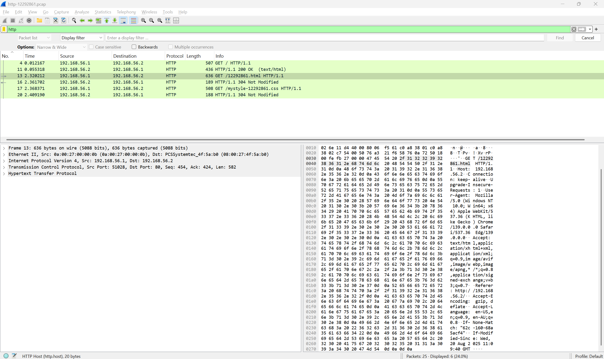
        - **HTTP Packet Diagram Screenshot:**
        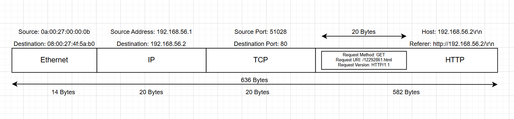

5. For the HTTP request from part (d), what is the value of the referrer? What does it identify? How can web servers use this information? 
    - **Wireshark Screenshot:** 
        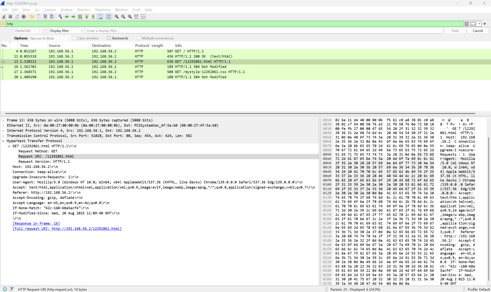
    - **Answer:** Referer: http://192.168.56.2/
    - **Explanation:** It identifies the webpage URL from which the request originated. In this case, the user was already on the base page http://192.168.56.2/ before navigating to /12292861.html. Web servers can use this information to track navigation paths, perform analytics on link clicks, implement access control or anti-hotlinking, and improve personalization or content recommendations.

6. For the HTTP request from part (d), what information did the server learn about the web browser 
(e.g., name, version)? 
    - **Answer:** The server learn about the web browser by looking at the HTTP request User-Agent header. From this, server learns:
        1. **Operating System:** Windows 10 (64-bit).
        2. **Browser Engine:** AppleWebKit/537.36 (like Gecko).
        3. **Browser:** Chrome 139.0.0.0, also indicates Microsoft Edge 139.0.0.0 (since Edge is Chromium-based).
        4. **Architecture:** Win64; x64 (running on 64-bit machine).

Now remove the “http” filter so that all captured packets are shown. 

7. What version of HTTP is used and what transport protocol is used?
    - **Answer:**
        - **HTTP version:** HTTP/1.1
        - **Transport protocol:** Transmission Control Protocol (TCP) - port 80
    - **Screenshot:**
        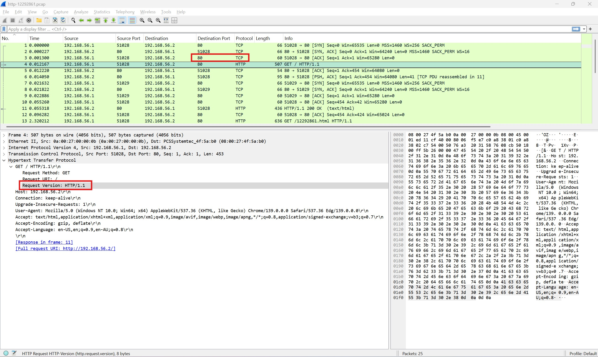

8. A connection-oriented service involves setting up a connection before any data transfer, as well as acknowledgements that are used to provide reliability. Identify the packets involved in connection setup (e.g., the packet numbers). How long did it take between the start of connection setup and the data transfer starting? 
    - **Answer:** A TCP connection is established using a 3-way handshake:
        1. **Packet 1:** 192.168.56.1:51028 → 192.168.56.2:80 [SYN]
        2. **Packet 2:** 192.168.56.2:80 → 192.168.56.1:51028 [SYN, ACK]
        3. **Packet 3:** 192.168.56.1:51028 → 192.168.56.2:80 [ACK]

    - **Explanation:** Packets 1, 2, 3 (connection setup). Data transfer starts at Packet 4, 0.12167 ms after initiation.

9. Identify the acknowledgements. When is an acknowledgement typically sent?
- **Answer:** In TCP, acknowledgements (ACKs) are used to confirm receipt of packets. Here's list of ACKs in the captured network PCAP:
    - **Screenshot:**
        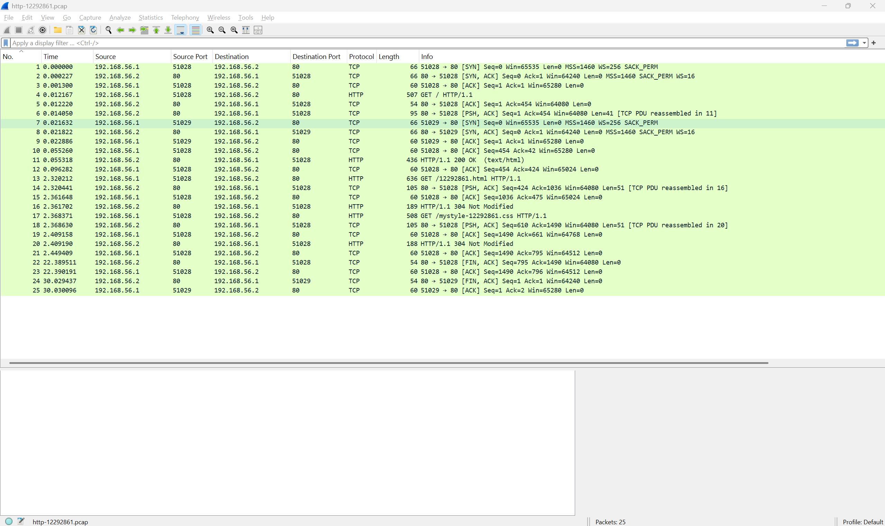

- **Pure ACK packets (ACK only, no data):**
    1. **Packet 3** – 192.168.56.1 → 192.168.56.2 [ACK] (completes 3-way handshake)
    2. **Packet 5** – 192.168.56.1 → 192.168.56.2 [ACK]
    3. **Packet 8** – 192.168.56.1 → 192.168.56.2 [ACK]
    4. **Packet 10** – 192.168.56.1 → 192.168.56.2 [ACK]
    5. **Packet 12** – 192.168.56.1 → 192.168.56.2 [ACK]
    6. **Packet 15** – 192.168.56.1 → 192.168.56.2 [ACK]
    7. **Packet 19** – 192.168.56.1 → 192.168.56.2 [ACK]
    9. **Packet 21** – 192.168.56.1 → 192.168.56.2 [ACK]
    10. **Packet 24** – 192.168.56.2 → 192.168.56.1 [FIN, ACK] (FIN + ACK for connection close, still an ACK flag but with FIN)
    11. **Packet 25** – 192.168.56.1 → 192.168.56.2 [FIN, ACK]

- **ACKs combined with data (PSH, ACK):**

    1. **Packet 6** – 192.168.56.2 → 192.168.56.1 [PSH, ACK] (HTTP response)
    2. **Packet 9** – 192.168.56.2 → 192.168.56.1 [PSH, ACK]
    3. **Packet 11** – 192.168.56.2 → 192.168.56.1 [PSH, ACK]
    4. **Packet 13** – 192.168.56.1 → 192.168.56.2 [PSH, ACK] (HTTP GET request)
    5. **Packet 14** – 192.168.56.2 → 192.168.56.1 [PSH, ACK]
    6. **Packet 16** – 192.168.56.2 → 192.168.56.1 [PSH, ACK]
    7. **Packet 17** – 192.168.56.1 → 192.168.56.2 [PSH, ACK] (HTTP GET request)
    8. **Packet 18** – 192.168.56.2 → 192.168.56.1 [PSH, ACK]
    9. **Packet 20** – 192.168.56.2 → 192.168.56.1 [PSH, ACK]
    10. **Packet 22** – 192.168.56.2 → 192.168.56.1 [PSH, ACK]
    11. **Packet 23** – 192.168.56.1 → 192.168.56.2 [PSH, ACK]

- **Explanation:** 
    An acknowledgement is typically sent whenever data is received — either immediately, delayed slightly (to reduce overhead), or piggybacked along with outgoing data. This ensures reliability by letting the sender know which bytes have been successfully received.

    The acknowledgements in the trace are the packets that contain the ACK flag. In this capture, the pure ACK-only packets are 3, 5, 8, 10, 12, 15, 19, and 21 (with 24 and 25 being FIN, ACK used for connection termination). In addition, many packets such as 6, 9, 11, 13, 14, 16, 17, 18, 20, 22, and 23 carry PSH, ACK, meaning they both acknowledge previous data and carry new data.

##  Task 5. View Your Cookies 
Use the developer tools in your web browser to view your cookies when you visit a particular website that you regularly visit. What information do the cookies store about you and/or your browser? As cookies can reveal personal information, you do not have to include the exact values in your journal (and be careful if displaying cookies to others, such as your tutor, in class). Rather explain the type of information the cookies store.  

- **Answer:** 
    - **Chosen Website:** Google.com
    - **Screenshot:** 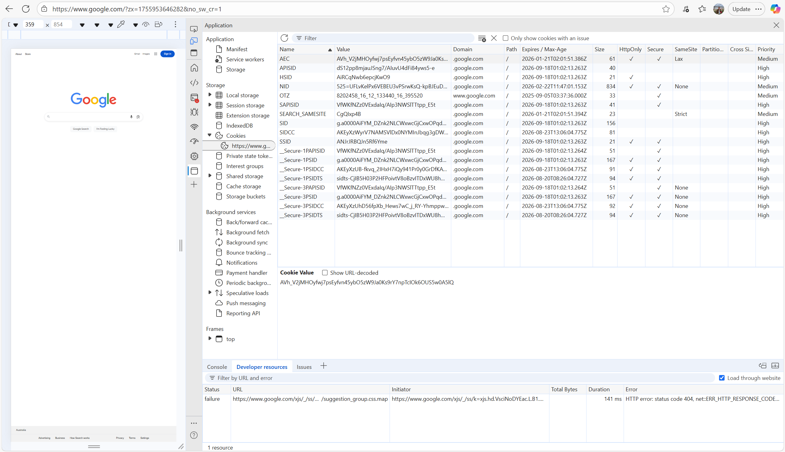

    - Types of Information Stored in Cookies

        1. **Session identifiers:** e.g., SID, SSID, _Secure-1PSID → unique tokens that identify your login session so you don’t need to keep logging in.

        2. **Authentication tokens:** secure cookies (marked Secure and HttpOnly) are used to confirm you are the same logged-in user across requests.

        3. **Preferences and settings:** some cookies store things like your search preferences, language, or personalization choices (SEARCH_SAMESITE, NID).

        4. **Tracking/analytics IDs:** cookies like AEC or OTZ may help Google track usage across services to improve ads or service delivery.

        5. **Expiry dates:** some expire after a session, while others persist for months or years (e.g., into 2026). This shows how long the website wants to remember your session/settings.

        6. **Security attributes:** many are marked Secure (sent only over HTTPS) and HttpOnly (not accessible via JavaScript), protecting against theft.

- **Explanation:** When I checked the cookies for Google using the Developer Tools, I found that the cookies store a variety of information. Some cookies contained session identifiers and authentication tokens to keep me logged in securely across requests. Others stored my preferences, such as search or personalization settings. I also noticed cookies related to tracking and analytics, which are likely used to measure my activity and improve ads or recommendations. Each cookie had an expiry date, with some lasting only for the session and others persisting for years. Many cookies were marked as Secure and HttpOnly, which means they are protected from being accessed by scripts and are only transmitted over HTTPS.

## References:

1. Captain Compliance. (2024, April 8). HSID cookie. Captain Compliance. Retrieved August 23, 2025, from https://captaincompliance.com/education/hsid-cookie

2. Captain Compliance. (2024, April 8). NID cookie. Captain Compliance. Retrieved August 23, 2025, from https://captaincompliance.com/education/nid-cookie

3. Captain Compliance. (2024, April 8). SID cookie. Captain Compliance. Retrieved August 23, 2025, from https://captaincompliance.com/education/sid-cookie/

4. CookieYes. (2022, July 6). Google cookies: What they are and how they are used. CookieYes. Retrieved August 23, 2025, from https://www.cookieyes.com/blog/google-cookies/?utm_source=chatgpt.com

5. GeeksforGeeks. (n.d.). Piggybacking in Computer Networks. GeeksforGeeks. Retrieved August 23, 2025, from https://www.geeksforgeeks.org/computer-networks/piggybacking-in-computer-networks/

6. GeeksforGeeks. (n.d.). Various TCP and UDP ports. GeeksforGeeks. Retrieved August 23, 2025, from https://www.geeksforgeeks.org/computer-networks/various-tcp-and-udp-ports/

7. GeeksforGeeks. (n.d.). What is Transmission Control Protocol (TCP)?. GeeksforGeeks. Retrieved August 23, 2025, from https://www.geeksforgeeks.org/computer-networks/what-is-transmission-control-protocol-tcp/

8. Google. (n.d.). Technologies: Cookies. Google. Retrieved August 23, 2025, from https://policies.google.com/technologies/cookies

9. Mozilla Developer Network. (n.d.). 304 Not Modified. Mozilla. Retrieved August 23, 2025, from https://developer.mozilla.org/en-US/docs/Web/HTTP/Reference/Status/304

10. SpeedGuide.net. (n.d.). Port 51028 Details. SpeedGuide.net. Retrieved August 23, 2025, from https://www.speedguide.net/port.php?port=51028

11. Stack Overflow. (2018, July 15). Google NID cookie. Stack Overflow. Retrieved August 23, 2025, from https://stackoverflow.com/questions/51348078/google-nid-cookie