# Week 07 | Wireless Networks

## Task 1. Complete the Knowledge Test
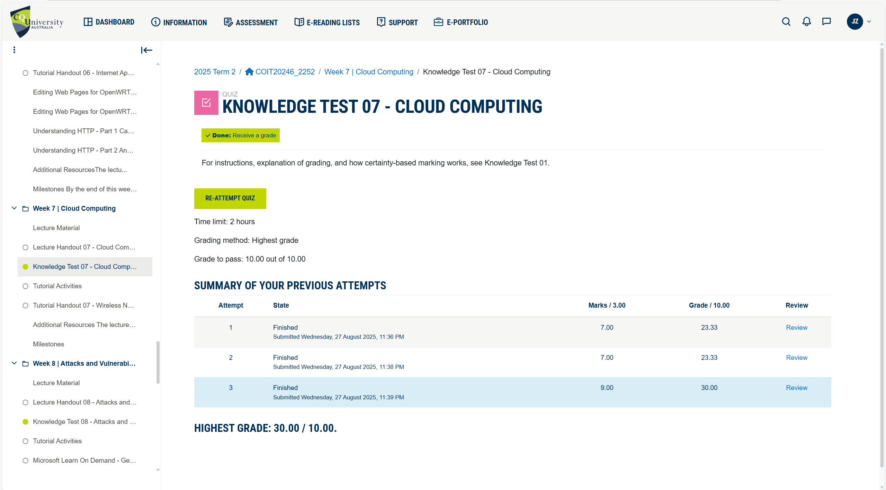

## Task 2. View Wi-Fi Details

1. **Command Used:**  Show-wifistate
    - **Description:** The command is used to display the current Wi-Fi adapter status, including whether it’s enabled, connected, and key details like SSID, signal, band, and security.
    - **Screenshot:** 
    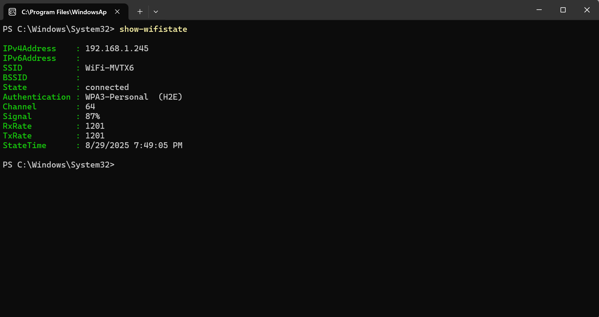

2. **Command Used:**  Show-wifistate
    - **Description:** The command is used to display the current Wi-Fi adapter status, including whether it’s enabled, connected, and key details like SSID, signal, band, and security.
    - **Screenshot:** 
    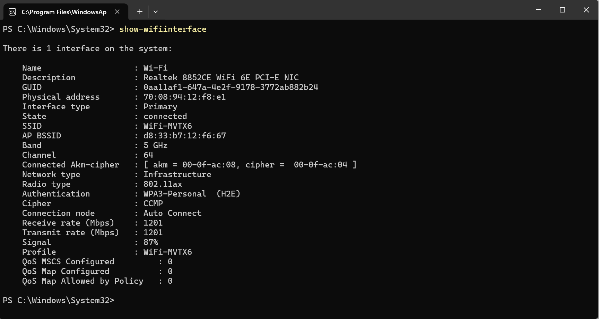

List of information found on my home Wifi:

- Access Point 1
- **SSID:** WiFi-MVTX6
- **BSSID:** d8:33:b7:12:f6:67
- **Frequency Band:** 5 GHz
- **Channel:** 64
- **Data Rate (Receive/Transmit):** 1201 Mbps / 1201 Mbps
- **Signal Strength:** 87%
- **Authentication:** WPA3-Personal (H2E)
- **Radio Type:** 802.11ax (Wi-Fi 6)

**Explanation:** This AP is using the modern Wi-Fi 6 standard (802.11ax) with WPA3-Personal (H2E), which provides strong security and high throughput. The connection is operating in the 5 GHz band on channel 64, which helps reduce interference compared to 2.4 GHz. The high data rate of 1201 Mbps indicates strong performance, suitable for demanding applications such as streaming and online gaming.

## Task 3. Use Wi-Fi Access Point

When designing or configuring a Wi-Fi network, the following settings are the most important to review and adjust:

1. **SSID (Service Set Identifier)**

    **Consideration:** Use a meaningful SSID (e.g., company name or location) rather than defaults like TP-Link_1234. Avoid using personal identifiers for security. In this case, I used Company 101 WiFi as an example, simulating a professional and appropriate WiFi name.
    
    **Screenshot:** 
    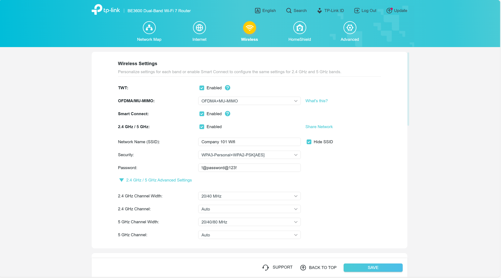

2. **Frequency Bands and Channels**

    **Consideration:** Wi-Fi uses 2.4 GHz, 5 GHz, and now 6 GHz (Wi-Fi 6E/7) but this router uses only up to 2.4 to 5GHz.
    
    - 2.4 GHz → longer range, better wall penetration, but more interference.
    - 5/6 GHz → faster speeds, less interference, but shorter range.

    **Channel selection:** Overlapping channels cause interference. For 2.4 GHz, use channels 1, 6, or 11. For 5 GHz, pick a less congested channel. In this case, I leave on its default settings but in design, manually set non-overlapping channels (especially in enterprise with multiple APs)

    **Screenshot:** 
    

3. **Security Settings**

    **Consideration:** WPA3 (if supported) is the most secure. WPA2-Enterprise provides additional RADIUS authentication for business networks. Always disable WEP and WPA (outdated and insecure). Enable WPA3 or WPA2-Personal with a strong passphrase for home; WPA2/WPA3-Enterprise for business.

    **Screenshot:** 
    

4. **IP Addressing**

    **Home Networks**

    Most home ISPs use Dynamic IPs (DHCP) for simplicity. The router automatically receives an IP address from the ISP.

    Inside the home LAN, the router acts as a DHCP server, assigning private IPs (e.g., 192.168.x.x) to connected devices.

    **Consideration:** DHCP is convenient for home use because users don’t need to manually configure each device. Only advanced cases (e.g., port forwarding for gaming servers) might benefit from a static IP.

    **Screenshot:** 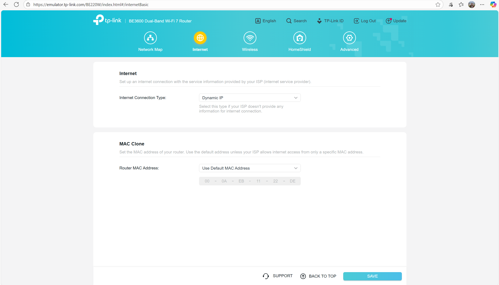

    **Business Networks**

    Many businesses prefer Static Public IPs from the ISP for reliability in hosting services (e.g., email servers, VPN gateways, cloud services). A static IP ensures customers, employees, or partners can always reach business systems at the same address.

    Within the LAN, a mix of DHCP and Static Reservations is used. End-user devices (laptops, mobiles) are dynamically assigned IPs via DHCP for flexibility. However, critical infrastructure (servers, printers, security cameras, VoIP phones) are assigned static IPs or DHCP reservations to ensure consistency and ease of management.

    In larger organisations, IP addressing is often integrated with VLANs and subnetting, ensuring different departments or functions have segmented and secure IP ranges.

    **Consideration:** Static assignments are crucial for systems that provide services to others, to avoid downtime caused by changing IPs. DHCP with reservations helps balance manageability with reliability.

    **Screenshot:** 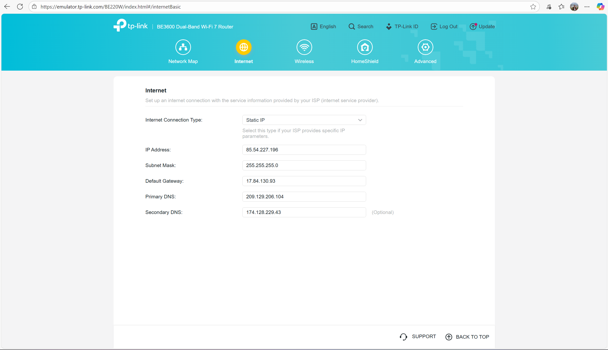

5. **Mesh Networking & Extenders**

    **Consideration:** The BE220W router shows mesh device support. In large homes or enterprises, deploy multiple APs/mesh nodes for roaming and coverage.

    **Screenshot:** 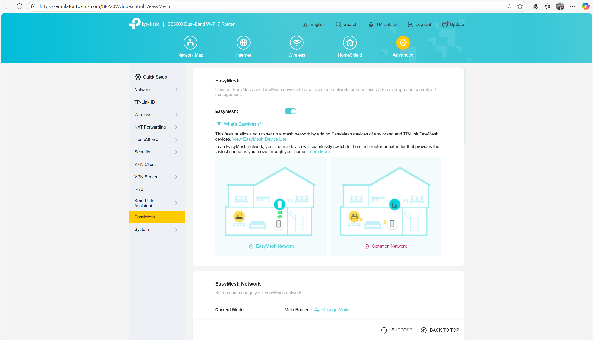

6. **Firewall**

    **Consideration:** Enable firewall by default. Open ports only when required (e.g., hosting a server).

    **Screenshot:** 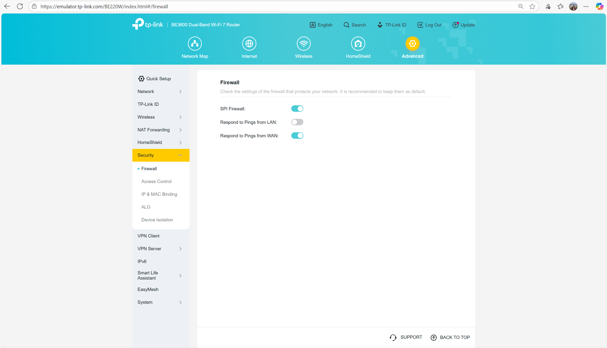

7. **Firmware Updates**

    **Consideration:** Keeping firmware updated ensures security patches and performance improvements. Enable auto-updates or check regularly.

    **Screenshot:** 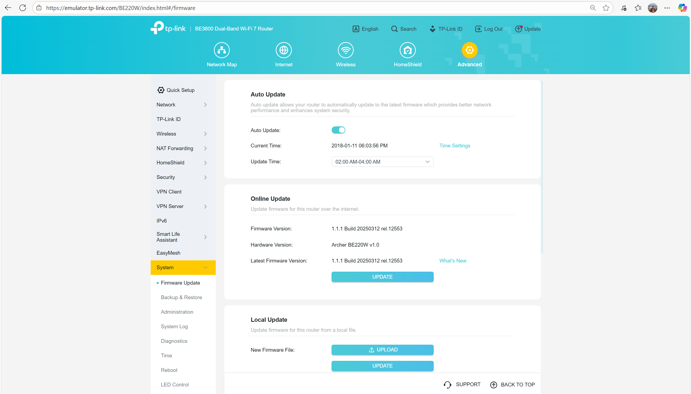

**Conclusion:** Home Router (e.g., Archer BE220W): Combines router, firewall, DHCP, AP in one device; simple setup; limited scalability. Business APs (e.g., TP-Link Omada, Cisco Meraki): Separate APs managed by a controller; support for WPA2 WPA3-Enterprise, VLANs, multiple SSIDs, centralized monitoring.

For enterprise, prefer multiple managed APs instead of a single home router to improve coverage, redundancy, and security.

## Task 4. Self-Evaluation of Teamwork

**AI Prompt Screenshot:**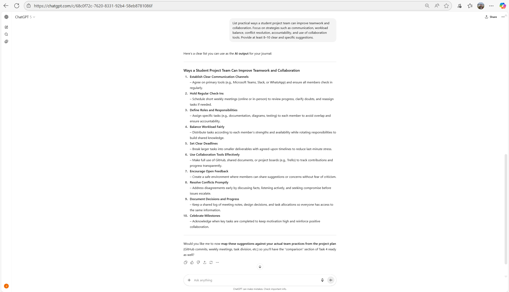

**AI Prompt (In text) Screenshot:** List practical ways a student project team can improve teamwork and collaboration. Focus on strategies such as communication, workload balance, conflict resolution, accountability, and use of collaboration tools. Provide at least 8–10 clear and specific suggestions.

1. **Comparison of Team Practices with AI Suggestions**

    The generative AI provided ten strategies for improving teamwork and collaboration. Comparing these to our actual project work, several practices were already in place, while others could be improved:

    - **Practices We Are Already Doing:**
        
        - Clear Communication Channels – Our team consistently used Microsoft Teams for online meetings and in-class tutorials for face-to-face communication. This aligns with the AI’s suggestion to establish dedicated communication channels. For example, we scheduled Saturday evening Teams calls to track progress

        - Regular Check-Ins – We held weekly meetings (Saturday evenings and Tuesday tutorials), ensuring we stayed aligned with tasks and deadlines. This reflected the AI’s recommendation for frequent check-ins.

        - Defined Roles and Responsibilities – Roles were divided clearly:

            - Angie Marcela Cardenas focused on planning, documentation, and Newcastle/Wollongong network designs.

            - Joshnell Briggs Zareno focused on WAN design, Sydney/Parramatta diagrams, and device research

        - Use of Collaboration Tools – We actively used GitHub for version control and draw.io for diagrams. Each member committed work individually, reflecting ongoing contributions instead of bulk uploads

        - Documentation of Decisions – Project details (IP tables, network diagrams, WiFi justifications, and hardware choices) were consistently documented in Markdown files (plan.md, network.md, etc.)

    - **Practices We Could Improve:**
    
        - Balanced Workload – While tasks were distributed by expertise, some roles (e.g., WAN diagrams vs. documentation) required significantly more effort. In future, we could rotate responsibilities or re-distribute technical and non-technical work more evenly.

        - Conflict Resolution – We did not face major conflicts, but we also lacked a defined conflict-resolution process. If disagreements arose (e.g., differing choices of hardware or WiFi standards), we could adopt the AI’s advice to resolve conflicts promptly through structured discussions.

        - Celebrating Milestones – Our focus was strongly on deliverables   rather than recognition. For the remainder of the project, acknowledging small achievements (e.g., finishing IP tables or finalizing diagrams) could improve team morale.

3. **GitHub Contribution Analysis**

    **AI Prompt Screenshot:**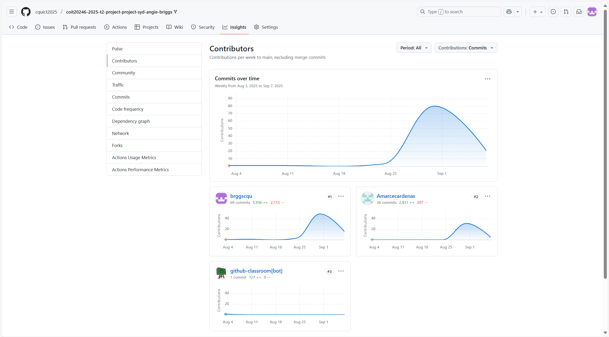

    A review of our GitHub repository (via Insights > Contributors) shows that:

    Both members contributed consistently with multiple commits across weeks 5–8.

    Angie’s commits are focused on project planning, scheduling, and Newcastle/Wollongong network diagrams.

    Joshnell’s commits are more technical, involving WAN diagrams, Sydney/Parramatta IP tables, and device justifications

4. **Comparison Within Our Team**

    My contributions involved many technical commits tied to diagrams, WAN design, and IP addressing.

    Angie contributed more on documentation, WiFi plans, and Newcastle/Wollongong deliverables.

    Overall, the workload appears balanced in type, but not identical in scope: I made more commits on technical diagrams, while Angie ensured documentation and planning completeness.

5. **Comparison Against Other Teams**

    From observing commit histories in other groups:

    Some teams show one dominant contributor with limited input from others.

    Our team stands out with equitable contributions and evidence of shared responsibility (multiple commits from both members each week).

    Improvements for the Remainder of the Project, we need to increase the number of joint commits by collaborating in real-time (e.g., pair-editing diagrams or reviewing each other’s justifications).Adopt milestone recognition (e.g., mark completion of Sydney HQ or final WAN diagrams with a quick celebration message on Teams). Lastly, Maintain consistent frequency of commits to avoid last-minute bulk uploads.

## References

IEEE 2021, IEEE 802.11ax: High-Efficiency WLAN (Amendment 6), IEEE, viewed 26 September 2025, https://standards.ieee.org/standard/802_11ax-2021.html

Wi-Fi Alliance 2021, Wi-Fi CERTIFIED WPA3™ technology overview, Wi-Fi Alliance, viewed 26 September 2025, https://www.wi-fi.org/discover-wi-fi/security

TP-Link 2025, Archer BE220W: BE22000 tri-band Wi-Fi 7 router, TP-Link, viewed 26 September 2025, https://www.tp-link.com

Cisco 2025, Cisco Meraki: Cloud-managed wireless access points, Cisco, viewed 26 September 2025, https://meraki.cisco.com