# Week 08 | Cloud Computing

## Task 1. Complete the Knowledge Test
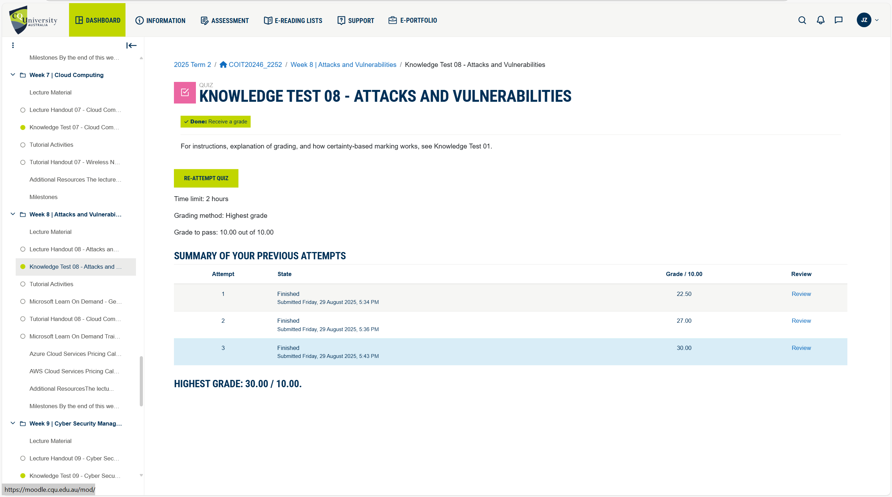

## Task 2.  Login to Microsoft Learn on Demand

**Microsoft Learn Link:** https://msle.learnondemand.net/

**Microsoft Profile Screenshot:**

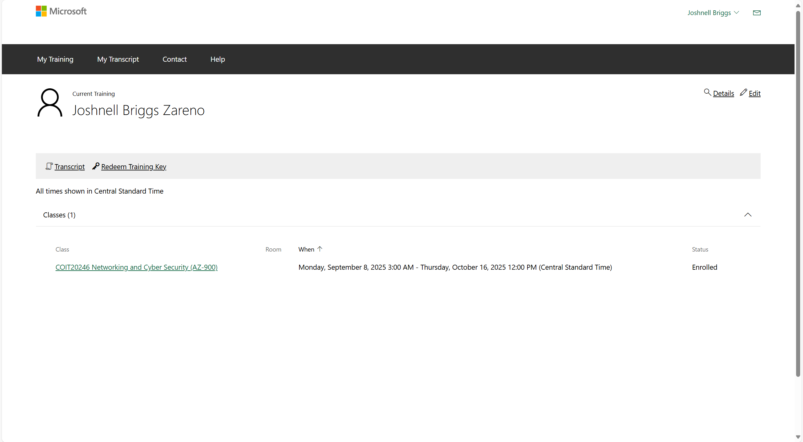

## Task 3. Create an Azure Resource 

**Screenshot:**

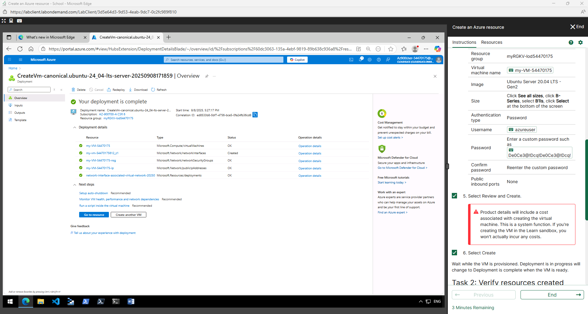

1. **Virtual Machine (my-VM-54470175)**

    This is the actual Ubuntu Server 20.04 LTS Gen2 virtual machine that runs your workloads. It provides a cloud-based compute environment where you can install software, run services, or host applications.

2. **Network Interface (my-VM-54470175i21-z1)**

    This is the virtual network card attached to your VM. It allows the VM to communicate with the virtual network and, if configured, with external networks (like the internet).

3. **Network Security Group (my-VM-54470175-nsg)**

    The NSG acts like a firewall for your VM. It defines inbound and outbound traffic rules, such as allowing SSH (port 22) or blocking other traffic to protect the VM.

4. **Public IP Address (my-VM-54470175-ip)**

    This assigns a unique, external-facing IP address to the VM so that you can connect to it from outside the Azure virtual network (e.g., using SSH from your own computer).

5. **Deployment Record (network-interface-associated-virtual-network-30250)**

    This represents the underlying deployment process that tied the VM’s network interface to the Azure Virtual Network. It ensures the VM is properly connected to the right subnet and network environment.

## Task 4. Create an Azure Virtual Machine and Allow Web

**Screenshot command (create the VM):**

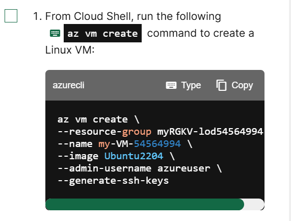

**Command for creating an Azure VM:**

    az vm create \
    --resource-group myRGKV-lod54564994 \
    --name my-VM-54564994 \
    --image Ubuntu2204 \
    --admin-username azureuser \
    --generate-ssh-keys

**Screenshot command (Nginx):**

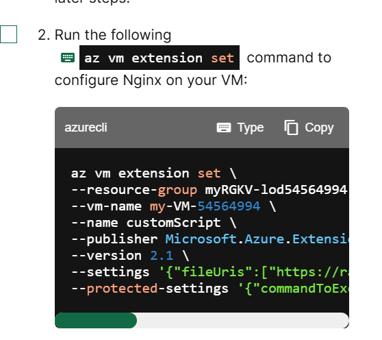

**Command for creating an Azure VM:**

    az vm extension set \
    --resource-group myRGKV-lod54564994 \
    --vm-name my-VM-54564994 \
    --name customScript \
    --publisher Microsoft.Azure.Extensions \
    --version 2.1 \
    --settings '{"fileUris":["https://raw.githubusercontent.com/MicrosoftDocs/mslearn-welcome-to-azure/master/configure-nginx.sh"]}' \
    --protected-settings '{"commandToExecute": "./configure-nginx.sh"}'

**IP Address:** http://172.203.14.126/

**Screenshot for VM's IP address:** 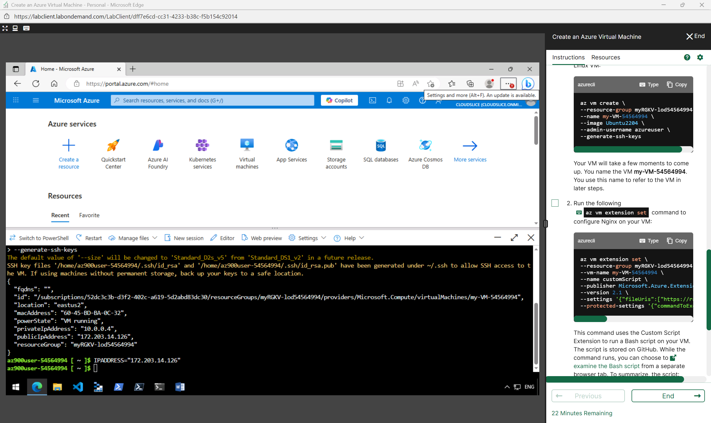

**Screenshot of Unedited Index.html:**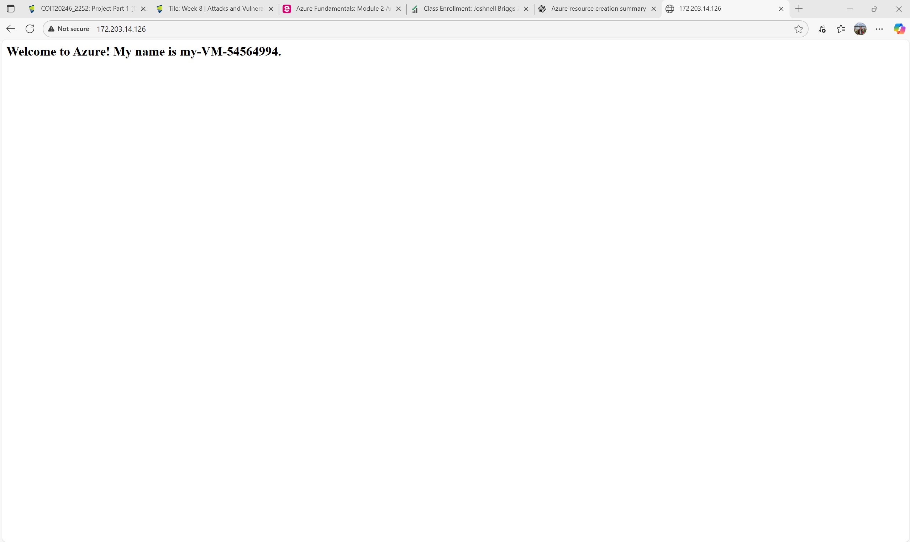

The screenshot above shows the webpage of the created website. 

**Screenshot of Edited Index.html:**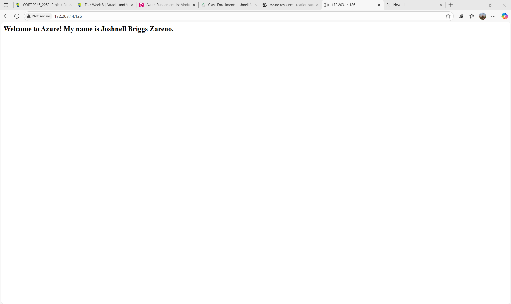

The screenshot above shows the webpage of the created site, edited to include our name.

**Screenshot of Inbound Security Rules:**

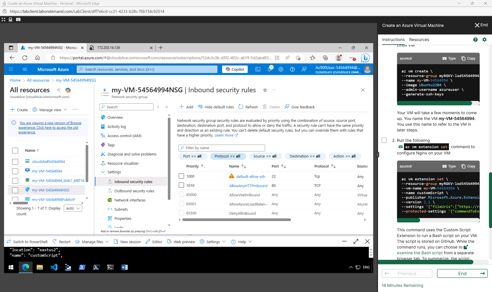

**Network security rules that allow access to your VM:**

1. **SSH (Secure Shell)**

    **Port Number:** 22

    **Explanation:** This rule allows Secure Shell (SSH) connections from external clients to your virtual machine. SSH is a protocol used to securely log in to and manage the VM’s operating system from a remote computer. For Linux-based VMs (like Ubuntu), SSH is the primary way administrators connect to the system’s command line to configure, update, and manage the server.

2. **HTTP (Hypertext Transfer Protocol)**

    **Port Number:** 80

    **Explanation:** This rule allows web traffic (HTTP protocol) from external clients to your virtual machine. Port 80 is the standard port for serving unencrypted web pages. By enabling this rule, users can access the web server you set up on the VM (such as the HTML page you created in /var/www/html/index.html) through their browser.

## Task 5. Compare Cloud vs On-premise Costs

1. **Local Consumer Desktop PC (Australia)**
    - **Link:** [Local Consumer Desktop PC - Dick Smith Australia](https://www.dicksmith.com.au/da/buy/pearl-laptops-intel-quad-core-i5-gaming-pc-nvidia-gt710-8gb-ram-128gb-ssd-500gb-hdd-w10p-200000000i5gpc8gbram120gbssd/)
    - **Desktop Specification:**
        - **CPU:** Intel “Quad Core i5” (model not clearly stated by the listing)
        - **RAM:** 8 GB
        - **Storage:** 128 GB SSD + (500 GB HDD)
        - **GPU:** Nvidia GT1030 (entry level)
        - **Price:** AUD $499.99
    - **Screenshot:**
    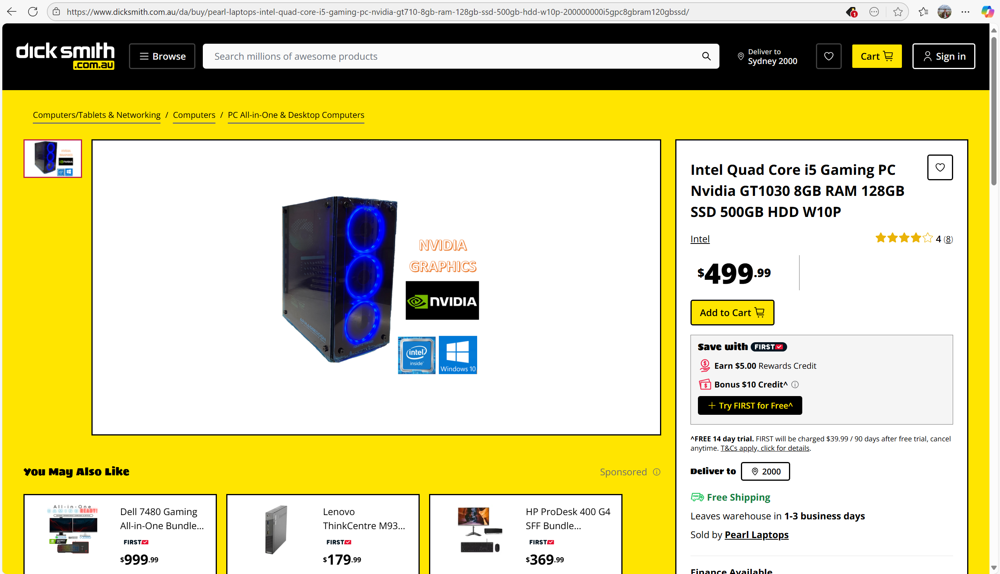
    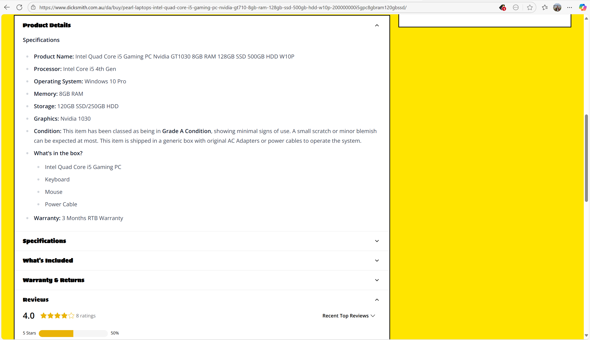

2. **Azure VM Comparable to the Local Consumer Desktop PC (Australia)**

    - **Explanation:** The chosen cloud VM roughly comparable to the Local Consumer Desktop PC in Australia, was a usual “general purpose” VM with 8 GB which is a Standard_D2s_v3 (2 vCPUs, 8 GB).

    - **Instance Screenshot:**
    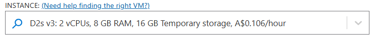
    
    - **Exported Excel File:** [1-year-Exported VM Cloud Estimate](./images/week8/week8-task5-1-year-ExportedEstimate.xlsx)

    - **1 year plan (Upfront) screenshot:**
    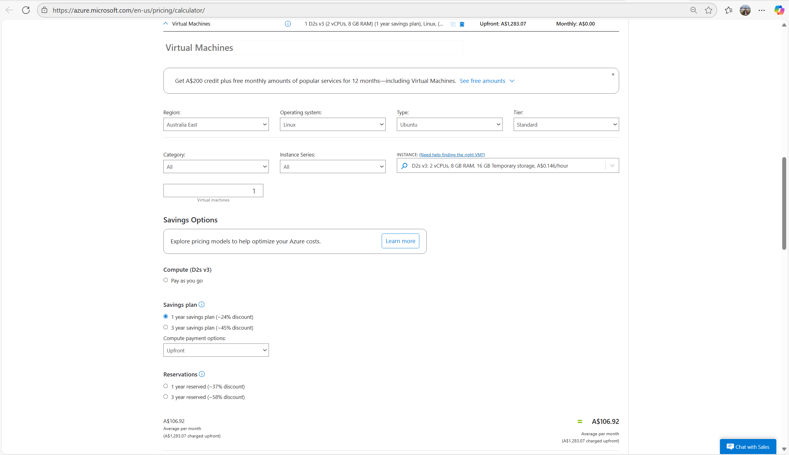
    In the screenshot above, it shows the selected VM setting of D2s v3: 2 vCPUs, 8 GB RAM, 16 GB temporary storage, at A$0.106 per hour, averaging A$106.92 per month for one year (a total upfront cost of A$1,283.07). This 1-year plan provides an estimated 24 percent discount.

    - **Exported Excel File:** [3-year-Exported VM Cloud Estimate](./images/week8/week8-task5-3-year-ExportedEstimate.xlsx)

    - **3 year plan (Upfront) screenshot:**
    
    In the screenshot above, it shows the selected VM setting of D2s v3: 2 vCPUs, 8 GB RAM, 16 GB temporary storage, at A$0.106 per hour, averaging A$77.38 per month for three years (a total upfront cost of A$2,785.62). This 3-year plan provides an estimated 45 percent discount.

3. **Trade-offs, Advantages & Disadvantages**
    - **Explanation:** One of the main advantages of a desktop computer is the one-time purchase cost, which means there are no ongoing hourly fees like those associated with cloud services. Users have full control over the hardware, allowing for easier upgrades and customisation as needs evolve. A desktop also avoids network latency or reliance on internet connectivity, since all processing is done locally. Additionally, there are no recurring cloud billing surprises, which makes budgeting more predictable and straightforward.

    **Disadvantages of Desktop:**
    - **Explanation:** Despite these strengths, desktops come with limitations. If workloads increase and demand more RAM or processing power, the user may need to upgrade or even replace hardware entirely. Building high availability, backup solutions, redundancy, and disaster recovery can be complex and costly to implement on a standalone machine. Physical location is also a constraint, as desktops cannot scale regionally or be accessed globally without additional infrastructure. Finally, the owner bears full responsibility for maintenance, cooling, and potential hardware failures.

    **Advantages of Azure VM:**
    - **Explanation:** Azure Virtual Machines offer scalability, meaning resources can be increased or decreased on demand, and users can spin up multiple VMs to meet varying workloads. Costs can be optimised by paying only for what is used, which is particularly beneficial for workloads that are occasional rather than constant. Azure also provides high availability, redundancy, and backup features as part of its managed infrastructure, reducing the burden on the user. Flexibility is another strength, as VMs can be provisioned instantly, restored from snapshots, and deployed globally, making them suitable for dynamic and distributed operations.

    **Disadvantages of Azure VM**
    - **Explanation:** The biggest disadvantage of Azure VMs is cost: when used continuously, the cumulative expense can far exceed the price of owning hardware. Cloud performance is also dependent on a stable internet connection, and latency or region-based limitations can affect reliability. Users may also lose cost advantages if the VM is underutilised, since the hourly charges still apply. Over the long term, running workloads in the cloud can be more expensive than investing in physical hardware. Lastly, managing cloud services can be complex, requiring careful attention to pricing models, region differences, and potential extra costs such as network data transfers.

## Reference:

Microsoft Azure 2023, What is a virtual machine in Azure?, Microsoft, viewed 11 September 2025,<https://learn.microsoft.com/en-us/azure/virtual-machines/overview>

Microsoft Azure 2023, Network interface in Azure, Microsoft, viewed 11 September 2025, <https://learn.microsoft.com/en-us/azure/virtual-network/virtual-network-network-interface>

Microsoft Azure 2023, What is a network security group?, Microsoft, viewed 11 September 2025, <https://learn.microsoft.com/en-us/azure/virtual-network/network-security-groups-overview>

Microsoft Azure 2023, Create, change, or delete a public IP address, Microsoft, viewed 11 September 2025, <https://learn.microsoft.com/en-us/azure/virtual-network/ip-services/public-ip-addresses>

Microsoft Azure 2023, Azure Resource Manager overview, Microsoft, viewed 11 September 2025, <https://learn.microsoft.com/en-us/azure/azure-resource-manager/management/overview>