# Week 09 | Attacks and Vulnerabilities

## Task 1. Complete the Knowledge Test
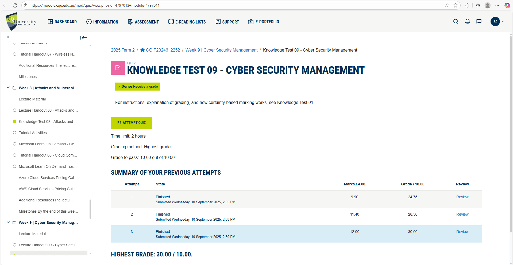

## Task 2. CIA Protections

### Confidentiality: 

1. **Asset:** Servers (Web, File, HR, Accounting, CRM)
    - **Protection:** Confidentiality
    - **Reason:** Servers store sensitive business data (employee records, financials, client info).

1. **Asset:** RFID Access Control System
    - **Protection:** Confidentiality
    - **Reason:** Protect employee credentials and access records from unauthorized users.

1. **Asset:** Internal Communication Systems (Email, VoIP, Messaging)
    - **Protection:** Confidentiality
    - **Reason:** Business discussions may include sensitive project or financial info.

1. **Asset:** Project Management and Engineering Data
    - **Protection:** Confidentiality
    - **Reason:** Designs and project plans are intellectual property; must be protected from competitors.

1. **Asset:** WiFi Network
    - **Protection:** Confidentiality
    - **Reason:** Prevent unauthorized access to internal network and data.

1. **Asset:** Cloud Services
    - **Protection:** Confidentiality
    - **Reason:** External storage of sensitive data must be secure from breaches.

1. **Asset:** End-user Devices (PCs, Laptops, Tablets)
    - **Protection:** Confidentiality
    - **Reason:** Devices may contain sensitive documents or access points to systems.

### Integrity: 

1. **Asset:** Servers (Web, File, HR, Accounting, CRM)
    - **Protection:** Integrity
    - **Reason:** 	Data must be accurate; corruption affects operations and decision-making.

1. **Asset:** CCTV Cameras & IoT Sensors
    - **Protection:** Integrity
    - **Reason:** Tampered video/sensor data can mislead investigations.

1. **Asset:** Project Management and Engineering Data
    - **Protection:** Integrity
    - **Reason:** Altered data could result in construction errors or safety issues.

1. **Asset:** Backup and Redundancy Systems
    - **Protection:** Integrity
    - **Reason:** Corrupted backups render recovery unreliable.

1. **Asset:** Cloud Services
    - **Protection:** Integrity
    - **Reason:** Cloud data must remain accurate across platforms.

1. **Asset:** End-user Devices (PCs, Laptops, Tablets)
    - **Protection:** Integrity
    - **Reason:** Malware or misconfiguration can compromise the entire network.

### Availability: 

1. **Asset:** Core Network Infrastructure (Routers, Switches, Firewalls)
    - **Protection:** Availability
    - **Reason:** If unavailable, network communication halts, affecting all business functions.

1. **Asset:** Servers (Web, File, HR, Accounting, CRM)
    - **Protection:** Availability
    - **Reason:** Critical services (e.g. HR, CRM) must be accessible to avoid workflow disruption.

1. **Asset:** CCTV Cameras & IoT Sensors
    - **Protection:** Availability
    - **Reason:** Security monitoring depends on continuous operation of devices.

1. **Asset:** RFID Access Control System
    - **Protection:** Availability
    - **Reason:** System must function to allow access for authorized staff and deny intruders.

1. **Asset:** Internal Communication Systems (Email, VoIP, Messaging)
    - **Protection:** Availability
    - **Reason:** Daily operations depend on fast and reliable communication tools.

1. **Asset:** Cloud Serviced
    - **Protection:** Availability
    - **Reason:** Services must be online and synchronized with internal systems.

## Task 3. Threat Sources and Motivation

1. **Threat Source:** Neighbouring Individuals or Casual Hackers (e.g. in nearby offices or buildings)
    - **Motivation:** Attempt to access Truelec’s WiFi for free Internet use. Try basic attacks out of curiosity or boredom (e.g. WiFi sniffing, password guessing)

1. **Threat Source:** Competitor Companies
    - **Motivation:** Exfiltrate bids, tender documents, project schedules, pricing or client lists, Obtain technical designs or proprietary methods to gain commercial advantage or Sabotage or delay projects to win contracts or harm reputation.

1. **Threat Source:** Insider Threats (Malicious)
    - **Motivation:** Revenge or retaliation after discipline, demotion, or termination, Steal or leak sensitive client data, project files, or intellectual property or Disrupt operations (delete data, tamper with configurations, disable CCTV).

1. **Threat Source:** Insider Threats (Accidental)
    - **Motivation:** Unintended data exposure through negligent actions (misconfigured cloud shares, reusing passwords, phishing clicks) or weak security hygiene that creates entry points for external attackers.

1. **Threat Source:** Cybercriminals (External Hackers / Ransomware Gangs)
    - **Motivation:** Encrypt servers and demand ransom (ransomware) for financial gain. Steal payroll, client, or accounting data for fraud or resale. Exploit known vulnerabilities in on-prem software to monetize access (sale of access, extortion).

1. **Threat Source:** Hacktivist Groups
    - **Motivation:** Target Truelec for symbolic reasons (projects in mining, gas or telecom perceived as socially/environmentally harmful). Deface public websites, leak documents, or conduct DDoS to draw attention to a cause.

1. **Threat Source:** Third-party Contractors or Partners (Intentional or Accidental)
    - **Motivation:** 
    Misuse of privileged access to internal systems (intentional data access or accidental misconfiguration). Compromise of vendor systems that become a pivot point into Truelec (supply-chain compromise). Poorly secured remote access tools creating ingress for attackers.

1. **Threat Source:** Amateur Attackers
    - **Motivation:** Use off-the-shelf tools for quick wins: DDoS, website defacement, or low-sophistication exploits. Reputation/ego in online communities; look for simple targets (e.g., poorly protected web server).

1. **Threat Source:** Nation-State or State-Sponsored Hackers
    - **Motivation:** Quietly steal information from telecom or government-related projects. Attack or monitor suppliers to reach critical infrastructure. Deliberately sabotage projects for political or strategic reasons.

1. **Threat Source:** Social Engineers / Phishers
    - **Motivation:** Trick staff into divulging credentials, MFA codes, or authorising payments (spear-phishing targeted at finance or project managers). Use phone-based pretexting to bypass controls (vishing) or to gain physical entry.

1. **Threat Source:** Competent Persistent Threat Actors (Organised Crime / Advanced Criminal Groups)
    - **Motivation:** Long-term targeting to compromise financial systems, payroll, or large client datasets for high-value fraud. Maintain stealthy footholds for sustained exfiltration or coordinated ransomware extortion campaigns.

1. **Threat Source:** Physical Thieves / Opportunistic Criminals
    - **Motivation:** Steal laptops, mobile devices, CCTV NVRs, or other hardware for resale or to obtain stored credentials/data. Tamper with site equipment (outdoor IoT, cameras) to blind monitoring systems before a theft.
    
## Task 4. Explore Vulnerabilities

1. **CVE ID:** [CVE-2025-46788](https://nvd.nist.gov/vuln/detail/CVE-2025-46788)
    - **CVE Description** Improper certificate validation in Zoom Workplace for Linux before version 6.4.13, allowing information disclosure via network.
    - **Company:** Zoom Video Communications, Inc.
    - **Product:** Zoom Workplace (Linux client)
    - **Explanation:** The Linux client fails to correctly validate TLS certificates, letting a network attacker present invalid or forged certs and hijack or intercept communications.
    - **NVD Published Date:** 10 Jul 2025
    - **Last Modified Date:** 05 Aug 2025
    - **Screenshot:**
        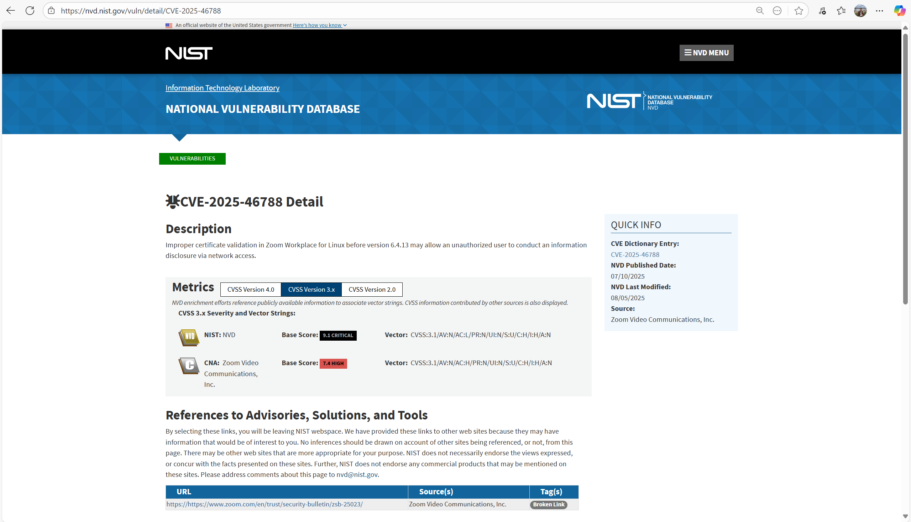
        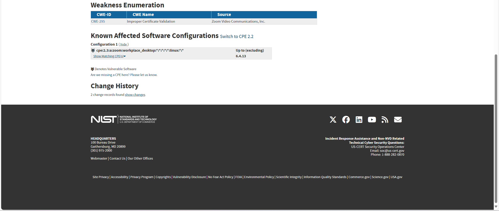
    - **CVSS v3.1 Base Score**
        -   **NVD:** 9.1 (Critical)
        -   **CNA (Zoom):** 7.4 (High)
        - **Impact on CIA:**
            - **Confidentiality:** High
            - **Integrity:** High
            - **Availability:** None
            - **Screenshot:**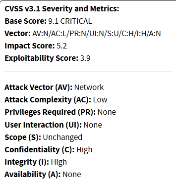

        - **CWE Code:** [CWE-295: Improper Certificate Validation](https://cwe.mitre.org/data/definitions/295.html)
        - **Screenshot:** 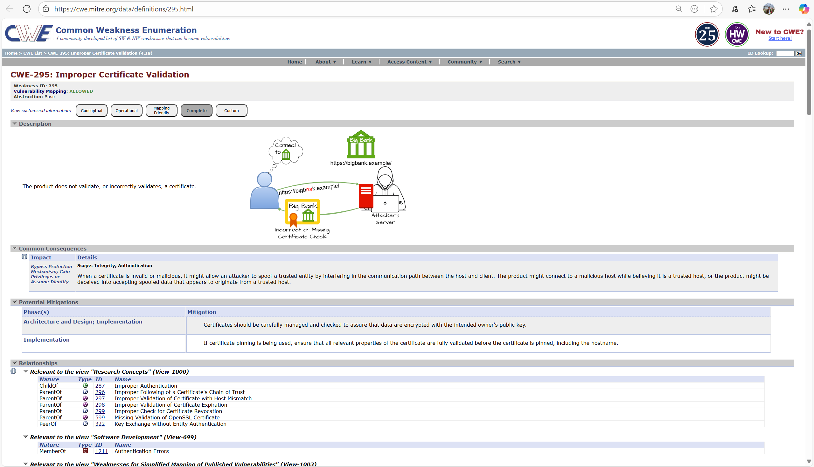
    - **Detection / Mitigation:** Update to Zoom Linux 6.4.13+; monitor for anomalies in TLS handshakes; use network inspection tools to detect cert mismatches; enforce version control in deployments.

1. **CVE ID:** [CVE-2025-49457](https://nvd.nist.gov/vuln/detail/CVE-2025-49457)
    - **CVE Description** Untrusted search path in certain Zoom Clients for Windows allows an unauthenticated attacker to escalate privileges over the network.
    - **Company:** Zoom Video Communications, Inc.
    - **Product:** Zoom Workplace / Windows client, Zoom Rooms, Zoom SDKs on Windows
    - **Explanation:** Zoom’s Windows apps search for DLLs in unsafe or ambiguous paths, which lets an attacker drop a malicious DLL in a location the app will load, giving them higher privileges.
    - **NVD Published Date:** 12 Aug 2025
    - **Last Modified Date:** 08 Sep 2025
    - **Screenshot:** 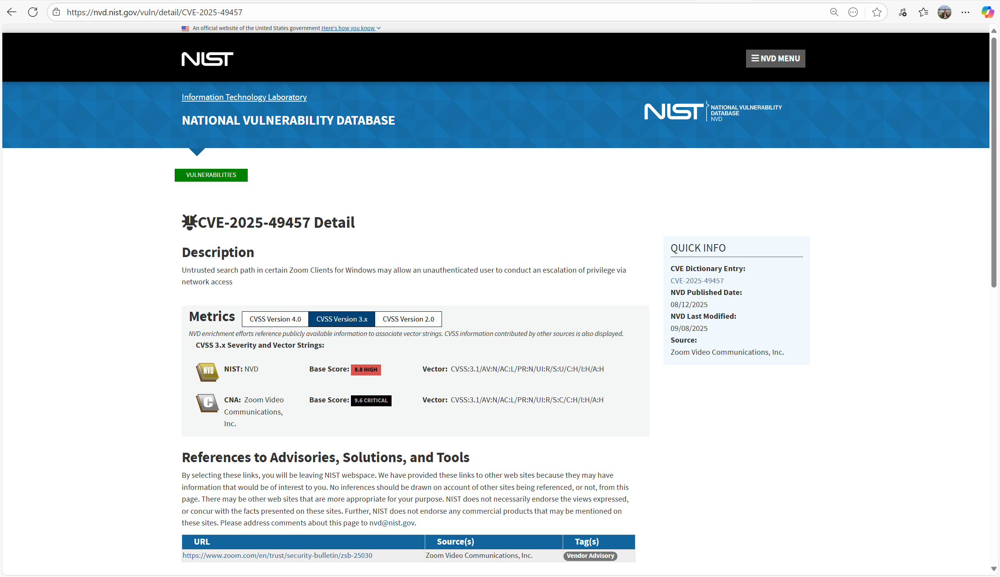
    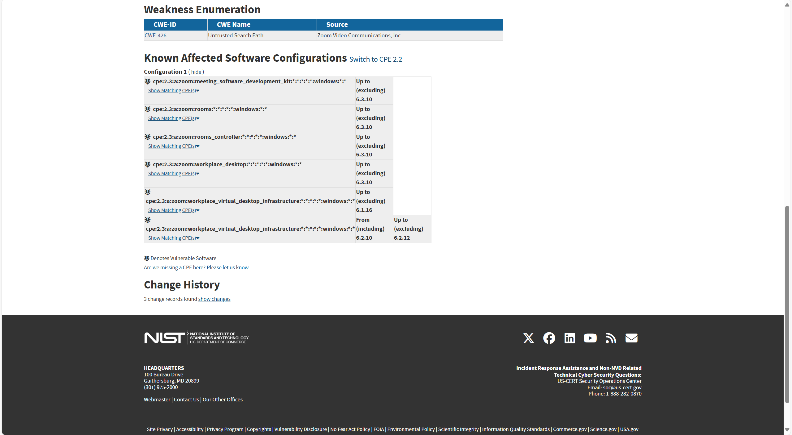

    - **CVSS v3.1 Base Score**
        -   **NVD:** 8.8 (High)
        -   **CNA (Zoom):** 9.6 (Critical)
        - **Impact on CIA:** CWE-426 “Untrusted Search Path”
            - **Confidentiality:** High
            - **Integrity:** High
            - **Availability:** High
            - **Screenshot:** 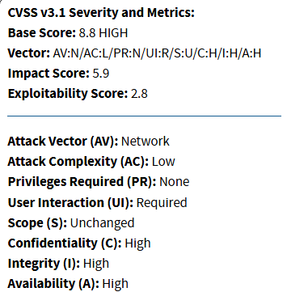

    - **CWE Code** [CWE-426: Untrusted Search Path](https://cwe.mitre.org/data/definitions/426.html)
        - **Screenshot:** 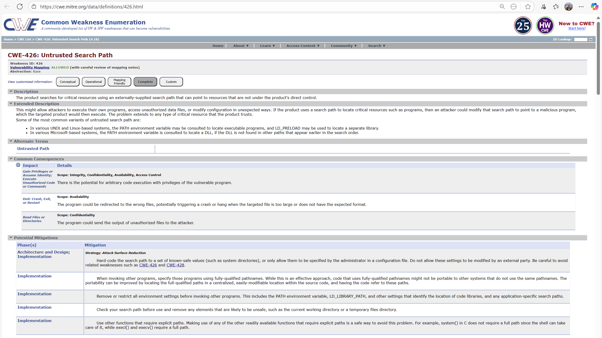
    - **Detection / Mitigation:** Patch to versions that fix the issue; scan for suspicious DLLs in Zoom directories; employ endpoint protection; verify Zoom version compliance.

1. **CVE ID:** [CVE-2025-30666](https://nvd.nist.gov/vuln/detail/CVE-2025-30666)
    - **CVE Description** NULL pointer dereference in some Zoom Workplace Apps for Windows may allow an authenticated user to conduct a denial-of-service (DoS) via network access.
    - **Company:** Zoom Video Communications, Inc. 
    - **Product:** Zoom Workplace applications for Windows (including Zoom Desktop, Meeting SDKs, etc.), versions up to but excluding 6.4.0 for certain components
    - **Explanation:** A NULL pointer (i.e., missing or invalid reference) in the code can be triggered by specific network requests. When accessed, it causes the application to crash, letting an authenticated user disrupt the service.
    - **NVD Published Date:** 14 May 2025
    - **Last Modified Date:** 05 Aug 2025
    - **Screenshot:** 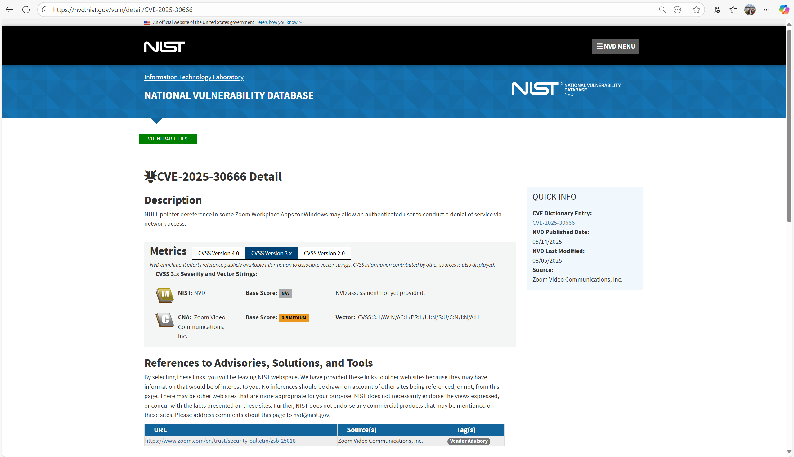
    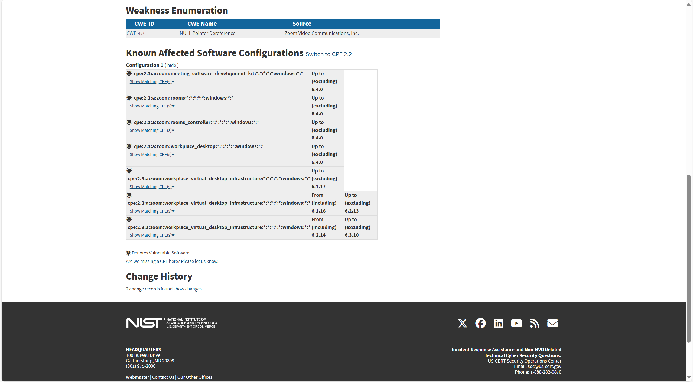

    - **CVSS v3.1 Base Score**
        -   **NVD:** None
        -   **CNA (Zoom):** 6.5 (Medium)
        - **Impact on CIA:**
            - **Confidentiality:** None
            - **Integrity:** None
            - **Availability:** High 
            - **Screenshot:** 
    - **CWE Code:** [CWE-476: NULL Pointer Dereference](https://cwe.mitre.org/data/definitions/476.html)
        - **Screenshot:** 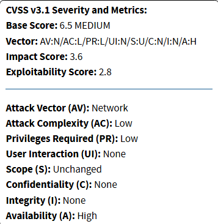
    - **Detection / Mitigation:** Update Zoom Workplace apps and SDKs on Windows to version 6.4.0 or later; monitor for repeated crashes in Zoom processes; use endpoint monitoring to detect abnormal process terminations; run version audits to ensure vulnerable releases are not deployed.

## Task 5. Vulnerability Disclosures 

**My Viewpoint on Vulnerability Disclosure:** When a security researcher discovers a vulnerability, it is usually reported privately to the vendor first. Public disclosure is delayed because releasing details too early could enable attackers to exploit the flaw before a fix is available. Vendors need time to confirm the issue, design a patch, and test it properly. In most cases, a window of 60–90 days is considered reasonable, although critical issues may require a much faster response.

Delays can create challenges. If a vendor does not act within a reasonable timeframe, researchers must decide whether to remain silent or disclose the vulnerability without the vendor’s approval. Full disclosure can pressure vendors to respond, but it also risks exposing users to active exploitation. To address this tension, coordinated vulnerability disclosure (CVD) has become a widely accepted practice. In CVD, both the researcher and the vendor agree on a timeline and share updates, ensuring the vulnerability is resolved before details are made public.

Bug bounty programs also encourage responsible reporting. By offering recognition or rewards, they create incentives for researchers to work with vendors rather than bypass them. Organisations such as Microsoft and Broadcom have adopted this approach, while frameworks provided by MITRE and OWASP give structure and clarity to the process.

From my perspective, disclosure should always prioritise the protection of end users. Vendors must respond quickly and transparently, researchers should act responsibly, and if a vendor is unresponsive, carefully timed public disclosure may still be necessary to safeguard users.

## References

Broadcom Inc. 2025, Vulnerability management, Broadcom, viewed 26 September 2025, https://www.broadcom.com/support/security-center/vulnerability-management

Carnegie Mellon University Software Engineering Institute (SEI) 2017, The CERT guide to coordinated vulnerability disclosure, CMU/SEI, viewed 26 September 2025, https://resources.sei.cmu.edu/library/asset-view.cfm?assetid=503330

CWE 295 2025, CWE-295: Improper Certificate Validation, MITRE, viewed 26 September 2025, https://cwe.mitre.org/data/definitions/295.html

CWE 426 2025, CWE-426: Untrusted Search Path, MITRE, viewed 26 September 2025, https://cwe.mitre.org/data/definitions/426.html

CWE 476 2025, CWE-476: NULL Pointer Dereference, MITRE, viewed 26 September 2025, https://cwe.mitre.org/data/definitions/476.html

MITRE 2025, CVE researcher reservation guidelines, CVE, viewed 26 September 2025, https://cve.mitre.org/cve/researcher_reservation_guidelines

Microsoft 2025, Coordinated vulnerability disclosure (CVD), Microsoft Security Response Center, viewed 26 September 2025, https://www.microsoft.com/en-us/msrc/cvd

NVD 2025a, CVE-2025-46788, NVD – National Vulnerability Database, viewed 26 September 2025, https://nvd.nist.gov/vuln/detail/CVE-2025-46788

NVD 2025b, CVE-2025-49457, NVD – National Vulnerability Database, viewed 26 September 2025, https://nvd.nist.gov/vuln/detail/CVE-2025-49457

NVD 2025c, CVE-2025-30666, NVD – National Vulnerability Database, viewed 26 September 2025, https://nvd.nist.gov/vuln/detail/CVE-2025-30666

OWASP 2025, Vulnerability disclosure cheat sheet, OWASP Cheat Sheet Series, viewed 26 September 2025, https://cheatsheetseries.owasp.org/cheatsheets/Vulnerability_Disclosure_Cheat_Sheet.html

