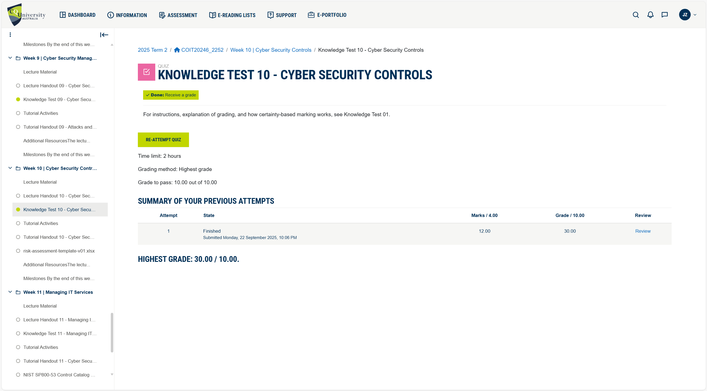

# Week 10 | Cyber Security Management 

## Task 1. Complete the Knowledge Test

## Task 2. Select Security Objectives

1. **Function:** Protect (PR)
    - **Category:** Identity Management, Authentication, and Access Control (PR.AA)
    - **Sub-category:** PR.AA-04 — Access permissions and authorizations are managed, including least privilege and separation of duties.
    - **Why it matters for Truelec:** With multiple branches, admin staff, engineers, contractors, and IoT systems (CCTV, sensors), controlling who can access what is vital. Ensuring users only have the permissions they need minimizes risk from misuse or compromise.
    - **Mitigated attack/vulnerability:** Insider misuse or compromised accounts being used to access projects or client data beyond their scope (lateral movement, privilege escalation).

1. **Function:** Protect (PR)
    - **Category:** Data Security (PR.DS)
    - **Sub-category:** PR.DS-01 — Data-at-rest is protected.
    - **Why it matters for Truelec:** The company hosts client/project files, HR/financial records, internal servers. Encrypting or otherwise protecting data on storage systems prevents sensitive data from being exposed if disks, backup media, or servers are compromised.
    - **Mitigated attack/vulnerability:** Data theft from physical theft of storage, server breaches, or ransomware exfiltration.

1. **Function:** Detect (DE)
    - **Category:** Anomalies and Events (DE.AE)
    - **Sub-category:** DE.AE-02 — Detected events are analyzed to understand attack targets and methods.
    - **Why it matters for Truelec:** Any anomaly such as login spikes, odd network flows, unexpected inter-VLAN communication, should be evaluated to uncover the attacker’s tactics or targets. This helps in early containment.
    - **Mitigated attack/vulnerability:** Brute-force attacks, credential stuffing, lateral movement, early reconnaissance activity.

1. **Function:** Detect (DE)
    - **Category:** Security Continuous Monitoring (DE.CM)
    - **Sub-category:** DE.CM-01 — The network (and assets) is monitored to detect cybersecurity events.
    - **Why it matters for Truelec:** Given multiple sites, Wi-Fi, servers, CCTV/IoT, continuous monitoring gives visibility into activity across all branches, HQ, and wired + wireless segments.
    - **Mitigated attack/vulnerability:** Intrusion attempts, rogue devices joining the network, unauthorized access to IoT / CCTV VLAN, lateral spread of malware.

## Task 3. Create Asset Inventory

### **Data Assets**
**Description:** Data assets include the critical information stored and processed by the organisation, such as HR records, financial data, project files, and backups. They are classified by sensitivity (e.g., Confidential, Internal Use) and must be protected for confidentiality, integrity, and availability.

| Asset                  | ID          | Class               | CIA     | Reason                          |
|------------------------|-------------|---------------------|---------|---------------------------------|
| HR Records             | DB-HR-001   | Highly Confidential | C,I,A   | Sensitive employee data.        |
| Accounting Data        | DB-AC-002   | Highly Confidential | C,I,A   | Financial compliance critical.  |
| Client Project Files   | PRJ-2025-01 | Confidential        | C,I     | Intellectual property.          |
| Internal Emails/Logs   | MSG-INT-03  | Confidential        | C,I     | Strategic discussions.          |
| RFID Access Logs       | RFID-LOG-04 | Internal Use        | C,I,A   | Tracks entry/exit.              |
| Backup Archives        | BCK-2025-05 | Confidential        | I,A     | Recovery must be reliable.      |

### **Hardware Assets**
**Description:** Hardware assets cover the physical equipment that supports IT operations, such as servers, switches, firewalls, laptops, and IoT devices. These devices must be maintained and secured to ensure reliable performance and prevent misuse.

| Asset                  | ID / MAC            | CIA   | Reason                        |
|------------------------|---------------------|-------|-------------------------------|
| Dell PowerEdge Server  | SRV-DEL-740-01      | C,I,A | Hosts critical applications.  |
| Cisco Catalyst 9300    | 00:1A:2B:3C:4D:5E   | A     | Core switching.               |
| Cisco Firepower 1010   | FW-FPR-1010-05      | C,I,A | Branch firewall.              |
| Cisco Firepower 1120   | FW-FPR-1120-01      | C,I,A | HQ firewall.                  |
| CCTV Cameras           | CCTV-CAM-021-040    | I,A   | Security monitoring.          |
| HP Laptops             | LTP-EMP-101-120     | C,I   | Staff devices.                |
| RFID Readers           | RFID-RD-01-05       | A,I   | Building access control.      |

### **Software Assets**
**Description:** Software assets are the applications and platforms used to run the business, from collaboration tools like Zoom to core systems such as ERP/CRM, endpoint protection, and access control software. Keeping software patched and updated reduces exposure to vulnerabilities.

| Asset                  | Version   | CIA   | Reason                       |
|------------------------|-----------|-------|------------------------------|
| Zoom Workplace         | v6.4.13   | C,I   | Collaboration software.      |
| Microsoft 365          | O365-2025 | C,I,A | Productivity suite.          |
| ERP/CRM Platform       | CRMv12.1  | C,I,A | Business operations.         |
| Trend Micro Apex One   | v14.5     | A,I   | Endpoint detection/response. |
| RFID Access Software   | RFID-SW-03| A,I   | Manages RFID system.         |

### **Network Assets**
**Description:** Network assets represent the underlying connectivity infrastructure, including LANs, Wi-Fi, VPNs, and SD-WAN routers. These assets ensure secure communication between headquarters, branches, and external users.

| Asset                  | ID / IP          | CIA   | Reason                       |
|------------------------|------------------|-------|------------------------------|
| HQ LAN Subnet          | 61.10.10.0/24    | C,I,A | Internal staff & servers.    |
| VPN Gateway            | vpn.truelec.local| C,I   | Secure remote access.        |
| Wi-Fi SSIDs            | STAFF/GUEST/IoT  | C,I   | Segregated wireless access.  |
| SD-WAN Routers         | RTR-SDWAN-01-05  | A     | Branch connectivity.         |
| DNS/DHCP Server        | 61.10.10.10      | A,I   | Core addressing services.    |

### **People Assets**
**Description:** People assets refer to the staff and external contractors who interact with systems and data. Proper access controls, training, and accountability are essential to prevent misuse, errors, or insider threats.

| Role                  | ID Range       | CIA   | Reason                     |
|-----------------------|----------------|-------|----------------------------|
| System Admins         | EMP-SYS-01-02  | I,A   | High privilege accounts.   |
| Engineers             | EMP-ENG-05-20  | C,I   | Access to project files.   |
| Finance/HR Staff      | EMP-HR-21-25   | C,I   | Payroll, HR records.       |
| Branch Managers       | EMP-BM-01-05   | C,I,A | Oversee branch operations. |
| IT Contractors        | CONT-IT-01-03  | C,I   | Limited system access.     |

### **Process Assets**
**Description:** Process assets are the policies and procedures that govern how IT and security operations are managed, such as incident response, patch management, and backup routines. These processes enforce consistency and resilience against threats.

| Process               | ID           | CIA   | Reason                         |
|-----------------------|--------------|-------|--------------------------------|
| User Provisioning     | PROC-ACCT-01 | I     | Correct access control.        |
| Backup & Recovery     | PROC-BCK-02  | I,A   | Enables disaster recovery.     |
| Incident Response     | PROC-IR-03   | A,I   | Detect/respond to incidents.   |
| Patch Management      | PROC-PCH-04  | I,A   | Updates and vulnerability fix. |
| Physical Access (RFID)| PROC-PHY-05  | A     | Building access control.       |

### Reference: 

National Institute of Standards and Technology (NIST) 2024, The NIST Cybersecurity Framework (CSF) 2.0, NIST, Gaithersburg, viewed 26 September 2025, https://nvlpubs.nist.gov/nistpubs/CSWP/NIST.CSWP.29.pdf

Cisco 2025, Cisco Firepower 1000 and 1100 series: Next-generation firewall appliances, Cisco, viewed 26 September 2025, https://www.cisco.com

Dell Technologies 2025, Dell PowerEdge rack servers: Performance, scalability, and security, Dell, viewed 26 September 2025, https://www.dell.com

Trend Micro 2025, Apex One endpoint security: Intelligent protection against advanced threats, Trend Micro, viewed 26 September 2025, https://www.trendmicro.com

Microsoft 2025, Microsoft 365 product suite: Productivity and collaboration tools, Microsoft, viewed 26 September 2025, https://www.microsoft.com

Zoom Video Communications 2025, Zoom Workplace: Communication and collaboration platform, Zoom, viewed 26 September 2025, https://explore.zoom.us