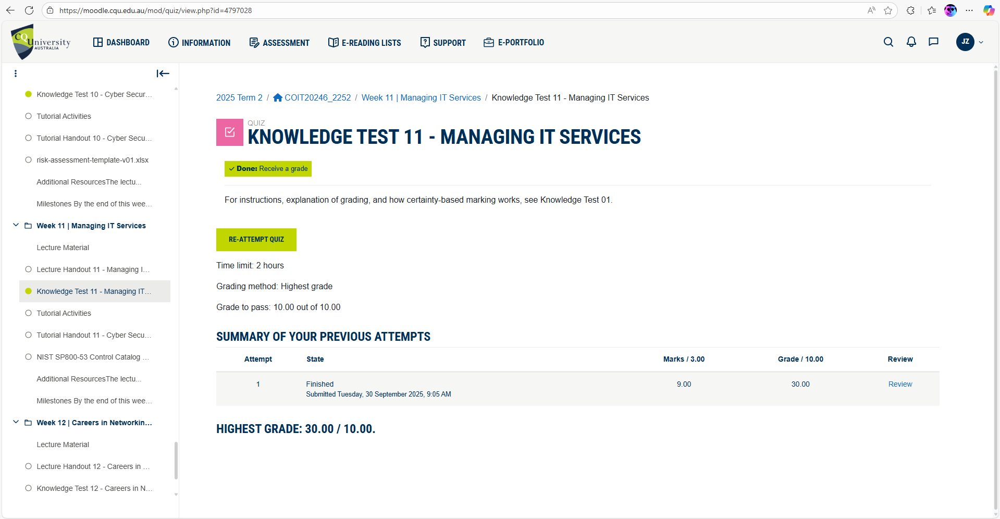
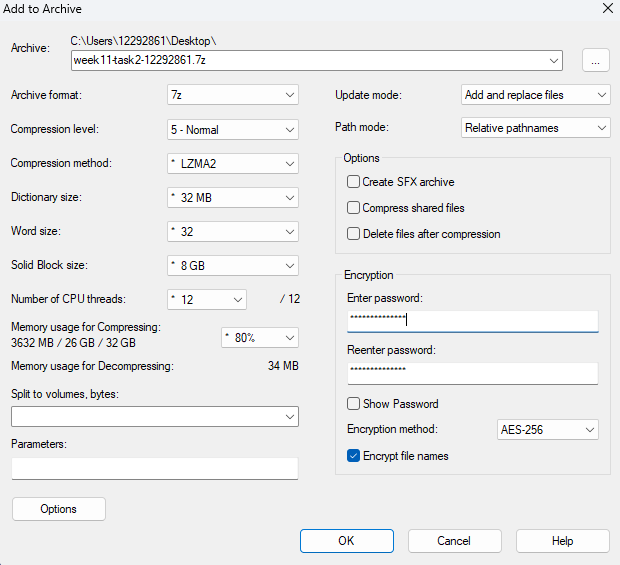

# Week 10 | Cyber Security Controls

## Task 1. Complete the Knowledge Test

## Task 2. Encrypt a File
- **Encrypted File:** [week11-task2-12292861.7z](./images/week11/week11-task2-12292861.7z)
- **Encryption File Setting:**
  
- Explanation:

## Task 3. View Password Information Stored in Linux

## Task 4. Essential Eight Mitigaton Strategies
